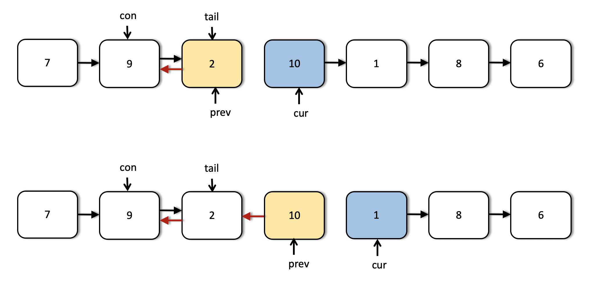

92. Reverse Linked List II

Reverse a linked list from position `m` to `n`. Do it in one-pass.

**Note:** 1 `≤ m ≤ n ≤ length of list`.

**Example:**
```
Input: 1->2->3->4->5->NULL, m = 2, n = 4
Output: 1->4->3->2->5->NULL
```

# Solution
---
## Approach 1: Recursion

**Intuition**

The idea for linked list reversal using recursion springs from a similar idea that we use for reversing an array. If we want to reverse an array, the huge advantage that we have is the availability of indexes. So, what we can do there is to simply have two pointers, one at the beginning of the array and one at the end. We repeatedly swap elements pointed to by these two pointers and we move both the pointers towards the center of the array. Let's quickly look at this simple algorithm on a sample array before we move on to linked lists.


The first approach for reversing a portion of the given linked list is based on the similar idea expressed above. Essentially, we want two different pointers, one at the $m^{th}$ node from the beginning and another one from the $n^{th}$ node from the beginning. Once we have such pointers in place, we can repeatedly swap the data between the nodes and progress these pointers towards each other like we saw in the case of an array.

However, we don't have any backward pointers in our linked list and neither do we have any indexes. So, we rely on recursion to simulate the backward pointer. Essentially, the backtracking process in a recursion will help us in simulating the backward movement of the pointer from the $n^{th}$ node in the linked list towards the center.

**Algorithm**

1. We define a recursion function that will do the job of reversing a portion of the linked list.
1. Let's call this function `recurse`. The function takes in 3 parameters: `m` being the starting point of the reversal, `n` being the ending point for the reversal, and a pointer `right` which will start at the $n^{th}$ node in the linked list and move backwards with the backtracking of the recursion. If this is not clear at the moment, the diagrams that follow will help.
1. Additionally, we have a pointer called `left` which starts from the $m^{th}$ node in the linked list and moves forward. In Python, we have to take a global variable for this which get's changed with recursion. In other languages, where changes made in function calls `persist`, we can consider this pointer as an additional variable for the function `recurse`.
1. In a recursion call, given `m`, `n`, and `right`, we check `if n == 1`. If this is the case, we don't need to go any further.
1. Until we reach `n = 1`, we keep moving the `right` pointer one step forward and after doing that, we make a recursive call with the value of n decreased by `1`. At the same time, we keep on moving the `left` pointer forward until `m == 1`. When we refer to a pointer being moved forward, it essentially means `pointer.next`.
1. So we backtrack as soon as n reaches 1. At that point of time, the right pointer is at the last node of the sublist we want to reverse and the left has already reached the first node of this sublist. So, we swap out the data and move the left pointer one step forward using `left = left.next`. We need this change to persist across the backtracking process.
1. From there on, every time we backtrack, the `right` pointer moves one step backwards. This is the simulation we've been mentioning all along. The backward movement is simulated by backtracking.
1. We stop the swaps when either `right == left`, which happens if the sublist size is odd, or, `right.next == left` which happens when during the backtracking process for an even sized sublist, the `right` pointer crosses `left`. We use a global boolean flag for stopping the swaps once these conditions are met.

Let's look at a series of diagrams explaining the process on a sample linked list. Hopefully, things would be clearer after this.


This is the first step in the recursion process. We have a list given to us and the `left` and the `right` pointers start off from the `head` of the linked list. The first step makes a recursive call with updated values of `m` and `n` i.e. their values each reduced by `1`. Also, the `left` and the `right` pointers move one step forward in the linked list.


The next two steps show the movement of the `left` and the `right` pointers in the list. Notice that after the second step, the `left` pointer reaches it's designated spot. So, we don't move it any further. Only the `right` pointer progresses from here on out until it reaches node 6.


As we can see, after the step 5, both the pointers are in their designated spots in the list and we can start the backtracking process. We don't recurse further. The operation performed during the backtracking is swapping of data between the `left` and `right` nodes.


The `right` pointer crosses the `left` pointer after step 3 (backtracking) as can be seen above and by that point, we have already reversed the required portion of the linked list. We needed the output list to be $[7 → 9 → 8 → 1 → 10 → 2 → 6]$ and that's what we have. So, we don't perform any more swaps and in the code, we can use a global boolean flag to stop the swapping after a point. We can't really break out of recursion per say.

```python
# Definition for singly-linked list.
# class ListNode:
#     def __init__(self, x):
#         self.val = x
#         self.next = None

class Solution:
    def reverseBetween(self, head: ListNode, m: int, n: int) -> ListNode:
        if not head:
            return None

        left, right = head, head
        stop = False
        def recurseAndReverse(right, m, n):
            nonlocal left, stop

            # base case. Don't proceed any further
            if n == 1:
                return

            # Keep moving the right pointer one step forward until (n == 1)
            right = right.next

            # Keep moving left pointer to the right until we reach the proper node
            # from where the reversal is to start.
            if m > 1:
                left = left.next

            # Recurse with m and n reduced.
            recurseAndReverse(right, m - 1, n - 1)

            # In case both the pointers cross each other or become equal, we
            # stop i.e. don't swap data any further. We are done reversing at this
            # point.
            if left == right or right.next == left:
                stop = True

            # Until the boolean stop is false, swap data between the two pointers     
            if not stop:
                left.val, right.val = right.val, left.val

                # Move left one step to the right.
                # The right pointer moves one step back via backtracking.
                left = left.next           

        recurseAndReverse(right, m, n)
        return head
```

**Complexity Analysis**

* Time Complexity: $O(N)$ since we process all the nodes at-most twice. Once during the normal recursion process and once during the backtracking process. During the backtracking process we only just swap half of the list if you think about it, but the overall complexity is $O(N)$.
* Space Complexity: $O(N)$ in the worst case when we have to reverse the entire list. This is the space occupied by the recursion stack.

## Approach 2: Iterative Link Reversal.

**Intuition**

In the previous approach, we looked at an algorithm for reversing a portion of the given linked list such that the underlying structure doesn't change. We only modified the values of the nodes for achieving the reversal. However, it may so happen that you cannot change the data available in the nodes. In that scenario, we have to modify the links themselves to achieve the reversal.

Essentially, starting from the node at position `m` and all the way up to `n`, we reverse the next pointers for all the nodes in between. Let's look at the algorithm for achieving this.

**Algorithm**

Before looking at the algorithm, it's important to understand how the link reversal will work and what set of pointers will be required for the same. Let's say we have a linked list consisting of three different nodes, `A → B → C` and we want to reverse the links between the nodes and obtain A ← B ← C.

Suppose we have at our disposal, two pointers. One of them points to the node A and the other one points to the node B. Let's call these pointers `prev` and `cur` respectively. We can simply use these two pointers to reverse the link between A and B.

`cur.next = prev`

The only problem with this is, we don't have a way of progressing further i.e. once we do this, we can't reach the node `C`. That's why we need a third pointer that will help us continue the link reversal process. So, we do the following instead.

```
third = cur.next
cur.next = prev
prev = cur
cur = third
```

We do the above iteratively and we will achieve what the question asks us to do. Let's look at the steps for the algorithm now.
1. We need two pointers, `prev` and `cur` as explained above.
1. The `prev` pointer should be initialized to None initially while `cur` is initialized to the head of the linked list.
1. We progress the `cur` pointer one step at a time and the `prev` pointer follows it.
1. We keep progressing the two pointers in this way until the `cur` pointer reaches the $m^{th}$ node from the beginning of the list. This is the point from where we start reversing our linked list.
1. An important thing to note here is the usage of two additional pointers which we will call as `tail` and `con`. The `tail` pointer points to the $m^{th}$ node from the beginning of the linked list and we call it a `tail` pointer since this node becomes the tail of the reverse sublist. The `con` points to the node one before $m^{th}$ node and this connects to the new head of the reversed sublist. Let's take a look at a figure to understand these two pointers better.

1. The `tail` and the `con` pointers are set once initially and then used in the end to finish the linked list reversal.
1. Once we reach the $m^{th}$ node, we iteratively reverse the links as explained before using the two pointers. We keep on doing this until we are done reversing the link (next pointer) for the $n^{th}$ node. At that point, the `prev` pointer would point to the $n^{th}$ node.
1. We use the `con` pointer to attach to the `prev` pointer since the node now pointed to by the `prev` pointer (the $n^{th}$ node from the beginning) will come in place of the $m^{th}$ node due after the reversal. Similarly, we will make use of the `tail` pointer to connect to the node next to the `prev` node i.e. $(n+1)^{th}$ node from the beginning.

Let's have a look at the algorithm execute on a sample linked list to make the use case for all these pointers clearer. We are given a linked list initially with elements `7 → 9 → 2 → 10 → 1 → 8 → 6` and we need to reverse the list from node `3` through `6`.


We can see the first few steps of our iterative solution above. The first step shows the initialization of the two pointers and the third step shows us the starting point for the list reversal process.


This shows us in detail how the links are reversed and how we move forward after reversing the links between two nodes. This step is done multiple times as shown in the following images.




As we can see from the above images, now the two pointers have reached their final positions. We are done reversing the sublist that we were required to do i.e. nodes `3` through `6`. However, we still have to fix some connections. The next image explains how we use the tail and con pointers to make the final connections.


32 ms, 14 MB
```python
# Definition for singly-linked list.
# class ListNode:
#     def __init__(self, x):
#         self.val = x
#         self.next = None

class Solution:
    def reverseBetween(self, head: ListNode, m: int, n: int) -> ListNode:
        # Empty list
        if not head:
            return None

        # Move the two pointers until they reach the proper starting point
        # in the list.
        cur, prev = head, None
        while m > 1:
            prev = cur
            cur = cur.next
            m, n = m - 1, n - 1

        # The two pointers that will fix the final connections.
        tail, con = cur, prev

        # Iteratively reverse the nodes until n becomes 0.
        while n:
            third = cur.next
            cur.next = prev
            prev = cur
            cur = third
            n -= 1

        # Adjust the final connections as explained in the algorithm
        if con:
            con.next = prev
        else:
            head = prev
        tail.next = cur
        return head
```

**Complexity Analysis**

* Time Complexity: $O(N)$ considering the list consists of $N$ nodes. We process each of the nodes at most once (we don't process the nodes after the $n^{th}$ node from the beginning.
* Space Complexity: $O(1)$ since we simply adjust some pointers in the original linked list and only use $O(1)$ additional memory for achieving the final result.

# Submissions
---
**Solution 1: (Recursion, Linked List)**
```
Runtime: 32 ms
Memory Usage: 13.2 MB
```
```python
# Definition for singly-linked list.
# class ListNode:
#     def __init__(self, x):
#         self.val = x
#         self.next = None

class Solution:
    def reverseBetween(self, head: ListNode, m: int, n: int) -> ListNode:
        
        if not head:
            return None

        left, right = head, head
        stop = False
        def recurseAndReverse(right, m, n):
            nonlocal left, stop

            # base case. Don't proceed any further
            if n == 1:
                return

            # Keep moving the right pointer one step forward until (n == 1)
            right = right.next

            # Keep moving left pointer to the right until we reach the proper node
            # from where the reversal is to start.
            if m > 1:
                left = left.next

            # Recurse with m and n reduced.
            recurseAndReverse(right, m - 1, n - 1)

            # In case both the pointers cross each other or become equal, we
            # stop i.e. don't swap data any further. We are done reversing at this
            # point.
            if left == right or right.next == left:
                stop = True

            # Until the boolean stop is false, swap data between the two pointers     
            if not stop:
                left.val, right.val = right.val, left.val

                # Move left one step to the right.
                # The right pointer moves one step back via backtracking.
                left = left.next           

        recurseAndReverse(right, m, n)
        return head
```

**Solution 2: (Iterative, Linked List)**
```
Runtime: 24 ms
Memory Usage: 12.8 MB
```
```python
# Definition for singly-linked list.
# class ListNode:
#     def __init__(self, x):
#         self.val = x
#         self.next = None

class Solution:
    def reverseBetween(self, head: ListNode, m: int, n: int) -> ListNode:
        
        # Empty list
        if not head:
            return None

        # Move the two pointers until they reach the proper starting point
        # in the list.
        cur, prev = head, None
        while m > 1:
            prev = cur
            cur = cur.next
            m, n = m - 1, n - 1

        # The two pointers that will fix the final connections.
        tail, con = cur, prev

        # Iteratively reverse the nodes until n becomes 0.
        while n:
            third = cur.next
            cur.next = prev
            prev = cur
            cur = third
            n -= 1

        # Adjust the final connections as explained in the algorithm
        if con:
            con.next = prev
        else:
            head = prev
        tail.next = cur
        return head
```

**Solution 3: (Iterative, Linked List)**
```
Runtime: 0 ms
Memory Usage: 6 MB
```
```c
/**
 * Definition for singly-linked list.
 * struct ListNode {
 *     int val;
 *     struct ListNode *next;
 * };
 */


struct ListNode* reverseBetween(struct ListNode* head, int left, int right){
    if (left == right)
        return head;
    struct ListNode *start, *end, *prev, *cur, *nxt;
    int i = 1;
    prev = NULL;
    cur = head;
    while (cur && i < left) {
        prev = cur;
        cur = cur->next;
        i += 1;
    }
    start = prev;
    end = cur;
    prev = cur;
    cur = cur->next;
    i += 1;
    while (cur && i <= right) {
        nxt = cur->next;
        cur->next = prev;
        prev = cur;
        cur = nxt;
        i += 1;
    }
    if (start)
        start->next = prev;
    else
        head = prev;
    end->next = cur;

    return head;
}
```
**Solution 4: (Iterative, Linked List)**
```
Runtime: 2 ms
Memory Usage: 7.5 MB
```
```c++
/**
 * Definition for singly-linked list.
 * struct ListNode {
 *     int val;
 *     ListNode *next;
 *     ListNode() : val(0), next(nullptr) {}
 *     ListNode(int x) : val(x), next(nullptr) {}
 *     ListNode(int x, ListNode *next) : val(x), next(next) {}
 * };
 */
class Solution {
public:
    ListNode* reverseBetween(ListNode* head, int left, int right) {
        ListNode *pre = nullptr, *cur = head, *start, *end, *tmp;
        int i = 1;
        while (i < left) {
            pre = cur;
            cur = cur->next;
            i += 1;
        }
        start = pre;
        end = cur;
        pre = cur;
        cur = cur->next;
        i += 1;
        while (i <= right) {
            tmp = cur->next;
            cur->next = pre;
            pre = cur;
            cur = tmp;
            i += 1;
        }
        if (start)
            start->next = pre;
        else
            head = pre;
        end->next = cur;
        return head;
    }
};
```
