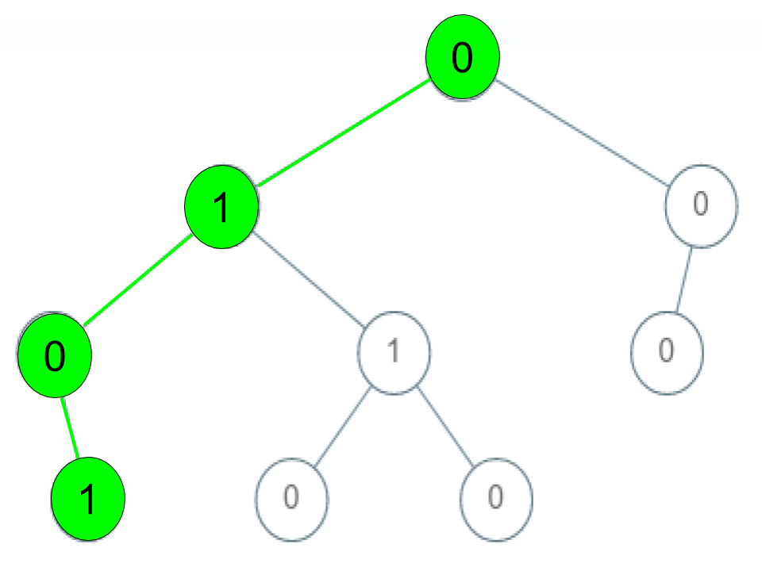

Check If a String Is a Valid Sequence from Root to Leaves Path in a Binary Tree

Given a binary tree where each path going from the root to any leaf form a **valid sequence**, check if a given string is a **valid sequence** in such binary tree. 

We get the given string from the concatenation of an array of integers `arr` and the concatenation of all values of the nodes along a path results in a sequence in the given binary tree.

 

**Example 1:**


```
Input: root = [0,1,0,0,1,0,null,null,1,0,0], arr = [0,1,0,1]
Output: true
Explanation: 
The path 0 -> 1 -> 0 -> 1 is a valid sequence (green color in the figure). 
Other valid sequences are: 
0 -> 1 -> 1 -> 0 
0 -> 0 -> 0
```

**Example 2:**


```
Input: root = [0,1,0,0,1,0,null,null,1,0,0], arr = [0,0,1]
Output: false 
Explanation: The path 0 -> 0 -> 1 does not exist, therefore it is not even a sequence.
```

**Example 3:**


```
Input: root = [0,1,0,0,1,0,null,null,1,0,0], arr = [0,1,1]
Output: false
Explanation: The path 0 -> 1 -> 1 is a sequence, but it is not a valid sequence.
```

**Constraints:**

* `1 <= arr.length <= 5000`
* `0 <= arr[i] <= 9`
* Each node's value is between `[0 - 9]`.

# Submissions
---
**Solution 1: (DFS)**
```
Runtime: 116 ms
Memory Usage: 15.2 MB
```
```python
# Definition for a binary tree node.
# class TreeNode:
#     def __init__(self, val=0, left=None, right=None):
#         self.val = val
#         self.left = left
#         self.right = right
class Solution:
    def isValidSequence(self, root: TreeNode, arr: List[int]) -> bool:
        N = len(arr)
        
        def dfs(node, i):
            if not node:
                return False
            if not node.left and not node.right:
                return True if i == N-1 and node.val == arr[i] else False
            if i >= N-1:
                return False
            elif node.val != arr[i]:
                return False
            if any(dfs(nei, i+1) for nei in [node.left, node.right]):
                return True
            return False
            
        return dfs(root, 0)
            
```