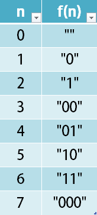

1256. Encode Number

Given a non-negative integer `num`, Return its encoding string.

The encoding is done by converting the integer to a string using a secret function that you should deduce from the following table:



**Example 1:**

```
Input: num = 23
Output: "1000"
```

**Example 2:**

```
Input: num = 107
Output: "101100"
```

**Constraints:**

* `0 <= num <= 10^9`

# Submissions
---
**Solution 1:**

The following sequence can be built up form the ealier result.
So I search index of the prefix part
For example:
```
f(5) = "10"
f(6) = "11"
The prefix are both f(2) = "1"
```
so we found that `f(n)` has `f((n - 1) / 2)` as prefix.

```
Runtime: 28 ms
Memory Usage: 12.7 MB
```
```python
class Solution:
    def encode(self, num: int) -> str:
        return self.encode((num - 1) // 2) + '10'[num % 2] if num else ""
```

**Solution 2:**

Assume `g(n) = "1" + f(n)`
we can find:
`g(0) = "1" g(1) = "10" g(2) = "111" g(3) = "100" g(4) = "101" g(5) = "110" g(6) = "111"`

Now everything is obvious:
```
g(n) = binary(n + 1)
"1" + f(n) = binary(n + 1)
f(n) = binary(n + 1).substring(1)
```
```
Runtime: 28 ms
Memory Usage: 12.9 MB
```
```python
class Solution:
    def encode(self, num: int) -> str:
        return bin(num + 1)[3:]
```