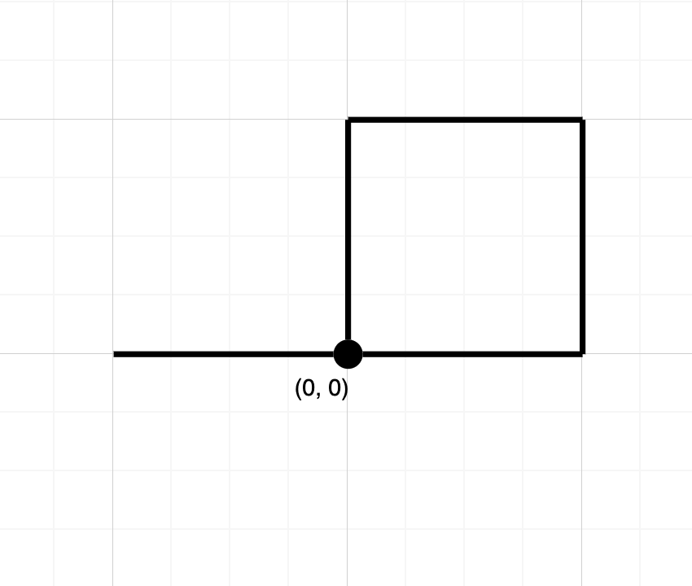

1496. Path Crossing

Given a string path, where `path[i] = 'N', 'S', 'E' or 'W'`, each representing moving one unit north, south, east, or west, respectively. You start at the origin `(0, 0)` on a 2D plane and walk on the path specified by path.

Return `True` if the path crosses itself at any point, that is, if at any time you are on a location you've previously visited. Return `False` otherwise.

 

**Example 1:**


```
Input: path = "NES"
Output: false 
Explanation: Notice that the path doesn't cross any point more than once.
```

**Example 2:**


```
Input: path = "NESWW"
Output: true
Explanation: Notice that the path visits the origin twice.
``` 

**Constraints:**

* `1 <= path.length <= 10^4`
* `path` will only consist of characters in `{'N', 'S', 'E', 'W}`

# Solution
---
**Solution 1: (Set)**
```
Runtime: 16 ms
Memory Usage: 14.1 MB
```
```python
class Solution:
    def isPathCrossing(self, path: str) -> bool:
        x = y = 0
        seen = {(0, 0)}
        for char in path:
            if char == 'N':
                y += 1
            elif char == 'S':
                y -= 1
            elif char == 'E':
                x += 1
            else:
                x -= 1
            if (x, y) in seen:
                return True    
            else:
                seen.add((x, y))
        return False  
            
```

**Solution 2: (Set)**
```
Runtime: 4 ms
Memory Usage: 6.7 MB
```
```c++
class Solution {
public:
    bool isPathCrossing(string path) {
        int x = 0,y=0;
        set<pair<int,int>>s;
        s.insert({0,0});
        for(char p: path){
            if(p == 'N') y++;
            else if(p == 'S')y--;
            else if(p == 'E') x++;
            else x--;
            
            if(s.find({x,y}) != s.end()) return true;
            else s.insert({x,y});
        }
        return false;
    }
};
```