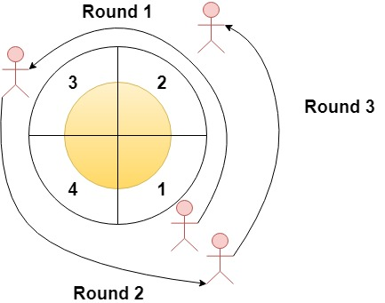

1560. Most Visited Sector in a Circular Track

Given an integer `n` and an integer array `rounds`. We have a circular track which consists of `n` sectors labeled from `1` to `n`. A marathon will be held on this track, the marathon consists of `m` rounds. The `i`th round starts at sector `rounds[i - 1]` and ends at sector `rounds[i]`. For example, round `1` starts at sector `rounds[0]` and ends at sector `rounds[1]`

Return an array of the most visited sectors sorted in ascending order.

Notice that you circulate the track in ascending order of sector numbers in the counter-clockwise direction (See the first example).

 

**Example 1:**


```
Input: n = 4, rounds = [1,3,1,2]
Output: [1,2]
Explanation: The marathon starts at sector 1. The order of the visited sectors is as follows:
1 --> 2 --> 3 (end of round 1) --> 4 --> 1 (end of round 2) --> 2 (end of round 3 and the marathon)
We can see that both sectors 1 and 2 are visited twice and they are the most visited sectors. Sectors 3 and 4 are visited only once.
```

**Example 2:**
```
Input: n = 2, rounds = [2,1,2,1,2,1,2,1,2]
Output: [2]
```

**Example 3:**
```
Input: n = 7, rounds = [1,3,5,7]
Output: [1,2,3,4,5,6,7]
```

**Constraints:**

* `2 <= n <= 100`
* `1 <= m <= 100`
* `rounds.length == m + 1`
* `1 <= rounds[i] <= n`
* `rounds[i] != rounds[i + 1] for 0 <= i < m`

# Submissions
---
**Solution 1: (Brainteaser)**

**Intuition**

We only need to care the start point and the end point.


**Explanation**

* If start <= end, return the range [start, end].
* If end < start, return the range [1, end] + range [start, n].


**Complexity**

* Time O(N)
* Space O(N)

```
Runtime: 56 ms
Memory Usage: 13.7 MB
```
```python
class Solution:
    def mostVisited(self, n: int, rounds: List[int]) -> List[int]:
        return list(range(rounds[0], rounds[-1] + 1)) or list(range(1, rounds[-1] + 1)) + list(range(rounds[0], n + 1))
```

**Solution 2: (Brainteaser)**
```
Runtime: 8 ms
Memory Usage: 11.3 MB
```
```c++
class Solution {
public:
    vector<int> mostVisited(int n, vector<int>& rounds) {
        vector<int> res;
        for (int i = rounds[0]; i <= rounds[rounds.size() - 1]; ++i)
            res.push_back(i);
        if (res.size() > 0) return res;
        for (int i = 1; i <= rounds[rounds.size() - 1]; ++i)
            res.push_back(i);
        for (int i = rounds[0]; i <= n; ++i)
            res.push_back(i);
        return res;
    }
};
```