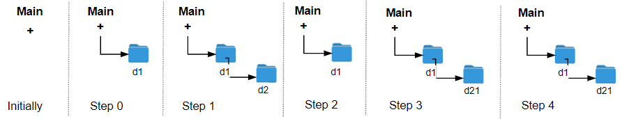

1598. Crawler Log Folder

The Leetcode file system keeps a log each time some user performs a change folder operation.

The operations are described below:

* `"../"` : Move to the parent folder of the current folder. (If you are already in the main folder, remain in the same folder).
* `"./"` : Remain in the same folder.
* `"x/"` : Move to the child folder named `x` (This folder is guaranteed to always exist).

You are given a list of strings `logs` where `logs[i]` is the operation performed by the user at the `i`th step.

The file system starts in the main folder, then the operations in logs are performed.

Return the minimum number of operations needed to go back to the main folder after the change folder operations.

 

**Example 1:**


```
Input: logs = ["d1/","d2/","../","d21/","./"]
Output: 2
Explanation: Use this change folder operation "../" 2 times and go back to the main folder.
```

**Example 2:**


```
Input: logs = ["d1/","d2/","./","d3/","../","d31/"]
Output: 3
```

**Example 3:**
```
Input: logs = ["d1/","../","../","../"]
Output: 0
```

**Constraints:**

* `1 <= logs.length <= 103`
* `2 <= logs[i].length <= 10`
* `logs[i]` contains lowercase English letters, digits, `'.'`, and `'/'`.
* `logs[i]` follows the format described in the statement.
* Folder names consist of lowercase English letters and digits.

# Submissions
---
**Solution 1: (Greedy)**
```
Runtime: 40 ms
Memory Usage: 14.3 MB
```
```python
class Solution:
    def minOperations(self, logs: List[str]) -> int:
        ans = 0
        for log in logs:
            if log == './':
                continue
            elif log == '../':
                ans = max(ans-1, 0)
            else:
                ans += 1
        return ans
```

**Solution 2: (Greedy)**
```
Runtime: 9 ms
Memory: 13.84 MB
```
```c++
class Solution {
public:
    int minOperations(vector<string>& logs) {
        int ans = 0;
        for (auto log: logs) {
            if (log == "../") {
                ans = max(ans - 1, 0);
            } else if (log != "./") {
                ans += 1;
            }
        }
        return ans;
    }
};
```
