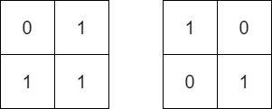

1886. Determine Whether Matrix Can Be Obtained By Rotation

Given two `n x n` binary matrices `mat` and `target`, return `true` if it is possible to make `mat` equal to `target` by rotating mat in 90-degree increments, or `false` otherwise.

 

**Example 1:**


```
Input: mat = [[0,1],[1,0]], target = [[1,0],[0,1]]
Output: true
Explanation: We can rotate mat 90 degrees clockwise to make mat equal target.
```

**Example 2:**


```
Input: mat = [[0,1],[1,1]], target = [[1,0],[0,1]]
Output: false
Explanation: It is impossible to make mat equal to target by rotating mat.
```

**Example 3:**


```
Input: mat = [[0,0,0],[0,1,0],[1,1,1]], target = [[1,1,1],[0,1,0],[0,0,0]]
Output: true
Explanation: We can rotate mat 90 degrees clockwise two times to make mat equal target.
```

**Constraints:**

* `n == mat.length == target.length`
* `n == mat[i].length == target[i].length`
* `1 <= n <= 10`
* `mat[i][j]` and `target[i][j]` are either `0` or `1`.

# Submissions
---
**Solution 1: (Matrix)**
```
Runtime: 52 ms
Memory Usage: 14.1 MB
```
```python
class Solution:
    def findRotation(self, mat: List[List[int]], target: List[List[int]]) -> bool:
        for _ in range(4):
            if mat == target:
                return True
            mat = list(map(list, zip(*mat[::-1])))
        return False
```