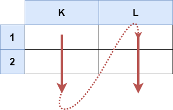
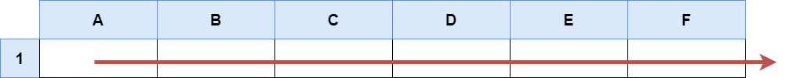

2194. Cells in a Range on an Excel Sheet

A cell `(r, c)` of an excel sheet is represented as a string `"<col><row>"` where:

* `<col>` denotes the column number `c` of the cell. It is represented by alphabetical letters.
    * For example, the `1`st column is denoted by `'A'`, the `2`nd by `'B'`, the `3`rd by `'C'`, and so on.
* `<row>` is the row number `r` of the cell. The `r`th row is represented by the integer `r`.
You are given a string `s` in the format `"<col1><row1>:<col2><row2>"`, where `<col1>` represents the column `c1`, `<row1>` represents the row `r1`, `<col2>` represents the column `c2`, and `<row2>` represents the row `r2`, such that `r1 <= r2` and `c1 <= c2`.

Return the **list of cells** `(x, y)` such that `r1 <= x <= r2` and `c1 <= y <= c2`. The cells should be represented as strings in the format mentioned above and be sorted in **non-decreasing** order first by columns and then by rows.

 

**Example 1:**


```
Input: s = "K1:L2"
Output: ["K1","K2","L1","L2"]
Explanation:
The above diagram shows the cells which should be present in the list.
The red arrows denote the order in which the cells should be presented.
```

**Example 2:**


```
Input: s = "A1:F1"
Output: ["A1","B1","C1","D1","E1","F1"]
Explanation:
The above diagram shows the cells which should be present in the list.
The red arrow denotes the order in which the cells should be presented.
```

**Constraints:**

* `s.length == 5`
* `'A' <= s[0] <= s[3] <= 'Z'`
* `'1' <= s[1] <= s[4] <= '9'`
* `s` consists of uppercase English letters, digits and `':'`.

# Submissions
---
**Solution 1: (Array)**
```
Runtime: 42 ms
Memory Usage: 13.7 MB
```
```python
class Solution:
    def cellsInRange(self, s: str) -> List[str]:
        return [chr(i)+chr(j) for i in range(ord(s[0]), ord(s[3])+1) for j in range(ord(s[1]), ord(s[4])+1)]
```

**Solution 2: (Array)**
```
Runtime: 0 ms
Memory Usage: 7.8 MB
```
```c++
class Solution {
public:
    vector<string> cellsInRange(string s) {
        vector<string> res;
        for (char c = s[0]; c <= s[3]; ++c)
            for (char r = s[1]; r <= s[4]; ++r)
                res.push_back({c, r});
        return res;
    }
};
```
