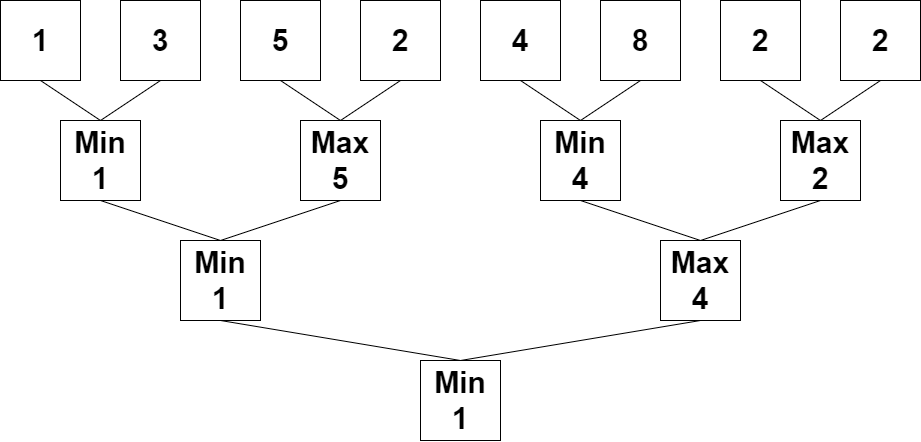

2293. Min Max Game

You are given a **0-indexed** integer array `nums` whose length is a power of `2`.

Apply the following algorithm on `nums`:

1. Let `n` be the length of `nums`. If `n == 1`, end the process. Otherwise, **create** a new **0-indexed** integer array `newNums` of length `n / 2`.
* For every **even** index `i` where `0 <= i < n / 2`, assign the value of `newNums[i]` as `min(nums[2 * i], nums[2 * i + 1])`.
1. For every **odd** index `i` where `0 <= i < n / 2`, assign the value of `newNums[i]` as `max(nums[2 * i], nums[2 * i + 1])`.
1. **Replace** the array `nums` with `newNums`.
1. **Repeat** the entire process starting from step 1.

Return the last number that remains in `nums` after applying the algorithm.

 

**Example 1:**


```
Input: nums = [1,3,5,2,4,8,2,2]
Output: 1
Explanation: The following arrays are the results of applying the algorithm repeatedly.
First: nums = [1,5,4,2]
Second: nums = [1,4]
Third: nums = [1]
1 is the last remaining number, so we return 1.
```

**Example 2:**
```
Input: nums = [3]
Output: 3
Explanation: 3 is already the last remaining number, so we return 3.
```

**Constraints:**

* `1 <= nums.length <= 1024`
* `1 <= nums[i] <= 10^9`
* `nums.length is a power of 2`.

# Submissions
---
**Solution 1: (DFS)**
```
Runtime: 104 ms
Memory Usage: 13.9 MB
```
```python
class Solution:
    def minMaxGame(self, nums: List[int]) -> int:
        return nums[0] if 1==len(nums) else self.minMaxGame([(max if i%2 else min)(nums[2*i],nums[2*i+1]) for i in range(len(nums)//2)])
```

**Solution 2: (Constant Space)**
```
Runtime: 12 ms
Memory Usage: 9.7 MB
```
```c++
class Solution {
public:
    int minMaxGame(vector<int>& nums) {
        int n(size(nums));
        for (; n>1; n-=n/2) {
            for (int i=0; i<n/2; i++) {
                nums[i] = ((i % 2 == 1) ? max(nums[2*i], nums[2*i+1]) : min(nums[2*i], nums[2*i+1]));
            }
        }
        return nums[0];
    }
};
```
