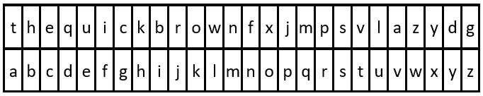

2325. Decode the Message

You are given the strings `key` and `message`, which represent a cipher key and a secret message, respectively. The steps to decode `message` are as follows:

1. Use the **first** appearance of all 26 lowercase English letters in `key` as the order of the substitution table.
1. Align the substitution table with the regular English alphabet.
1. Each letter in message is then **substituted** using the table.
1. Spaces `' '` are transformed to themselves.

* For example, given `key = "happy boy"` (actual key would have **at least one** instance of each letter in the alphabet), we have the partial substitution table of (`'h'` -> `'a'`, `'a'` -> `'b'`, `'p'` -> `'c'`, `'y'` -> `'d'`, `'b'` -> `'e'`, `'o'` -> `'f'`).

Return the decoded message.

 

**Example 1:**


```
Input: key = "the quick brown fox jumps over the lazy dog", message = "vkbs bs t suepuv"
Output: "this is a secret"
Explanation: The diagram above shows the substitution table.
It is obtained by taking the first appearance of each letter in "the quick brown fox jumps over the lazy dog".
```

**Example 2:**

!{2325_ex2new.jpg](img/2325_ex2new.jpg)
```
Input: key = "eljuxhpwnyrdgtqkviszcfmabo", message = "zwx hnfx lqantp mnoeius ycgk vcnjrdb"
Output: "the five boxing wizards jump quickly"
Explanation: The diagram above shows the substitution table.
It is obtained by taking the first appearance of each letter in "eljuxhpwnyrdgtqkviszcfmabo".
```

**Constraints:**

* `26 <= key.length <= 2000`
* `key` consists of lowercase English letters and `' '`.
* `key` contains every letter in the English alphabet (`'a'` to `'z'`) at least once.
* `1 <= message.length <= 2000`
* `message` consists of lowercase English letters and `' '`.

# Submissions
---
**Solution 1: (Hash Table)**
```
Runtime: 59 ms
Memory Usage: 14 MB
```
```python
class Solution:
    def decodeMessage(self, key: str, message: str) -> str:
        mapping = {' ': ' '}
        i = 0
        res = ''
        letters = 'abcdefghijklmnopqrstuvwxyz'
        
        for char in key:
            if char not in mapping:
                mapping[char] = letters[i]
                i += 1
        
        for char in message:
            res += mapping[char]
                
        return res
```

**Solution 2: (Hash Table)**
```
Runtime: 8 ms
Memory Usage: 6.8 MB
```
```c++
class Solution {
public:
    string decodeMessage(string key, string message) {
        vector<char> map(26);
        int k = 0;
    
        //create mapping
        for(auto i:key){
            // current is not a space and is not found before
            if(i!=32 and !map[i-'a']) map[i-'a']= (k+'a') , k++;
        }

        //then update characters inplace in message string according to mapping except for spaces
        for(int i=0;i<message.size();i++) if(message[i]!=32) message[i]= map[message[i]-'a'];
        return message;
    }
};
```
