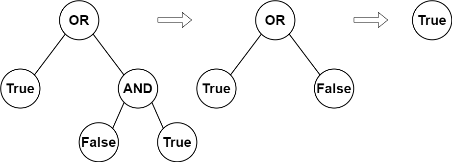

2331. Evaluate Boolean Binary Tree

You are given the root of a **full binary tree** with the following properties:

* **Leaf nodes** have either the value `0` or `1`, where `0` represents `False` and `1` represents `True`.
* **Non-leaf nodes** have either the value `2` or `3`, where `2` represents the boolean `OR` and `3` represents the boolean `AND`.

The **evaluation** of a node is as follows:

* If the node is a leaf node, the evaluation is the **value** of the node, i.e. `True` or `False`.
* Otherwise, **evaluate** the node's two children and **apply** the boolean operation of its value with the children's evaluations.

Return the boolean result of **evaluating** the `root` node.

A **full binary tree** is a binary tree where each node has either `0` or `2` children.

A **leaf node** is a node that has zero children.

 

**Example 1:**


```
Input: root = [2,1,3,null,null,0,1]
Output: true
Explanation: The above diagram illustrates the evaluation process.
The AND node evaluates to False AND True = False.
The OR node evaluates to True OR False = True.
The root node evaluates to True, so we return true.
```

**Example 2:**
```
Input: root = [0]
Output: false
Explanation: The root node is a leaf node and it evaluates to false, so we return false.
```

**Constraints:**

* The number of nodes in the tree is in the range `[1, 1000]`.
* `0 <= Node.val <= 3`
* Every node has either `0` or `2` children.
* Leaf nodes have a value of `0` or `1`.
* Non-leaf nodes have a value of `2` or `3`.

# Submissions
---
**Solution 1: (DFS)**
```
Runtime: 64 ms
Memory Usage: 14.7 MB
```
```python
# Definition for a binary tree node.
# class TreeNode:
#     def __init__(self, val=0, left=None, right=None):
#         self.val = val
#         self.left = left
#         self.right = right
class Solution:
    def evaluateTree(self, root: Optional[TreeNode]) -> bool:
        if root.val == 0 or root.val == 1:
            return root.val
        elif root.val == 2:
            return self.evaluateTree(root.left) or self.evaluateTree(root.right)
        else:
            return self.evaluateTree(root.left) and self.evaluateTree(root.right)
```

**Solution 2: (DFS)**
```
Runtime: 20 ms
Memory Usage: 15.1 MB
```
```c++
/**
 * Definition for a binary tree node.
 * struct TreeNode {
 *     int val;
 *     TreeNode *left;
 *     TreeNode *right;
 *     TreeNode() : val(0), left(nullptr), right(nullptr) {}
 *     TreeNode(int x) : val(x), left(nullptr), right(nullptr) {}
 *     TreeNode(int x, TreeNode *left, TreeNode *right) : val(x), left(left), right(right) {}
 * };
 */
class Solution {
public:
    bool evaluateTree(TreeNode* root) {
        if (!root->left and !root->right)   return root->val;
        int l = evaluateTree(root->left);
        int r = evaluateTree(root->right);
        return (root->val == 2) ? l or r : l and r;
    }
};
```
