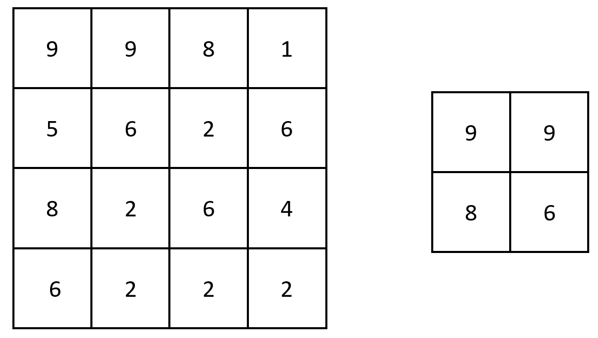
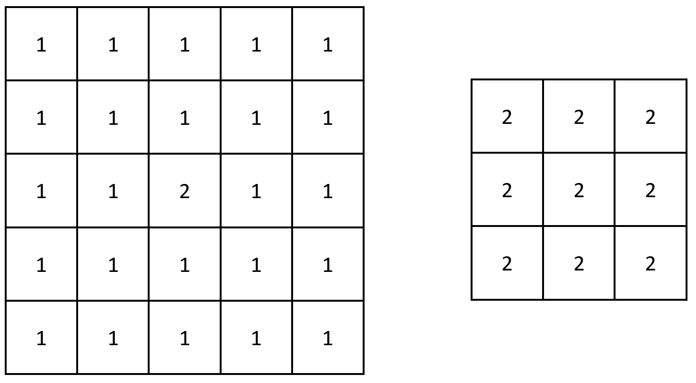

2373. Largest Local Values in a Matrix

You are given an `n x n` integer matrix `grid`.

Generate an integer matrix `maxLocal` of size `(n - 2) x (n - 2)` such that:

* `maxLocal[i][j]` is equal to the largest value of the `3 x 3` matrix in grid centered around row `i + 1` and column `j + 1`.

In other words, we want to find the largest value in every contiguous `3 x 3` matrix in `grid`.

Return the generated matrix.

 

**Example 1:**


```
Input: grid = [[9,9,8,1],[5,6,2,6],[8,2,6,4],[6,2,2,2]]
Output: [[9,9],[8,6]]
Explanation: The diagram above shows the original matrix and the generated matrix.
Notice that each value in the generated matrix corresponds to the largest value of a contiguous 3 x 3 matrix in grid.
```

**Example 2:**


```
Input: grid = [[1,1,1,1,1],[1,1,1,1,1],[1,1,2,1,1],[1,1,1,1,1],[1,1,1,1,1]]
Output: [[2,2,2],[2,2,2],[2,2,2]]
Explanation: Notice that the 2 is contained within every contiguous 3 x 3 matrix in grid.
```

**Constraints:**

* `n == grid.length == grid[i].length`
* `3 <= n <= 100`
* `1 <= grid[i][j] <= 100`

# Submissions
---
**Solution 1: (Array)**
```
Runtime: 263 ms
Memory Usage: 14.5 MB
```
```python
class Solution:
    def largestLocal(self, grid: List[List[int]]) -> List[List[int]]:
        n = len(grid)
        ans = [[0]*(n-2) for _ in range(n-2)]
        for i in range(n-2):
            for j in range(n-2):
                for ni in range(i, i+3):
                    for nj in range(j, j+3):
                        ans[i][j] = max(ans[i][j], grid[ni][nj]);
        return ans
```

**Solution 2: (Array)**
```
Runtime: 32 ms
Memory Usage: 11.1 MB
```
```c++
class Solution {
public:
    vector<vector<int>> largestLocal(vector<vector<int>>& grid) {
        int n = grid.size();
        vector<vector<int>> res(n - 2, vector<int>(n - 2));
        for (int i = 0; i < n - 2; ++i)
            for (int j = 0; j < n - 2; ++j)
                for (int ii = i; ii < i + 3; ++ii)
                    for (int jj = j; jj < j + 3; ++jj)
                        res[i][j] = max(res[i][j], grid[ii][jj]);
        return res;
    }
};
```
