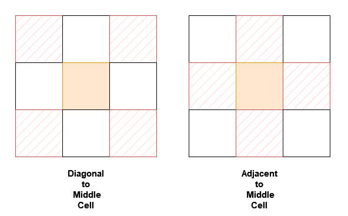

242. Design Neighbor Sum Service

You are given a `n x n` 2D array `grid` containing distinct elements in the range `[0, n^2 - 1]`.

Implement the `neighborSum` class:

* `neighborSum(int [][]grid)` initializes the object.
* `int adjacentSum(int value)` returns the sum of elements which are adjacent neighbors of value, that is either to the top, left, right, or bottom of value in `grid`.
* `int diagonalSum(int value)` returns the sum of elements which are diagonal neighbors of value, that is either to the top-left, top-right, bottom-left, or bottom-right of value in `grid`.


 

**Example 1:**
```
Input:

["neighborSum", "adjacentSum", "adjacentSum", "diagonalSum", "diagonalSum"]

[[[[0, 1, 2], [3, 4, 5], [6, 7, 8]]], [1], [4], [4], [8]]

Output: [null, 6, 16, 16, 4]

Explanation:
```

```
The adjacent neighbors of 1 are 0, 2, and 4.
The adjacent neighbors of 4 are 1, 3, 5, and 7.
The diagonal neighbors of 4 are 0, 2, 6, and 8.
The diagonal neighbor of 8 is 4.
```

**Example 2:**
```
Input:

["neighborSum", "adjacentSum", "diagonalSum"]

[[[[1, 2, 0, 3], [4, 7, 15, 6], [8, 9, 10, 11], [12, 13, 14, 5]]], [15], [9]]

Output: [null, 23, 45]

Explanation:
```

```
The adjacent neighbors of 15 are 0, 10, 7, and 6.
The diagonal neighbors of 9 are 4, 12, 14, and 15.
```

**Constraints:**

* `3 <= n == grid.length == grid[0].length <= 10`
* `0 <= grid[i][j] <= n2 - 1`
* All `grid[i][j]` are distinct.
* value in `adjacentSum` and `diagonalSum` will be in the range `[0, n^2 - 1]`.
* At most 2 * n2 calls will be made to adjacentSum and diagonalSum.

# Submissionsw
---
**Solution 1: (Brute Force)**
```
Runtime: 66 ms
Memory: 70.30 MB
```
```c++
class neighborSum {
    int suma[101] = {}, sumd[101] = {};
    const int adj[5] = {0, 1, 0, -1, 0}, dia[5] = {1, 1, -1, -1, 1};
public:
    neighborSum(vector<vector<int>>& grid) {
        auto add = [&](int i, int j, int val, int arr[]){
            if (min(i, j) >= 0 && max(i, j) < grid.size())
            arr[grid[i][j]] += val;
        };
        for (int i = 0; i < grid.size(); ++i)
            for (int j = 0; j < grid.size(); ++j)
                for (int d = 0; d < 4; ++d) {
                    add(i + adj[d], j + adj[d + 1], grid[i][j], suma);
                    add(i + dia[d], j + dia[d + 1], grid[i][j], sumd);
                }
    }
    
    int adjacentSum(int value) {
        return suma[value]; 
    }
    
    int diagonalSum(int value) {
        return sumd[value];
    }
};

/**
 * Your neighborSum object will be instantiated and called as such:
 * neighborSum* obj = new neighborSum(grid);
 * int param_1 = obj->adjacentSum(value);
 * int param_2 = obj->diagonalSum(value);
 */
```
