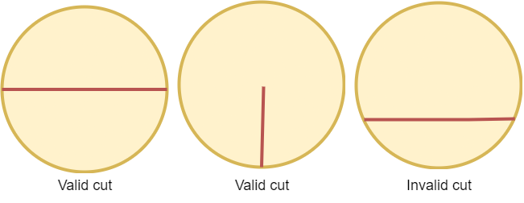

2481. Minimum Cuts to Divide a Circle

A valid cut in a circle can be:

* A cut that is represented by a straight line that touches two points on the edge of the circle and passes through its center, or
* A cut that is represented by a straight line that touches one point on the edge of the circle and its center.

Some valid and invalid cuts are shown in the figures below.



Given the integer `n`, return the **minimum** number of cuts needed to divide a circle into `n` equal slices.

 

**Example 1:**


```
Input: n = 4
Output: 2
Explanation: 
The above figure shows how cutting the circle twice through the middle divides it into 4 equal slices.
```

**Example 2:**


```
Input: n = 3
Output: 3
Explanation:
At least 3 cuts are needed to divide the circle into 3 equal slices. 
It can be shown that less than 3 cuts cannot result in 3 slices of equal size and shape.
Also note that the first cut will not divide the circle into distinct parts.
```

**Constraints:**

* `1 <= n <= 100`

# Submissions
---
**Solution 1: (Math)**
```
Runtime: 49 ms
Memory: 13.8 MB
```
```python
class Solution:
    def numberOfCuts(self, n: int) -> int:
        if n == 1: return 0
        return n if n % 2 else n // 2
```

**Solution 2: (Math)**
```
Runtime: 0 ms
Memory: 5.9 MB
```
```c++
class Solution {
public:
    int numberOfCuts(int n) {
        if (n == 1) return 0;
        return n % 2 ? n : n / 2;
    }
};
```
