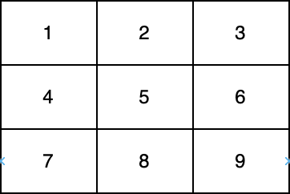

2614. Prime In Diagonal

You are given a **0-indexed** two-dimensional integer array `nums`.

Return the largest **prime** number that lies on at least one of the diagonals of `nums`. In case, no prime is present on any of the diagonals, return `0`.

Note that:

* An integer is **prime** if it is greater than `1` and has no positive integer divisors other than `1` and itself.
* An integer `val` is on one of thediagonals of `nums` if there exists an integer `i` for which `nums[i][i] = val` or an `i` for which `nums[i][nums.length - i - 1]= val`.


In the above diagram, one diagonal is `[1,5,9]` and another diagonal is `[3,5,7]`.

 

**Example 1:**
```
Input: nums = [[1,2,3],[5,6,7],[9,10,11]]
Output: 11
Explanation: The numbers 1, 3, 6, 9, and 11 are the only numbers present on at least one of the diagonals. Since 11 is the largest prime, we return 11.
```

**Example 2:**
```
Input: nums = [[1,2,3],[5,17,7],[9,11,10]]
Output: 17
Explanation: The numbers 1, 3, 9, 10, and 17 are all present on at least one of the diagonals. 17 is the largest prime, so we return 17.
```

**Constraints:**

* `1 <= nums.length <= 300`
* `nums.length == numsi.length`
* `1 <= nums[i][j] <= 4*10^6`

# submissions
---
**Solution 1: (Brute Force)**
```
Runtime: 121 ms
Memory: 35.6 MB
```
```c++
class Solution {
    bool isprime(long long n){
        if(n==1) return false;
        n = 1L*n;
        for(long long i=2;i*i<=n;i++){
            if(n%i==0) return false;
        }
        return true;
    }
public:
    int diagonalPrime(vector<vector<int>>& nums) {
        long long ans=0;
        for(long long i=0,j=nums[0].size()-1;i<nums.size();i++,j--){
            if(isprime(nums[i][i])) ans = max((long long)nums[i][i]*1L,ans);
            if(isprime(nums[i][nums.size()-1-i])) ans = max((long long)nums[i][j]*1L,ans);
        }
        return ans;
    }
};
```
