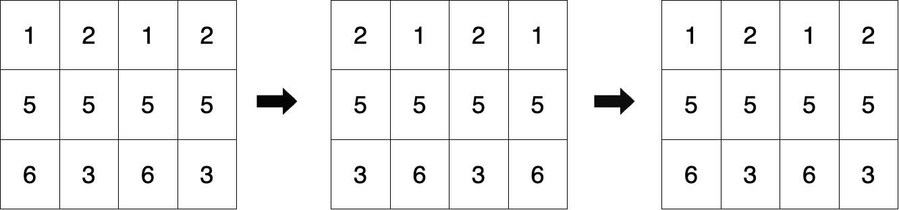

2946. Matrix Similarity After Cyclic Shifts

You are given a **0-indexed** `m x n` integer matrix `mat` and an integer `k`. You have to cyclically **right** shift **odd** indexed rows `k` times and cyclically **left** shift **even** indexed rows `k` times.

Return `true` if the initial and final matrix are exactly the same and `false` otherwise.

 

**Example 1:**


```
Input: mat = [[1,2,1,2],[5,5,5,5],[6,3,6,3]], k = 2
Output: true
Explanation:


Initially, the matrix looks like the first figure. 
Second figure represents the state of the matrix after one right and left cyclic shifts to even and odd indexed rows.
Third figure is the final state of the matrix after two cyclic shifts which is similar to the initial matrix.
Therefore, return true.
```

**Example 2:**
```
Input: mat = [[2,2],[2,2]], k = 3
Output: true
Explanation: As all the values are equal in the matrix, even after performing cyclic shifts the matrix will remain the same. Therefeore, we return true.
```

**Example 3:**
```
Input: mat = [[1,2]], k = 1
Output: false
Explanation: After one cyclic shift, mat = [[2,1]] which is not equal to the initial matrix. Therefore we return false.
```

**Constraints:**

* `1 <= mat.length <= 25`
* `1 <= mat[i].length <= 25`
* `1 <= mat[i][j] <= 25`
* `1 <= k <= 50`

# Submissions
---
**Solution 1: (Brute Force)**
```
Runtime: 15 ms
Memory: 27.4 MB
```
```c++
class Solution {
public:
    bool areSimilar(vector<vector<int>>& mat, int k) {
        int m = mat.size(), n = mat[0].size();
        k %= n;
        for (int i = 0; i < m; i ++) {
            for (int j = 0; j < n; j ++) {
                if (i%2) {
                    if (mat[i][(j+k)%n] != mat[i][j]) {
                        return false;
                    }
                } else {
                    if (mat[i][(j+n-k)%n] != mat[i][j]) {
                        return false;
                    }
                }
            }
        }
        return true;
    }
};
```
