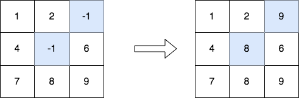
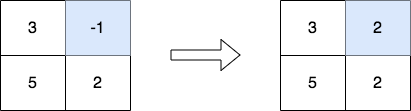

3033. Modify the Matrix

Given a **0-indexed** `m x n` integer matrix `matrix`, create a new **0-indexed** matrix called `answer`. Make `answer` equal to `matrix`, then replace each element with the value `-1` with the maximum element in its respective column.

Return the matrix `answer`.

 

**Example 1:**


```
Input: matrix = [[1,2,-1],[4,-1,6],[7,8,9]]
Output: [[1,2,9],[4,8,6],[7,8,9]]
Explanation: The diagram above shows the elements that are changed (in blue).
- We replace the value in the cell [1][1] with the maximum value in the column 1, that is 8.
- We replace the value in the cell [0][2] with the maximum value in the column 2, that is 9.
```

**Example 2:**


```
Input: matrix = [[3,-1],[5,2]]
Output: [[3,2],[5,2]]
Explanation: The diagram above shows the elements that are changed (in blue).
```

**Constraints:**

* `m == matrix.length`
* `n == matrix[i].length`
* `2 <= m, n <= 50`
* `-1 <= matrix[i][j] <= 100`
* The input is generated such that each column contains at least one non-negative integer.

# Submissions
---
**Solution 1: (Array)**
```
Runtime: 11 ms
Memory: 22.34 MB
```
```c++
class Solution {
public:
    vector<vector<int>> modifiedMatrix(vector<vector<int>>& matrix) {
        // Get the number of rows (m) and columns (n) in the matrix
        int m = matrix.size();
        int n = matrix[0].size();

        // Create a new matrix "ans" filled with zeros
        vector<vector<int>> ans(m, vector<int>(n, 0));

        // Create a vector "col" to store maximum elements in each column, initially filled with -1
        vector<int> col(n, -1);

        // Step 1: Iterate through each column of the matrix
        for (int i = 0; i < n; i++) {
            // Step 2: Iterate through each row of the matrix
            for (int j = 0; j < m; j++) {
                // Step 3: Copy elements from the original matrix to the "ans" matrix
                ans[j][i] = matrix[j][i];
                
                // Update the "col" vector with the maximum element in the current column
                col[i] = max(col[i], matrix[j][i]);
            }
        }

        // Step 4: Iterate through each element in the "ans" matrix
        for (int i = 0; i < n; i++) {
            for (int j = 0; j < m; j++) {
                // Step 5: If the element is -1, replace it with the maximum value from its column
                if (ans[j][i] == -1) {
                    ans[j][i] = col[i];
                }
            }
        }

        // Return the modified "ans" matrix
        return ans;
    }
};
```
