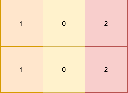

3142. Check if Grid Satisfies Condition

You are given a 2D matrix `grid` of size m x n. You need to check if each cell `grid[i][j]` is:

* Equal to the cell below it, i.e. `grid[i][j] == grid[i + 1][j]` (if it exists).
* Different from the cell to its right, i.e. `grid[i][j] != grid[i][j + 1]` (if it exists).

Return `true` if all the cells satisfy these conditions, otherwise, return `false`.

 

**Example 1:**


```
Input: grid = [[1,0,2],[1,0,2]]

Output: true

Explanation:


All the cells in the grid satisfy the conditions.
```

**Example 2:**


```
Input: grid = [[1,1,1],[0,0,0]]

Output: false

Explanation:


All cells in the first row are equal.
```

**Example 3:**


```
Input: grid = [[1],[2],[3]]

Output: false

Explanation:


Cells in the first column have different values.
```
 

**Constraints:**

* `1 <= n, m <= 10`
* `0 <= grid[i][j] <= 9`

# Submissions
---
**Solution 1: (Brute Force)**
```
Runtime: 9 ms
Memory: 28.69 MB
```
```c++
class Solution {
public:
    bool satisfiesConditions(vector<vector<int>>& grid) {
        int m = grid.size(), n = grid[0].size();
        for (int i = 0; i < m; i ++) {
            for (int j = 0; j < n; j ++) {
                if (i < m-1 && grid[i][j] != grid[i+1][j]) {
                    return false;
                }
                if (j < n-1 && grid[i][j] == grid[i][j+1]) {
                    return false;
                }
            }
        }
        return true;
    }
};
```
