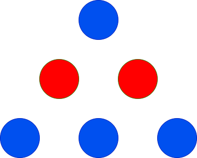

3200. Maximum Height of a Triangle

You are given two integers `red` and `blue` representing the count of red and blue colored balls. You have to arrange these balls to form a triangle such that the 1st row will have 1 ball, the 2nd row will have 2 balls, the 3rd row will have 3 balls, and so on.

All the balls in a particular row should be the **same** color, and adjacent rows should have **different** colors.

Return the **maximum** height of the triangle that can be achieved.

 

**Example 1:**


```
Input: red = 2, blue = 4

Output: 3

Explanation:


The only possible arrangement is shown above.
```

**Example 2:**


```
Input: red = 2, blue = 1

Output: 2

Explanation:


The only possible arrangement is shown above.
```

**Example 3:**
```
Input: red = 1, blue = 1

Output: 1
```

**Example 4:**


```
Input: red = 10, blue = 1

Output: 2

Explanation:


The only possible arrangement is shown above.
```
 

**Constraints:**

* `1 <= red, blue <= 100`

# Submissions
---
**Solution 1: (Brute Force)**
```
Runtime: 0 ms
Memory: 7.48 MB
```
```c++
class Solution {
public:
    int maxHeightOfTriangle(int red, int blue) {
        int dp[2] = {red, blue}, cur = 0, h =1, ans = 0;
        while (dp[cur] >= h) {
            dp[cur] -= h;
            ans = max(ans, h);
            cur ^= 1;
            h += 1;
        }
        dp[0] = red;
        dp[1] = blue;
        cur = 1;
        h = 1;
        while (dp[cur] >= h) {
            dp[cur] -= h;
            ans = max(ans, h);
            cur ^= 1;
            h += 1;
        }
        return ans;
    }
};
```
