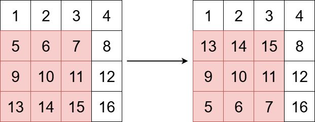
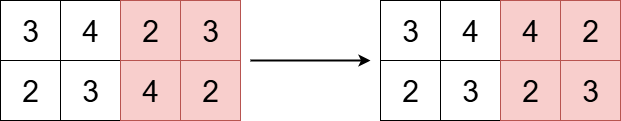

3643. Flip Square Submatrix Vertically

You are given an `m x n` integer matrix `grid`, and three integers `x`, `y`, and `k`.

The integers `x` and `y` represent the row and column indices of the top-left corner of a square submatrix and the integer `k` represents the size (side length) of the square submatrix.

Your task is to flip the submatrix by reversing the order of its rows vertically.

Return the updated matrix.

 

**Example 1:**


```
Input: grid = [[1,2,3,4],[5,6,7,8],[9,10,11,12],[13,14,15,16]], x = 1, y = 0, k = 3

Output: [[1,2,3,4],[13,14,15,8],[9,10,11,12],[5,6,7,16]]

Explanation:

The diagram above shows the grid before and after the transformation.
```

**Example 2:**


```
Input: grid = [[3,4,2,3],[2,3,4,2]], x = 0, y = 2, k = 2

Output: [[3,4,4,2],[2,3,2,3]]

Explanation:

The diagram above shows the grid before and after the transformation.
```
 

**Constraints:**

* `m == grid.length`
* `n == grid[i].length`
* `1 <= m, n <= 50`
* `1 <= grid[i][j] <= 100`
* `0 <= x < m`
* `0 <= y < n`
* `1 <= k <= min(m - x, n - y)`

# Submissions
---
**Solution 1: (Brute Force)**
```
Runtime: 0 ms, Beats 100.00%
Memory: 33.83 MB, Beats 67.34%
```
```c++
class Solution {
public:
    vector<vector<int>> reverseSubmatrix(vector<vector<int>>& grid, int x, int y, int k) {
        int i, j;
        for (j = y; j < y+k; j ++) {
            for (i = x; i-x < k/2; i ++) {
                swap(grid[i][j], grid[x+k-1-(i-x)][j]);
            }
        }
        return grid;
    }
};
```
