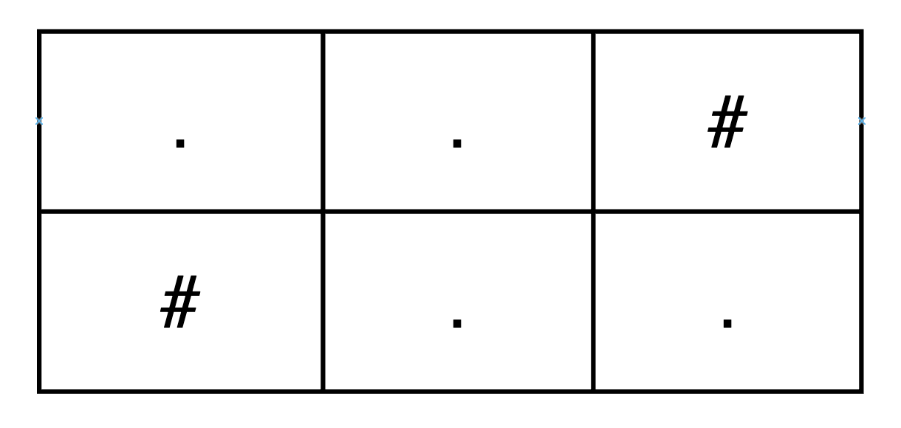
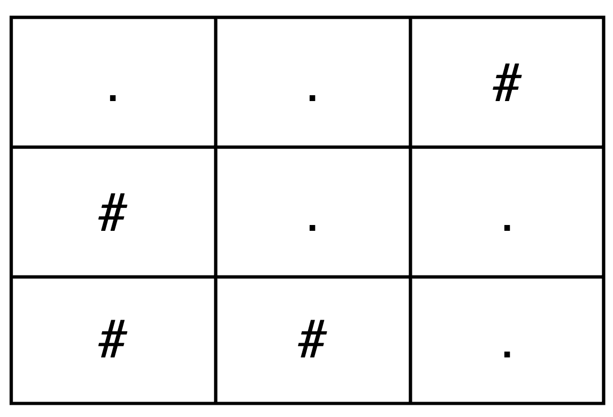

3963. Create Grid With Exactly One Path

You are given two integers `m` and `n`, representing the number of rows and columns of a grid.

Construct any `m x n` grid consisting only of the characters `'.'` and `'#'`, where:

* `'.'` represents a free cell.
* `'#'` represents an obstacle cell.
A valid **path** is a sequence of free cells that:

* Starts at the top-left cell `(0, 0)`.
* Ends at the bottom-right cell `(m - 1, n - 1)`.
* Moves only:
    * Right, from `(i, j)` to `(i, j + 1)`, or
    * Down, from `(i, j)` to `(i + 1, j)`.
Return any grid such that there is **exactly one valid path** from the top-left cell to the bottom-right cell.

 

**Example 1:**
```
Input: m = 2, n = 3

Output: ["..#","#.."]

Explanation:
```

```
The only valid path is: (0,0) → (0,1) → (1,1) → (1,2)
```

**Example 2:**
```
Input: m = 3, n = 3

Output: ["..#","#..","##."]

Explanation:
```

```
The only valid path is: (0,0) → (0,1) → (1,1) → (1,2) → (2,2)
```

**Example 3:**
```
Input: m = 1, n = 4

Output: ["...."]

Explanation:

The only valid path is: (0,0) → (0,1) → (0,2) → (0,3)
```
 

**Constraints:**

* `1 <= m, n <= 25`

# Submissions
---
**Solution 1: (Brute Force)**
```
Runtime: 3 ms, Beats 25.00%
Memory: 12.74 MB, Beats -%
```
```c++
class Solution {
public:
    vector<string> createGrid(int m, int n) {
        vector<string> ans;
        for (int i = 0; i < m; i ++) {
            if (i == 0) {
                ans.push_back(string(n, '.'));
            } else {
                ans.push_back(string(n - 1, '#'));
                ans.back() += '.';
            }
        }
        return ans;
    }
};
```
