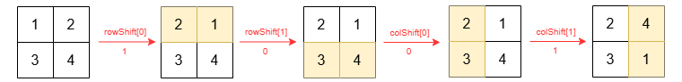
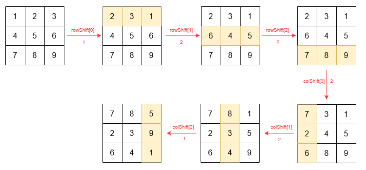

4052. Cyclically Shift Rows and Columns

You are given an integer `n`, a 2D integer array `grid` of size `n x n`, and two integer arrays `rowShift` and `colShift`, each of length n, where:

* `rowShift[i]` represents the number of positions to cyclically shift the `i`th row of `grid` to the left.
* `colShift[j]` represents the number of positions to cyclically shift the `j`th column of `grid` upward.

First, cyclically shift each row according to `rowShift`, then cyclically shift each column of the resulting grid according to `colShift`.

Return the resulting grid after performing all the shifts.

A **cyclic left shift** of a row by `k` positions moves the element at column j to column `(j - k + n) % n`. All other rows remain unchanged.

A **cyclic upward shift** of a column by `k` positions moves the element at row `i` to row `(i - k + n) % n`. All other columns remain unchanged.

 

**Example 1:**
```
Input: n = 2, grid = [[1,2],[3,4]], rowShift = [1,0], colShift = [0,1]

Output: [[2,4],[3,1]]

Explanation:

The grid changes as follows:
```



**Example 2:**
```
Input: n = 3, grid = [[1,2,3],[4,5,6],[7,8,9]], rowShift = [1,2,0], colShift = [2,2,1]

Output: [[7,8,5],[2,3,9],[6,4,1]]

Explanation:

The grid changes as follows:
```


 

**Constraints:**

* `1 <= n == grid.length == grid[i].length <= 10`
* `1 <= grid[i][j] <= 100`
* `rowShift.length == colShift.length == n`
* `0 <= rowShift[i], colShift[i] < n`

# Submissions
---
**Solution 1: (Matrix)**
```
Runtime: 6 ms, Beats 18.78%
Memory: 73.46 MB, Beats 75.81%
```
```c++
class Solution {
public:
    vector<vector<int>> cyclicShift(int n, vector<vector<int>>& grid, vector<int>& rowShift, vector<int>& colShift) {
        vector<vector<int>> dp(n, vector<int>(n));
        vector<vector<int>> ans(n, vector<int>(n));
        for (int i = 0; i < n; i ++ ){
            for (int j = 0; j < n; j ++) {
                dp[i][(j - rowShift[i] + n) % n] = grid[i][j];
            }
        }
        for (int j = 0; j < n; j ++){
            for (int i = 0; i < n; i ++){
                ans[(i - colShift[j] + n) % n][j] = dp[i][j];
            }
        }
        return ans;
    }
};
```
