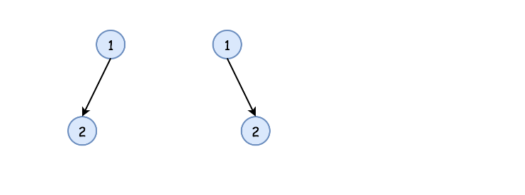

100. Same Tree

Given two binary trees, write a function to check if they are the same or not.

Two binary trees are considered the same if they are structurally identical and the nodes have the same value.

**Example 1:**
```
Input:     1         1
          / \       / \
         2   3     2   3

        [1,2,3],   [1,2,3]

Output: true
```

**Example 2:**
```
Input:     1         1
          /           \
         2             2

        [1,2],     [1,null,2]

Output: false
```

**Example 3:**
```
Input:     1         1
          / \       / \
         2   1     1   2

        [1,2,1],   [1,1,2]

Output: false
```

# Solution
---
## Approach 1: Recursion
**Intuition**

The simplest strategy here is to use recursion. Check if `p` and `q` nodes are not `None`, and their values are equal. If all checks are OK, do the same for the child nodes recursively.

**Implementation**




```python
class Solution:
    def isSameTree(self, p, q):
        """
        :type p: TreeNode
        :type q: TreeNode
        :rtype: bool
        """    
        # p and q are both None
        if not p and not q:
            return True
        # one of p and q is None
        if not q or not p:
            return False
        if p.val != q.val:
            return False
        return self.isSameTree(p.right, q.right) and \
               self.isSameTree(p.left, q.left)
```

**Complexity Analysis**

* Time complexity : $\mathcal{O}(N)$, where N is a number of nodes in the tree, since one visits each node exactly once.

* Space complexity : $\mathcal{O}(\log(N))$ in the best case of completely balanced tree and $\mathcal{O}(N)$ in the worst case of completely unbalanced tree, to keep a recursion stack.

## Approach 2: Iteration
**Intuition**

Start from the root and then at each iteration pop the current node out of the deque. Then do the same checks as in the approach 1 :

* `p` and `p` are not None,

* `p.val` is equal to `q.val`,

and if checks are OK, push the child nodes.

**Implementation**
```python
from collections import deque
class Solution:
    def isSameTree(self, p, q):
        """
        :type p: TreeNode
        :type q: TreeNode
        :rtype: bool
        """    
        def check(p, q):
            # if both are None
            if not p and not q:
                return True
            # one of p and q is None
            if not q or not p:
                return False
            if p.val != q.val:
                return False
            return True
        
        deq = deque([(p, q),])
        while deq:
            p, q = deq.popleft()
            if not check(p, q):
                return False
            
            if p:
                deq.append((p.left, q.left))
                deq.append((p.right, q.right))
                    
        return True
```

**Complexity Analysis**

* Time complexity : $\mathcal{O}(N)$ since each node is visited exactly once.

* Space complexity : $\mathcal{O}(\log(N))$ in the best case of completely balanced tree and $\mathcal{O}(N)$ in the worst case of completely unbalanced tree, to keep a deque.

# Submissions
---
**Solution: (Recursion)**
```
Runtime: 28 ms
Memory Usage: 12.8 MB
```
```python
# Definition for a binary tree node.
# class TreeNode:
#     def __init__(self, x):
#         self.val = x
#         self.left = None
#         self.right = None

class Solution:
    def isSameTree(self, p: TreeNode, q: TreeNode) -> bool:
        # p and q are both None
        if not p and not q:
            return True
        # one of p and q is None
        if not q or not p:
            return False
        if p.val != q.val:
            return False
        return self.isSameTree(p.right, q.right) and \
               self.isSameTree(p.left, q.left)
```

**Solution 2: (DFS)**
```
Runtime: 0 ms
Memory: 11.60 MB
```
```c++
/**
 * Definition for a binary tree node.
 * struct TreeNode {
 *     int val;
 *     TreeNode *left;
 *     TreeNode *right;
 *     TreeNode() : val(0), left(nullptr), right(nullptr) {}
 *     TreeNode(int x) : val(x), left(nullptr), right(nullptr) {}
 *     TreeNode(int x, TreeNode *left, TreeNode *right) : val(x), left(left), right(right) {}
 * };
 */
class Solution {
public:
    bool isSameTree(TreeNode* p, TreeNode* q) {
        if (!p && !q) {
            return true;
        }
        if (!p || !q) {
            return false;
        }
        return p->val == q->val && isSameTree(p->left, q->left) && isSameTree(p->right, q->right);
    }
};
```
