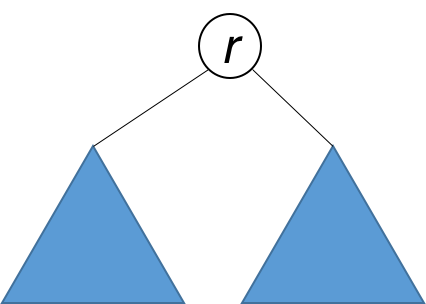

101. Symmetric Tree

Given a binary tree, check whether it is a mirror of itself (ie, symmetric around its center).

For example, this binary tree `[1,2,2,3,4,4,3]` is symmetric:
```
    1
   / \
  2   2
 / \ / \
3  4 4  3
```

But the following `[1,2,2,null,3,null,3]` is not:
```
    1
   / \
  2   2
   \   \
   3    3
```

**Note:**

Bonus points if you could solve it both recursively and iteratively.

# Solution
---
## Approach 1: Recursive
A tree is symmetric if the left subtree is a mirror reflection of the right subtree.



Therefore, the question is: when are two trees a mirror reflection of each other?

Two trees are a mirror reflection of each other if:

1. Their two roots have the same value.
1. The right subtree of each tree is a mirror reflection of the left subtree of the other tree.


This is like a person looking at a mirror. The reflection in the mirror has the same head, but the reflection's right arm corresponds to the actual person's left arm, and vice versa.

The explanation above translates naturally to a recursive function as follows.

```java
public boolean isSymmetric(TreeNode root) {
    return isMirror(root, root);
}

public boolean isMirror(TreeNode t1, TreeNode t2) {
    if (t1 == null && t2 == null) return true;
    if (t1 == null || t2 == null) return false;
    return (t1.val == t2.val)
        && isMirror(t1.right, t2.left)
        && isMirror(t1.left, t2.right);
}
```

**Complexity Analysis**

* Time complexity : $O(n)$. Because we traverse the entire input tree once, the total run time is $O(n)$, where $n$ is the total number of nodes in the tree.

* Space complexity : The number of recursive calls is bound by the height of the tree. In the worst case, the tree is linear and the height is in $O(n)$. Therefore, space complexity due to recursive calls on the stack is $O(n)$ in the worst case.

Approach 2: Iterative
Instead of recursion, we can also use iteration with the aid of a queue. Each two consecutive nodes in the queue should be equal, and their subtrees a mirror of each other. Initially, the queue contains `root` and `root`. Then the algorithm works similarly to BFS, with some key differences. Each time, two nodes are extracted and their values compared. Then, the right and left children of the two nodes are inserted in the queue in opposite order. The algorithm is done when either the queue is empty, or we detect that the tree is not symmetric (i.e. we pull out two consecutive nodes from the queue that are unequal).

```java
public boolean isSymmetric(TreeNode root) {
    Queue<TreeNode> q = new LinkedList<>();
    q.add(root);
    q.add(root);
    while (!q.isEmpty()) {
        TreeNode t1 = q.poll();
        TreeNode t2 = q.poll();
        if (t1 == null && t2 == null) continue;
        if (t1 == null || t2 == null) return false;
        if (t1.val != t2.val) return false;
        q.add(t1.left);
        q.add(t2.right);
        q.add(t1.right);
        q.add(t2.left);
    }
    return true;
}
```

**Complexity Analysis**

* Time complexity : $O(n)$. Because we traverse the entire input tree once, the total run time is $O(n)$, where $n$ is the total number of nodes in the tree.

* Space complexity : There is additional space required for the search queue. In the worst case, we have to insert $O(n)$ nodes in the queue. Therefore, space complexity is $O(n)$.

# Submissions
---
**Solution 1: (DFS)**
```
Runtime: 52 ms
Memory Usage: N/A
```
```python
# Definition for a binary tree node.
# class TreeNode:
#     def __init__(self, x):
#         self.val = x
#         self.left = None
#         self.right = None

class Solution:
    
    def isSymmetric(self, root):
        """
        :type root: TreeNode
        :rtype: bool
        """
        def isMirror(left_node, right_node):
            if not left_node and not right_node:
                return True
            if not left_node:
                return False
            if not right_node:
                return False

            return left_node.val == right_node.val and isMirror(left_node.left, right_node.right) and isMirror(left_node.right, right_node.left)
        
        if not root:
            return True
        
        return isMirror(root.left, root.right)
```

**Solution 2: (BFS)**
```
Runtime: 44 ms
Memory Usage: N/A
```
```python
# Definition for a binary tree node.
# class TreeNode:
#     def __init__(self, x):
#         self.val = x
#         self.left = None
#         self.right = None

class Solution:
    def isSymmetric(self, root):
        """
        :type root: TreeNode
        :rtype: bool
        """
        if not root:
            return True
        q = collections.deque([root, root])
        while len(q):
            t1 = q.popleft()
            t2 = q.popleft()
            if not t1 and not t2:
                continue
            if not t1 or not t2:
                return False
            if t1.val != t2.val:
                return False
            q.append(t1.left)
            q.append(t2.right)
            q.append(t1.right)
            q.append(t2.left)
        return True
```

**Solution 3: (DFS)**
```
Runtime: 8 ms
Memory Usage: 16.3 MB
```
```c++
/**
 * Definition for a binary tree node.
 * struct TreeNode {
 *     int val;
 *     TreeNode *left;
 *     TreeNode *right;
 *     TreeNode() : val(0), left(nullptr), right(nullptr) {}
 *     TreeNode(int x) : val(x), left(nullptr), right(nullptr) {}
 *     TreeNode(int x, TreeNode *left, TreeNode *right) : val(x), left(left), right(right) {}
 * };
 */
class Solution {
public:
    bool dfs(TreeNode* n1, TreeNode* n2){
        if (n1 == nullptr && n2 == nullptr) return true;
        if (n1 == nullptr || n2 == nullptr) return false;
        if (n1->val != n2->val)
            return false;
        if (n1->val == n2->val)
            return dfs(n1->left, n2->right) & dfs(n1->right, n2->left);
        return true;
    }
    bool isSymmetric(TreeNode* root) {
        TreeNode* node1 = root;
        TreeNode* node2 = root;
        return dfs(node1, node2);
    }
};
```