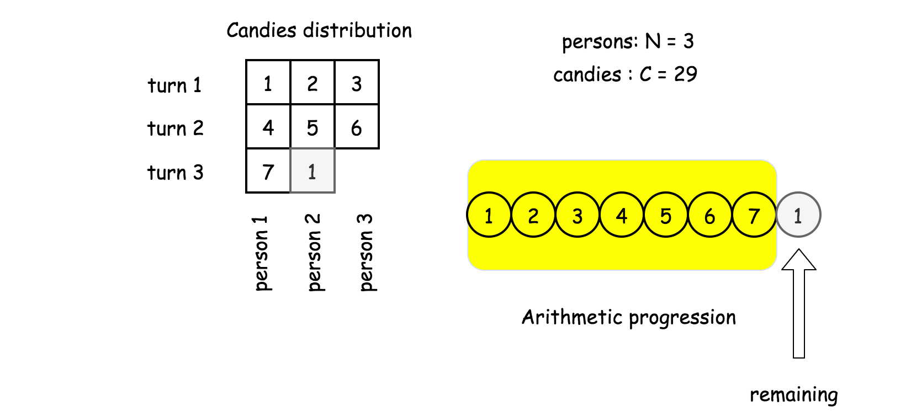
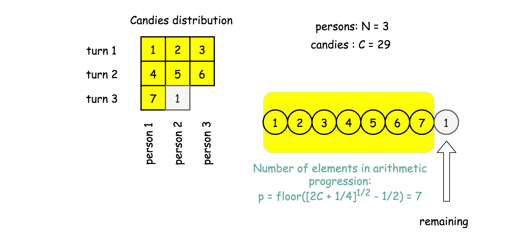
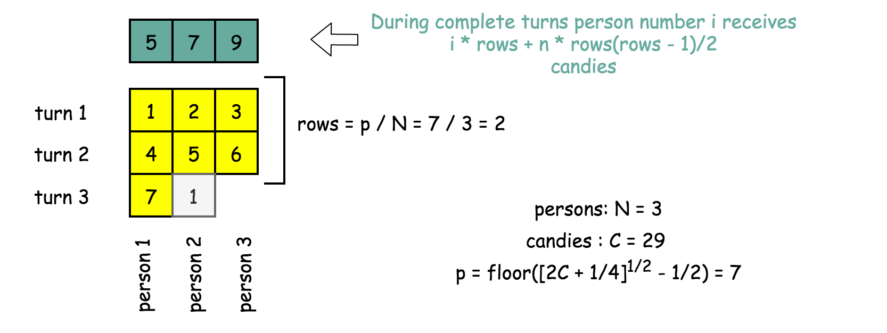
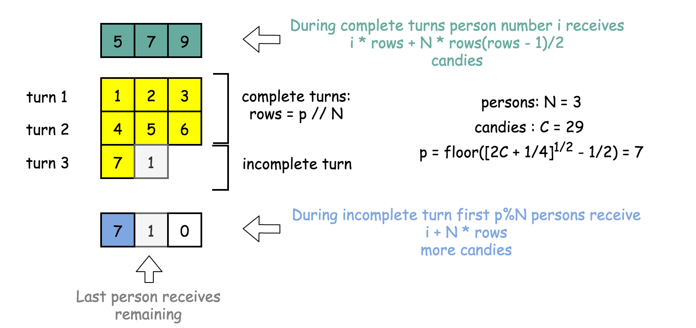

1103. Distribute Candies to People

We distribute some number of candies, to a row of `n = num_people` people in the following way:

We then give 1 candy to the first person, 2 candies to the second person, and so on until we give `n` candies to the last person.

Then, we go back to the start of the row, giving `n + 1` candies to the first person, `n + 2` candies to the second person, and so on until we give `2 * n` candies to the last person.

This process repeats (with us giving one more candy each time, and moving to the start of the row after we reach the end) until we run out of candies.  The last person will receive all of our remaining candies (not necessarily one more than the previous gift).

Return an array (of length `num_people` and sum candies) that represents the final distribution of candies.

 

**Example 1:**
```
Input: candies = 7, num_people = 4
Output: [1,2,3,1]
Explanation:
On the first turn, ans[0] += 1, and the array is [1,0,0,0].
On the second turn, ans[1] += 2, and the array is [1,2,0,0].
On the third turn, ans[2] += 3, and the array is [1,2,3,0].
On the fourth turn, ans[3] += 1 (because there is only one candy left), and the final array is [1,2,3,1].
```

**Example 2:**
```
Input: candies = 10, num_people = 3
Output: [5,2,3]
Explanation: 
On the first turn, ans[0] += 1, and the array is [1,0,0].
On the second turn, ans[1] += 2, and the array is [1,2,0].
On the third turn, ans[2] += 3, and the array is [1,2,3].
On the fourth turn, ans[0] += 4, and the final array is [5,2,3].
```

**Constraints:**

* `1 <= candies <= 10^9`
* `1 <= num_people <= 1000`

# Solution
---
## Approach 1: Sum of Arithmetic Progression
**Intuition**

That sort of "Math" questions is to check on how far one could simplify the problem even before starting to code.

Naive idea here is to jump into code and start to give candies in a loop till the end of candies. Time complexity of such a solution would be $\mathcal{O}(\max(G, N))$, where G is a number of gifts and N is a number of people.

More elegant way would be to notice that candies distribution could be described by a simple formula. Using that formula one could solve the problem in $\mathcal{O}(N)$ time by the straightforward generation of final distribution array.

Let's derive that formula step by step.

**Number of persons with complete gifts**

Candies gifts, except the last gift which contains the remaining, represent the arithmetic progression of natural numbers.



Let's assume that the progression has p elements, then the remaining is just a difference between number of candies $C$ and sum of the progression elements

$\textrm{remaining} = C - \sum\limits_{k = 0}^{k = p}{k}$

Sum of the natural numbers progression is a school knowledge, and remaining could be rewritten as

$\textrm{remaining} = C - \frac{p(p + 1)}{2}$

It's known that remaining is larger or equal to 0 and smaller than the next progression number $p + 1$.

$0 \le C - \frac{p(p + 1)}{2} < p + 1$

Simple calculations results in

$\sqrt{2C + \frac{1}{4}} - \frac{3}{2} < p \le \sqrt{2C + \frac{1}{4}} - \frac{1}{2}$ 

There is only one integer in this interval, and hence now one knows the number of elements in the arithmetic progression

$p = \textrm{floor}\left(\sqrt{2C + \frac{1}{4}} - \frac{1}{2}\right)$



**Candies gain during the complete turns**

Now one could compute a number of complete turns when all N persons received a gift : rows = p / N.

During complete turns person number i receives in total

$d[i] = i + (i + N) + (i + 2N) + ... (i + (\textrm{rows} - 1) N) = i \times \textrm{rows} + N \frac{\textrm{rows}(\textrm{rows} - 1)}{2}$
 


**Candies gain during the incomplete turn**

The last turn could be incomplete, i.e. not all persons receive their gifts.

One could compute a number of persons which received a complete gift : cols = p % N. These persons will receive one turn more candies

$d[i] += i + N \times \textrm{rows}$

And the last person with a gift will receive all remaining candies

$d[\textrm{cols} + 1] += \textrm{remaining}$



That's all, all distributed candies are computed.

**Algorithm**

* Compute number of persons with complete gifts
$p = \textrm{floor}\left(\sqrt{2C + \frac{1}{4}} - \frac{1}{2}\right)$

and the last gift $\textrm{remaining} = C - \frac{p(p + 1)}{2}$.

* Compute the number of complete turns, when all persons receive their gifts : rows = p // n, and candies gain from these turns : $d[i] = i \times \textrm{rows} + N \frac{\textrm{rows}(\textrm{rows} - 1)}{2}$

* Add one turn more candies to first `p % N` persons participated in the last incomplete turn : $d[i] += i + N \times \textrm{rows}$.

* Add `remaining` to the person after the first `p % N` persons.

* Return candies distribution `d`.

**Implementation**

```python
class Solution:
    def distributeCandies(self, candies: int, num_people: int) -> List[int]:
        n = num_people
        # how many people received complete gifts
        p = int((2 * candies + 0.25)**0.5 - 0.5) 
        remaining = int(candies - (p + 1) * p * 0.5)
        rows, cols = p // n, p % n
        
        d = [0] * n
        for i in range(n):
            # complete rows
            d[i] = (i + 1) * rows + int(rows * (rows - 1) * 0.5) * n
            # cols in the last row
            if i < cols:
                d[i] += i + 1 + rows * n
        # remaining candies        
        d[cols] += remaining
        return d
```

**Complexity Analysis**

* Time complexity : $\mathcal{O}(N)$ to create N elements of the output array.
* Space complexity : $\mathcal{O}(N)$ to keep the output.

# Submissions
---
**Solution 1: (Sum of Arithmetic Progression)**
```
Runtime: 28 ms
Memory Usage: 13.9 MB
```
```python
class Solution:
    def distributeCandies(self, candies: int, num_people: int) -> List[int]:
        n = num_people
        # how many people received complete gifts
        p = int((2 * candies + 0.25)**0.5 - 0.5) 
        remaining = int(candies - (p + 1) * p * 0.5)
        rows, cols = p // n, p % n
        
        d = [0] * n
        for i in range(n):
            # complete rows
            d[i] = (i + 1) * rows + int(rows * (rows - 1) * 0.5) * n
            # cols in the last row
            if i < cols:
                d[i] += i + 1 + rows * n
        # remaining candies        
        d[cols] += remaining
        return d
```

**Solution 2: (Greedy)**
```
Runtime: 36 ms
Memory Usage: 12.7 MB
```
```python
class Solution:
    def distributeCandies(self, candies: int, num_people: int) -> List[int]:
        i = 1
        ans = [0]*num_people
        i = 1
        while candies-i > 0:
            ans[(i-1)%num_people] += i
            candies -= i
            i += 1
        ans[(i-1)%num_people] += candies
        return ans
```

