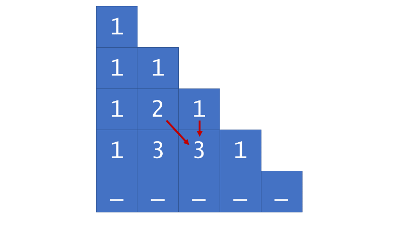

118. Pascal's Triangle

Given a non-negative integer numRows, generate the first numRows of Pascal's triangle.


In Pascal's triangle, each number is the sum of the two numbers directly above it.

**Example:**
```
Input: 5
Output:
[
     [1],
    [1,1],
   [1,2,1],
  [1,3,3,1],
 [1,4,6,4,1]
]
```

# Solution
---
## Approach 1: Dynamic Programming
**Intuition**

If we have the a row of Pascal's triangle, we can easily compute the next row by each pair of adjacent values.

**Algorithm**

Although the algorithm is very simple, the iterative approach to constructing Pascal's triangle can be classified as dynamic programming because we construct each row based on the previous row.

First, we generate the overall triangle list, which will store each row as a sublist. Then, we check for the special case of $0$, as we would otherwise return $[1]$. If $numRows > 0$, then we initialize triangle with $[1]$ as its first row, and proceed to fill the rows as follows:





```python
class Solution:
    def generate(self, num_rows):
        triangle = []

        for row_num in range(num_rows):
            # The first and last row elements are always 1.
            row = [None for _ in range(row_num+1)]
            row[0], row[-1] = 1, 1

            # Each triangle element is equal to the sum of the elements
            # above-and-to-the-left and above-and-to-the-right.
            for j in range(1, len(row)-1):
                row[j] = triangle[row_num-1][j-1] + triangle[row_num-1][j]

            triangle.append(row)

        return triangle
```

**Complexity Analysis**

* Time complexity : $O(numRows^2)$

Although updating each value of triangle happens in constant time, it is performed $O(numRows^2)$ times. To see why, consider how many overall loop iterations there are. The outer loop obviously runs $numRows$ times, but for each iteration of the outer loop, the inner loop runs $rowNum$ times. Therefore, the overall number of triangle updates that occur is $1 + 2 + 3 + \ldots + numRows$, which, according to Gauss' formula, is

\begin{aligned} \frac{numRows(numRows+1)}{2} &= \frac{numRows^2 + numRows}{2} \\ &= \frac{numRows^2}{2} + \frac{numRows}{2} \\ &= O(numRows^2) \end{aligned} 

* Space complexity : $O(numRows^2)$

# Submissions
---
**Solution 1: (Dynamic Programming)**
```
Runtime: 48 ms
Memory Usage: N/A
```
```python
class Solution:
    def generate(self, numRows):
        """
        :type numRows: int
        :rtype: List[List[int]]
        """
        triangle = []

        for row_num in range(numRows):
            # The first and last row elements are always 1.
            row = [None for _ in range(row_num+1)]
            row[0], row[-1] = 1, 1

            # Each triangle element is equal to the sum of the elements
            # above-and-to-the-left and above-and-to-the-right.
            for j in range(1, len(row)-1):
                row[j] = triangle[row_num-1][j-1] + triangle[row_num-1][j]

            triangle.append(row)

        return triangle
                
```

**Solution 2: (DP Bottom-Up)**

0       [1],
        [1, 1],
        [1, 2, 1],
        [1, 3, 3, 1],
        [1, 4, 6, 4, 1]
numRows  0              numRows


```
Runtime: 0 ms, Beats 100.00%
Memory: 9.68 MB, Beats 62.59%
```
```c++
class Solution {
public:
    vector<vector<int>> generate(int numRows) {
        int i, j;
        vector<vector<int>> ans(numRows);
        ans[0].push_back(1);
        if (numRows == 1) {
            return ans;
        }
        for (i = 1; i < numRows; i ++) {
            ans[i].resize(i + 1);
            for (j = 0; j < ans[i].size(); j ++) {
                if (j == 0 || j == ans[i].size() - 1) {
                    ans[i][j] = 1;
                } else {
                    ans[i][j] = ans[i-1][j-1] + ans[i-1][j];
                }
            }
        }
        return ans;
    }
};
```
