20. Valid Parentheses

Given a string containing just the characters `'('`, `')'`, `'{'`, `'}'`, `'['` and `']'`, determine if the input string is valid.

An input string is valid if:

* Open brackets must be closed by the same type of brackets.
* Open brackets must be closed in the correct order.

Note that an empty string is also considered valid.

**Example 1:**
```
Input: "()"
Output: true
```

**Example 2:**
```
Input: "()[]{}"
Output: true
```

**Example 3:**
```
Input: "(]"
Output: false
```

**Example 4:**
```
Input: "([)]"
Output: false
```

**Example 5:**
```
Input: "{[]}"
Output: true
```

# Solution
---
**Intuition**

Imagine you are writing a small compiler for your college project and one of the tasks (or say sub-tasks) for the compiler would be to detect if the parenthesis are in place or not.

The algorithm we will look at in this article can be then used to process all the parenthesis in the program your compiler is compiling and checking if all the parenthesis are in place. This makes checking if a given string of parenthesis is valid or not, an important programming problem.

The expressions that we will deal with in this problem can consist of three different type of parenthesis:
```
(),
{} and
[]
```

Before looking at how we can check if a given expression consisting of these parenthesis is valid or not, let us look at a simpler version of the problem that consists of just one type of parenthesis. So, the expressions we can encounter in this simplified version of the problem are e.g.
```
(((((()))))) -- VALID

()()()()     -- VALID

(((((((()    -- INVALID

((()(())))   -- VALID
```

Let's look at a simple algorithm to deal with this problem.

1. We process the expression one bracket at a time starting from the left.

1. Suppose we encounter an opening bracket i.e. `(`, it may or may not be an invalid expression because there can be a matching ending bracket somewhere in the remaining part of the expression. Here, we simply increment the counter keeping track of left parenthesis till now. `left += 1`

1. If we encounter a closing bracket, this has two meanings:

    1. One, there was no matching opening bracket for this closing bracket and in that case we have an invalid expression. This is the case when `left == 0` i.e. when there are no unmatched left brackets available.
    1. We had some unmatched opening bracket available to match this closing bracket. This is the case when `left > 0` i.e. we have unmatched left brackets available.
    
1. If we encounter a closing bracket i.e. `)` when `left == 0`, then we have an invalid expression on our hands. Else, we decrement `left` thus reducing the number of unmatched `left` parenthesis available.

1. Continue processing the string until all parenthesis have been processed.

1. If in the end we still have unmatched left parenthesis available, this implies an invalid expression.

The reason we discussed this particular algorithm here is because the approach for the original problem derives its inspiration from this very solution. Have a look at the following dry run of the algorithm we discussed to have a better understanding.

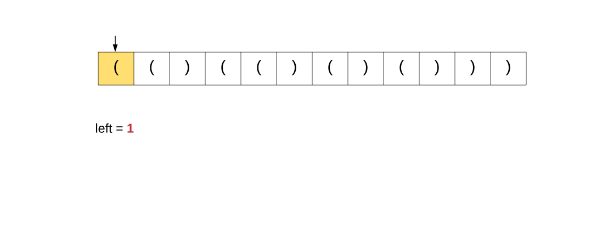
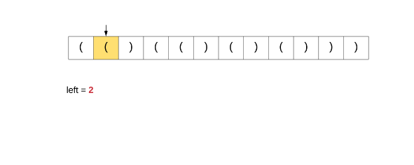
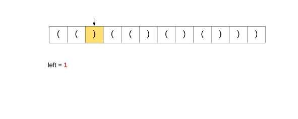

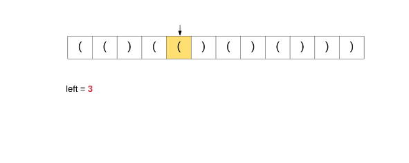
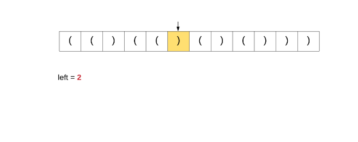

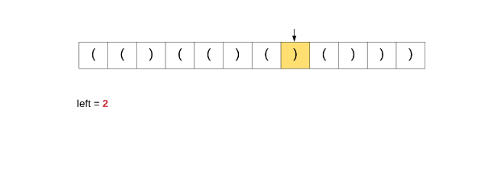


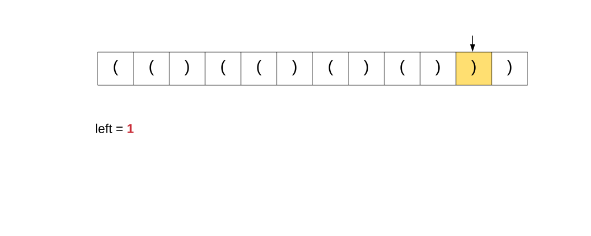
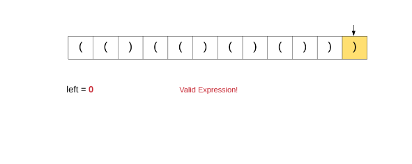

If we try and follow the same approach for our original problem, then it simply won't work. The reason a simple counter based approach works above is because all the parenthesis are of the same type. So when we encounter a closing bracket, we simply assume a corresponding opening matching bracket to be available i.e. if `left > 0`.

But, in our problem, if we encounter say `]`, we don't really know if there is a corresponding opening [ available or not. You could say:

> Why not maintain a separate counter for the different types of parenthesis?

This doesn't work because the relative placement of the parenthesis also matters here. e.g.:
```
[{]
```

If we simply keep counters here, then as soon as we encounter the closing square bracket, we would know there is an unmatched opening square bracket available as well. But, the **closest unmatched opening bracket available is a curly bracket and not a square bracket** and hence the counting approach breaks here.

## Approach 1: Stacks
An interesting property about a valid parenthesis expression is that a sub-expression of a valid expression should also be a valid expression. (Not every sub-expression) e.g.

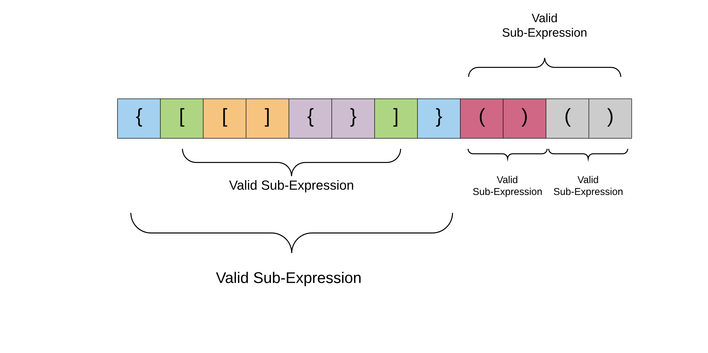

Also, if you look at the above structure carefully, the color coded cells mark the opening and closing pairs of parenthesis. The entire expression is valid, but sub portions of it are also valid in themselves. This lends a sort of a recursive structure to the problem. For e.g. Consider the expression enclosed within the two green parenthesis in the diagram above. The opening bracket at index `1` and the corresponding closing bracket at index `6`.

> What if whenever we encounter a matching pair of parenthesis in the expression, we simply remove it from the expression?

Let's have a look at this idea below where remove the smaller expressions one at a time from the overall expression and since this is a valid expression, we would be left with an empty string in the end.

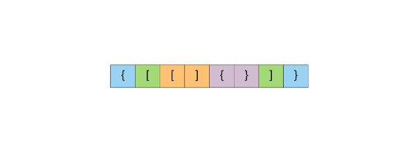
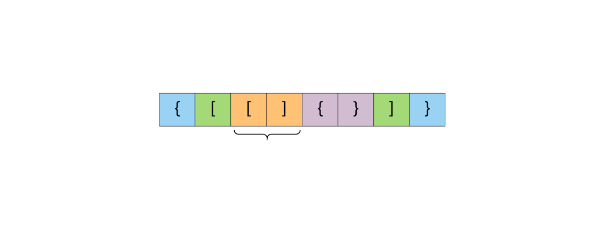

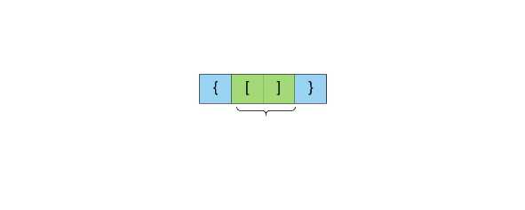


> The stack data structure can come in handy here in representing this recursive structure of the problem. We can't really process this from the inside out because we don't have an idea about the overall structure. But, the stack can help us process this recursively i.e. from outside to inwards.

Let us have a look at the algorithm for this problem using stacks as the intermediate data structure.

**Algorithm**

1. Initialize a stack S.
1. Process each bracket of the expression one at a time.
1. If we encounter an opening bracket, we simply push it onto the stack. This means we will process it later, let us simply move onto the **sub-expression** ahead.
1. If we encounter a closing bracket, then we check the element on top of the stack. If the element at the top of the stack is an opening bracket `of the same type`, then we pop it off the stack and continue processing. Else, this implies an invalid expression.
1. In the end, if we are left with a stack still having elements, then this implies an invalid expression.

We'll have a look a dry run for the algorithm and then move onto the implementation.

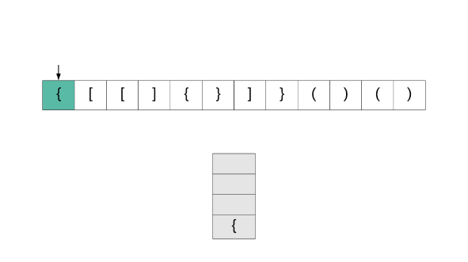
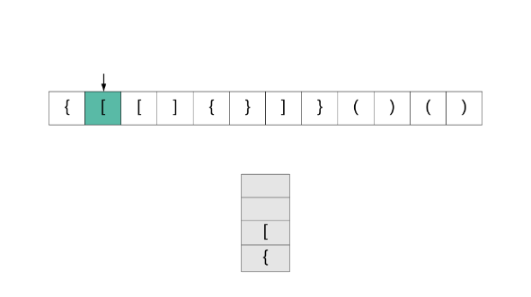
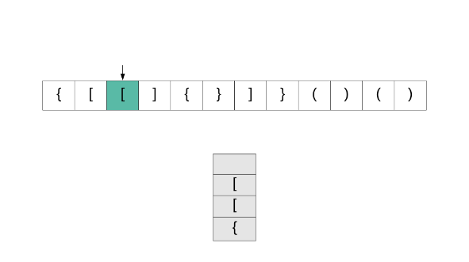
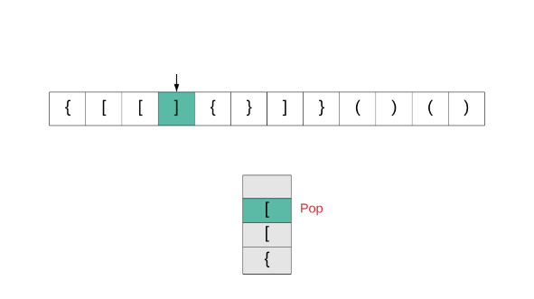

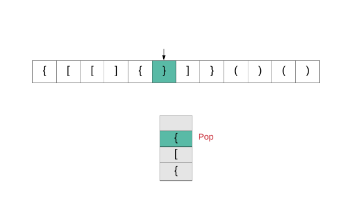

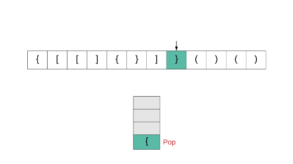
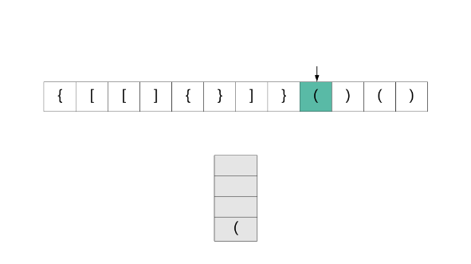
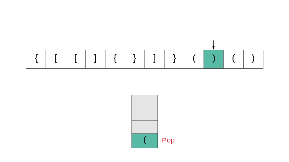
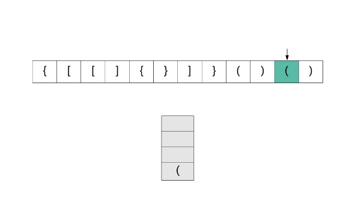
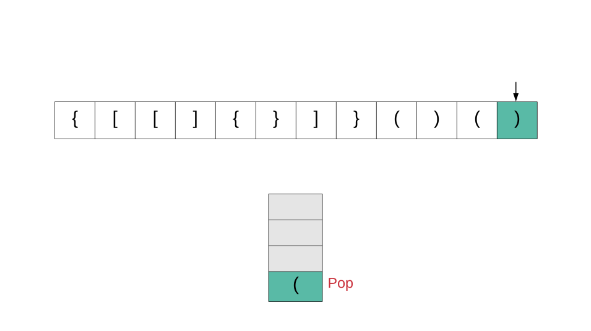

Let us now have a look at the implementation for this algorithm.

```python
class Solution(object):
    def isValid(self, s):
        """
        :type s: str
        :rtype: bool
        """

        # The stack to keep track of opening brackets.
        stack = []

        # Hash map for keeping track of mappings. This keeps the code very clean.
        # Also makes adding more types of parenthesis easier
        mapping = {")": "(", "}": "{", "]": "["}

        # For every bracket in the expression.
        for char in s:

            # If the character is an closing bracket
            if char in mapping:

                # Pop the topmost element from the stack, if it is non empty
                # Otherwise assign a dummy value of '#' to the top_element variable
                top_element = stack.pop() if stack else '#'

                # The mapping for the opening bracket in our hash and the top
                # element of the stack don't match, return False
                if mapping[char] != top_element:
                    return False
            else:
                # We have an opening bracket, simply push it onto the stack.
                stack.append(char)

        # In the end, if the stack is empty, then we have a valid expression.
        # The stack won't be empty for cases like ((()
        return not stack
```

**Complexity analysis**

* Time complexity : $O(n)$ because we simply traverse the given string one character at a time and push and pop operations on a stack take $O(1)$ time.

* Space complexity : $O(n)$ as we push all opening brackets onto the stack and in the worst case, we will end up pushing all the brackets onto the stack. e.g. `((((((((((`.

# Submissions
---
**Solution: (Stack)**
```
Runtime: 28 ms
Memory Usage: 12.6 MB
```
```python
class Solution:
    def isValid(self, s):
        """
        :type s: str
        :rtype: bool
        """
        # The stack to keep track of opening brackets.
        stack = []

        # Hash map for keeping track of mappings. This keeps the code very clean.
        # Also makes adding more types of parenthesis easier
        mapping = {")": "(", "}": "{", "]": "["}

        # For every bracket in the expression.
        for char in s:

            # If the character is an closing bracket
            if char in mapping:

                # Pop the topmost element from the stack, if it is non empty
                # Otherwise assign a dummy value of '#' to the top_element variable
                top_element = stack.pop() if stack else '#'

                # The mapping for the opening bracket in our hash and the top
                # element of the stack don't match, return False
                if mapping[char] != top_element:
                    return False
            else:
                # We have an opening bracket, simply push it onto the stack.
                stack.append(char)

        # In the end, if the stack is empty, then we have a valid expression.
        # The stack won't be empty for cases like ((()
        return not stack
```

**Solution 2: (Stack)**
```
Runtime: 0 ms
Memory Usage: 5.6 MB
```
```c
bool isValid(char * s){
    char *stack = malloc(strlen(s)*sizeof(char));
    int cnt = 0, i = 0;
    while (i < strlen(s)) {
        if (s[i] == '(')
            stack[cnt++] = ')';
        else if (s[i] == '[')
            stack[cnt++] = ']';
        else if (s[i] == '{')
            stack[cnt++] = '}';
        else {
            if (cnt > 0) {
                if (s[i] != stack[--cnt])
                    return false;
            } else
                return false;
        }
        i += 1;
    }
    return cnt == 0;
}
```
