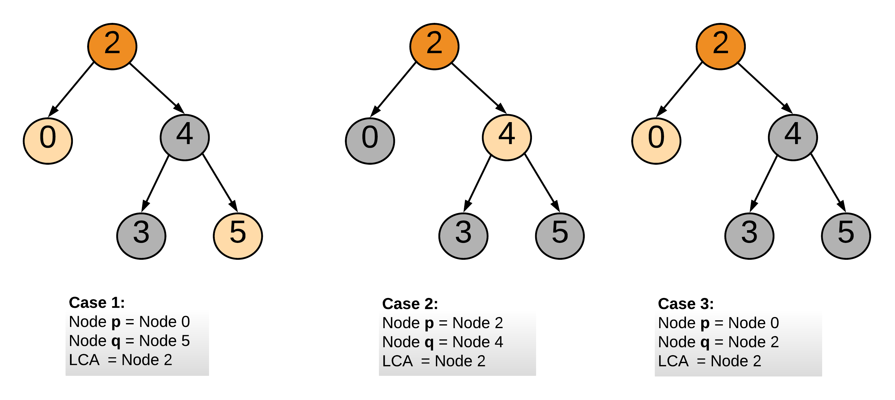

235. Lowest Common Ancestor of a Binary Search Tree

Given a binary search tree (BST), find the lowest common ancestor (LCA) of two given nodes in the BST.

According to the definition of LCA on Wikipedia: “The lowest common ancestor is defined between two nodes p and q as the lowest node in T that has both p and q as descendants (where we allow **a node to be a descendant of itself)**.”

Given binary search tree:  root = `[6,2,8,0,4,7,9,null,null,3,5]`


 

**Example 1:**
```
Input: root = [6,2,8,0,4,7,9,null,null,3,5], p = 2, q = 8
Output: 6
Explanation: The LCA of nodes 2 and 8 is 6.
```

**Example 2:**
```
Input: root = [6,2,8,0,4,7,9,null,null,3,5], p = 2, q = 4
Output: 2
Explanation: The LCA of nodes 2 and 4 is 2, since a node can be a descendant of itself according to the LCA definition.
``` 

**Note:**

* All of the nodes' values will be unique.
* `p` and `q` are different and both values will exist in the BST.

# Solution
---
We can solve this using the approaches to find LCA in a binary tree.

But, binary search tree's property could be utilized, to come up with a better algorithm.

Lets review properties of a BST:

>1. Left subtree of a node N contains nodes whose values are lesser than or equal to node N's value.
>1. Right subtree of a node N contains nodes whose values are greater than node N's value.
>1. Both left and right subtrees are also BSTs.

## Approach 1: Recursive Approach
**Intuition**

Lowest common ancestor for two nodes `p` and `q` would be the last ancestor node common to both of them. Here `last` is defined in terms of the depth of the node. The below diagram would help in understanding what `lowest` means.


Note: One of `p` or `q` would be in the left subtree and the other in the right subtree of the LCA node.

Following cases are possible:



**Algorithm**

1. Start traversing the tree from the root node.
1. If both the nodes `p` and `q` are in the right subtree, then continue the search with right subtree starting step 1.
1. If both the nodes `p` and `q` are in the left subtree, then continue the search with left subtree starting step 1.
1. If both step 2 and step 3 are not true, this means we have found the node which is common to node p's and q's subtrees. and hence we return this common node as the LCA.

```python
class Solution:
    def lowestCommonAncestor(self, root, p, q):
        """
        :type root: TreeNode
        :type p: TreeNode
        :type q: TreeNode
        :rtype: TreeNode
        """
        # Value of current node or parent node.
        parent_val = root.val

        # Value of p
        p_val = p.val

        # Value of q
        q_val = q.val

        # If both p and q are greater than parent
        if p_val > parent_val and q_val > parent_val:    
            return self.lowestCommonAncestor(root.right, p, q)
        # If both p and q are lesser than parent
        elif p_val < parent_val and q_val < parent_val:    
            return self.lowestCommonAncestor(root.left, p, q)
        # We have found the split point, i.e. the LCA node.
        else:
            return root
```

**Complexity Analysis**

* Time Complexity: $O(N)$, where $N$ is the number of nodes in the BST. In the worst case we might be visiting all the nodes of the BST.

* Space Complexity: $O(N)$. This is because the maximum amount of space utilized by the recursion stack would be $N$ since the height of a skewed BST could be $N$.

## Approach 2: Iterative Approach
**Algorithm**

The steps taken are also similar to approach 1. The only difference is instead of recursively calling the function, we traverse down the tree iteratively. This is possible without using a stack or recursion since we don't need to backtrace to find the LCA node. In essence of it the problem is iterative, it just wants us to find the split point. The point from where `p` and `q` won't be part of the same subtree or when one is the parent of the other.

```python
class Solution:
    def lowestCommonAncestor(self, root, p, q):
        """
        :type root: TreeNode
        :type p: TreeNode
        :type q: TreeNode
        :rtype: TreeNode
        """

        # Value of p
        p_val = p.val

        # Value of q
        q_val = q.val

        # Start from the root node of the tree
        node = root

        # Traverse the tree
        while node:

            # Value of current node or parent node.
            parent_val = node.val

            if p_val > parent_val and q_val > parent_val:    
                # If both p and q are greater than parent
                node = node.right
            elif p_val < parent_val and q_val < parent_val:
                # If both p and q are lesser than parent
                node = node.left
            else:
                # We have found the split point, i.e. the LCA node.
                return node
```

**Complexity Analysis**

* Time Complexity : $O(N)$, where $N$ is the number of nodes in the BST. In the worst case we might be visiting all the nodes of the BST.

* Space Complexity : $O(1)$.

# Submissions
---
**Solution:**
```
Runtime: 80 ms
Memory Usage: 16.8 MB
```
```python
# Definition for a binary tree node.
# class TreeNode:
#     def __init__(self, x):
#         self.val = x
#         self.left = None
#         self.right = None

class Solution:
    def lowestCommonAncestor(self, root: 'TreeNode', p: 'TreeNode', q: 'TreeNode') -> 'TreeNode':
        # Value of current node or parent node.
        parent_val = root.val

        # Value of p
        p_val = p.val

        # Value of q
        q_val = q.val

        # If both p and q are greater than parent
        if p_val > parent_val and q_val > parent_val:    
            return self.lowestCommonAncestor(root.right, p, q)
        # If both p and q are lesser than parent
        elif p_val < parent_val and q_val < parent_val:    
            return self.lowestCommonAncestor(root.left, p, q)
        # We have found the split point, i.e. the LCA node.
        else:
            return root
```

**Solution:**
```
Runtime: 68 ms
Memory Usage: 16.6 MB
```
```python
# Definition for a binary tree node.
# class TreeNode:
#     def __init__(self, x):
#         self.val = x
#         self.left = None
#         self.right = None

class Solution:
    def lowestCommonAncestor(self, root: 'TreeNode', p: 'TreeNode', q: 'TreeNode') -> 'TreeNode':
        # Value of p
        p_val = p.val

        # Value of q
        q_val = q.val

        # Start from the root node of the tree
        node = root

        # Traverse the tree
        while node:

            # Value of current node or parent node.
            parent_val = node.val

            if p_val > parent_val and q_val > parent_val:    
                # If both p and q are greater than parent
                node = node.right
            elif p_val < parent_val and q_val < parent_val:
                # If both p and q are lesser than parent
                node = node.left
            else:
                # We have found the split point, i.e. the LCA node.
                return node
```