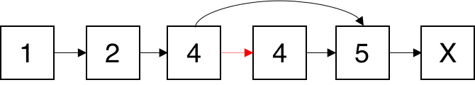

237. Delete Node in a Linked List

Write a function to delete a node (except the tail) in a singly linked list, given only access to that node.

Given linked list -- head = [4,5,1,9], which looks like following:


 

**Example 1:**
```
Input: head = [4,5,1,9], node = 5
Output: [4,1,9]
Explanation: You are given the second node with value 5, the linked list should become 4 -> 1 -> 9 after calling your function.
```

**Example 2:**
```
Input: head = [4,5,1,9], node = 1
Output: [4,5,9]
Explanation: You are given the third node with value 1, the linked list should become 4 -> 5 -> 9 after calling your function.
```

**Note:**

* The linked list will have at least two elements.
* All of the nodes' values will be unique.
* The given node will not be the tail and it will always be a valid node of the linked list.
* Do not return anything from your function.

# Solution
---
## Approach: Swap with Next Node [Accepted]
The usual way of deleting a node node from a linked list is to modify the next pointer of the node before it, to point to the node after it.


Since we do not have access to the node before the one we want to delete, we cannot modify the next pointer of that node in any way. Instead, we have to replace the value of the node we want to delete with the value in the node after it, and then delete the node after it.





Because we know that the node we want to delete is not the tail of the list, we can guarantee that this approach is possible.

**Java**
```java
public void deleteNode(ListNode node) {
    node.val = node.next.val;
    node.next = node.next.next;
}
```

**Complexity Analysis**

* Time and space complexity are both $O(1)$.

Analysis written by: @noran

# Submissions
---
**Solution 1: (Linked List)**
```
Runtime: 44 ms
Memory Usage: N/A
```
```python
# Definition for singly-linked list.
# class ListNode:
#     def __init__(self, x):
#         self.val = x
#         self.next = None

class Solution:
    def deleteNode(self, node):
        """
        :type node: ListNode
        :rtype: void Do not return anything, modify node in-place instead.
        """
        node.val = node.next.val
        node.next = node.next.next
        
```