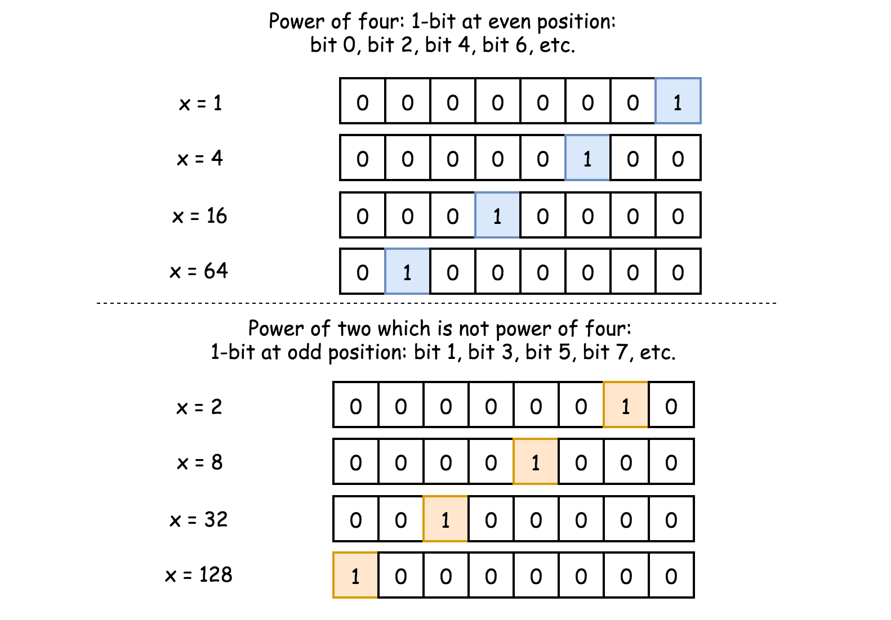

342. Power of Four

Given an integer (signed 32 bits), write a function to check whether it is a power of 4.

**Example 1:**
```
Input: 16
Output: true
```

**Example 2:**
```
Input: 5
Output: false
```

**Follow up:** Could you solve it without loops/recursion?

# Solution
---
## Overview
**Prerequisites**

This bitwise trick will be used as something already known:

How to check if the number is a power of two : `x > 0 and x & (x - 1) == 0`.

Please check the article Power of Two for the detailed explanation.

**Intuition**

There is an obvious $\mathcal{O}(\log N)$ time solution and we're not going to discuss it here.

```python
class Solution(object):
    def isPowerOfTwo(self, n):
        if n == 0:
            return False
        while n % 4 == 0:
            n /= 4
        return n == 1
```
Let's discuss $\mathcal{O}(1)$ time and \mathcal{O}(1)O(1) space solutions only.

## Approach 1: Brute Force + Precomputations
Let's precompute all possible answers, as we once did for the problem Nth Tribonacci Number.

Input number is known to be signed 32 bits integer, i.e. $x \le 2^{31} - 1$. Hence the max power of four to be considered is $[\log_4\left(2^{31} - 1\right)] = 15$. Voila, here is all 16 possible answers: $4^0$, $4^1$, $4^2$, ..., $4^{15}$. Let's precompute them all, and then during the runtime just check if input number is in the list of answers.

```python
class Powers:
    def __init__(self):
        max_power = 15
        self.nums = nums = [1] * (max_power + 1)
        for i in range(1, max_power + 1):
            nums[i] = 4 * nums[i - 1]

class Solution:
    p = Powers()
    def isPowerOfFour(self, num: int) -> bool:
        return num in self.p.nums
```
**Complexity Analysis**

* Time complexity: $\mathcal{O}(1)$.

* Space complexity: $\mathcal{O}(1)$.

## Approach 2: Math
If num is a power of four $x = 4^a$, then $a = \log_4 x = \frac{1}{2}\log_2 x$ is an integer. Hence let's simply check if $\log_2 x$ is an even number.

```python
from math import log2
class Solution:
    def isPowerOfFour(self, num: int) -> bool:
        return num > 0 and log2(num) % 2 == 0
```
**Complexity Analysis**

* Time complexity : $\mathcal{O}(1)$.

* Space complexity : $\mathcal{O}(1)$.

## Approach 3: Bit Manipulation
Let's first check if num is a power of two: x > 0 and x & (x - 1) == 0.

Now the problem is to distinguish between even powers of two (when $x$ is a power of four) and odd powers of two (when $x$ is not a power of four). In binary representation both cases are single 1-bit followed by zeros.

>What is the difference? In the first case (power of four), 1-bit is at even position: bit 0, bit 2, bit 4, etc. In the second case, at odd position.



Hence power of four would make a zero in a bitwise AND with number $(101010...10)_2$:

$4^a \land (101010...10)_2 == 0$

How long should be $(101010...10)_2$ if $x$ is a signed integer? 32 bits. To write shorter, in 8 charaters instead of 32, it's common to use hexadecimal representation: $(101010...10)_2 = (aaaaaaaa)_{16}$.

$x \land (aaaaaaaa)_{16} == 0$

```python
class Solution:
    def isPowerOfFour(self, num: int) -> bool:
        return num > 0 and num & (num - 1) == 0 and num & 0xaaaaaaaa == 0
```

**Complexity Analysis**

* Time complexity : $\mathcal{O}(1)$.

* Space complexity : $\mathcal{O}(1)$.

## Approach 4: Bit Manipulation + Math
Let's first check if $x$ is a power of two: x > 0 and x & (x - 1) == 0. Now one could be sure that $x = 2^a$. Though $x$ is a power of four only if $a$ is even.

Next step is to consider both cases $a = 2k$ and $a = 2k + 1$, and to compute $x$ modulo after division by three:

$(2^{2k} \mod 3) = (4^k \mod 3) = ((3 + 1)^k \mod 3) = 1$
$((2^{2k + 1}) \mod 3) = ((2 \times 4^k) \mod 3) = ((2 \times(3 + 1)^k) \mod 3) = 2$

>If $x$ is a power of two and x % 3 == 1, then $x$ is a power of four.

```python
class Solution:
    def isPowerOfFour(self, num: int) -> bool:
        return num > 0 and num & (num - 1) == 0 and num % 3 == 1
```

**How this works: mod arithmetic**

To show the idea, let's compute $x = 2^{2k} \mod 3$.

First, $2^{2k} = {2^2}^k = 4^k$. Second, since $4 = 3 + 1$, $x$ could be rewritten as

$x = ((3 + 1)^k \mod 3)$

Let's decompose

$(3 + 1)^k = (3 + 1) \times (3 + 1)^{k - 1} = 3 \times (3 + 1)^{k - 1} + (3 + 1)^{k - 1}$.

The first term is divisible by 3, i.e. $(3 \times (3 + 1)^{k - 1}) \mod 3 = 0$. Hence

$x = ((3 + 1)^{k - 1} \mod 3)$

One could continue like this k -> k - 1 -> k - 2 -> ... -> 1 and finally rewrite xx as

$x = ((3 + 1)^1 \mod 3) = 1$.

The job is done. Now $y = 2^{2k + 1} \mod 3$ is simple, because if $x \mod 3 = 1$, then $y \mod 3 = 2x \mod 3 = 2$.

**Complexity Analysis**

* Time complexity : $\mathcal{O}(1)$.

* Space complexity : $\mathcal{O}(1)$.

# Submissions
---
**Solution 1: (Bit Manipulation, String)**
```
Runtime: 40 ms
Memory Usage: 12.6 MB
```
```python
class Solution:
    def isPowerOfFour(self, num: int) -> bool:
        if num < 0:
            return False

        s = bin(num).replace("0b", "")
        # number power of 4 has total odd number of bits with only '1' bit

        if s.count("1") == 1:
            if len(s) % 2 == 1:
                return True
            else:
                return False
        else:
            return False
```

**Solution 2: (Bit Manipulation, String)**
```
Runtime: 24 ms
Memory Usage: 12.5 MB
```
```python
class Solution:
    def isPowerOfFour(self, num: int) -> bool:
        temp = bin(num).split('1')
        return num > 0 and len(temp) == 2 and not len(temp[-1]) % 2
```

**Solution 3: (Bit Manipulation)**
```
Runtime: 0 ms, Beats 100.00%
Memory: 7.94 MB, Beats 18.14%
```
```c++
class Solution {
public:
    bool isPowerOfFour(int n) {
        long long a = 1;
        while (a <= n) {
            if (a == n) {
                return true;
            }
            a <<= 2;
        }
        return false;
    }
};
```

**Solution 4: (Math)**
```
Runtime: 0 ms, Beats 100.00%
Memory: 7.94 MB, Beats 18.14%
```
```c++
class Solution {
public:
    bool isPowerOfFour(int n) {
        return n > 0 && (n&(n-1)) == 0 && (n-1)%3 == 0;
    }
};
```
