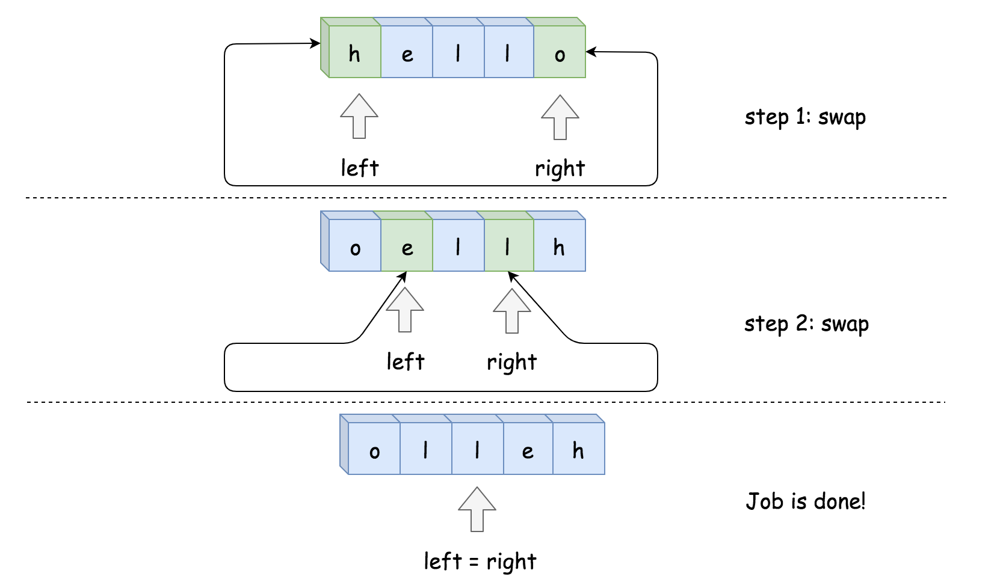

344. Reverse String

Write a function that reverses a string. The input string is given as an array of characters `char[]`.

Do not allocate extra space for another array, you must do this by **modifying the input array** in-place with O(1) extra memory.

You may assume all the characters consist of printable ascii characters.

 

**Example 1:**
```
Input: ["h","e","l","l","o"]
Output: ["o","l","l","e","h"]
```

**Example 2:**
```
Input: ["H","a","n","n","a","h"]
Output: ["h","a","n","n","a","H"]
```

# Solution
---
## Overview
Life is short, use Python. (c)
```python
class Solution:
    def reverseString(self, s):
        s.reverse()
```
Speaking seriously, let's use this problem to discuss two things:

* Does in-place mean constant space complexity?

* Two Pointers approach.

## Approach 1: Recursion, In-Place, \mathcal{O}(N)O(N) Space
Does in-place mean constant space complexity?

No. By definition, an in-place algorithm is an algorithm which transforms input using no auxiliary data structure.

The tricky part is that space is used by many actors, not only by data structures. The classical example is to use recursive function without any auxiliary data structures.

Is it in-place? Yes.

Is it constant space? No, because of recursion stack.

**Algorithm**

Here is an example. Let's implement recursive function `helper` which receives two pointers, `left` and `right`, as arguments.

* Base case: if `left >= right`, do nothing.

* Otherwise, swap `s[left]` and `s[right]` and call `helper(left + 1, right - 1)`.

To solve the problem, call `helper` function passing the head and tail indexes as arguments: return `helper(0, len(s) - 1)`.

**Implementation**
```python
class Solution:
    def reverseString(self, s):
        def helper(left, right):
            if left < right:
                s[left], s[right] = s[right], s[left]
                helper(left + 1, right - 1)

        helper(0, len(s) - 1)
```

**Complexity Analysis**

* Time complexity : $\mathcal{O}(N)$ time to perform $N/2$ swaps.

* Space complexity : $\mathcal{O}(N)$ to keep the recursion stack.

## Approach 2: Two Pointers, Iteration, \mathcal{O}(1)O(1) Space
**Two Pointers Approach**

In this approach, two pointers are used to process two array elements at the same time. Usual implementation is to set one pointer in the beginning and one at the end and then to move them until they both meet.

Sometimes one needs to generalize this approach in order to use three pointers, like for classical Sort Colors problem.

**Algorithm**

Set pointer `left` at index `0`, and pointer `right` at index `n - 1`, where `n` is a number of elements in the array.

* While `left` < `right`:

    * Swap `s[left]` and `s[right]`.

    * Move `left` pointer one step right, and `right` pointer one step left.



```python
class Solution:
    def reverseString(self, s):
        left, right = 0, len(s) - 1
        while left < right:
            s[left], s[right] = s[right], s[left]
            left, right = left + 1, right - 1
```
**Complexity Analysis**

* Time complexity : $\mathcal{O}(N)$ to swap $N/2$ element.

* Space complexity : $\mathcal{O}(1)$, it's a constant space solution.

# Submissions
---
**Solution 1: (String)**
```
Runtime: 212 ms
Memory Usage: 17.2 MB
```
```python
class Solution:
    def reverseString(self, s: List[str]) -> None:
        """
        Do not return anything, modify s in-place instead.
        """
        s.reverse()
```

**Solution: (DFS)**
```
Runtime: 228 ms
Memory Usage: 42.8 MB
```
```python
class Solution:
    def reverseString(self, s: List[str]) -> None:
        """
        Do not return anything, modify s in-place instead.
        """
        def helper(left, right):
            if left < right:
                s[left], s[right] = s[right], s[left]
                helper(left + 1, right - 1)

        helper(0, len(s) - 1)
```

**Solution: (Two Pointers)**
```
Runtime: 216 ms
Memory Usage: 17.2 MB
```
```python
class Solution:
    def reverseString(self, s: List[str]) -> None:
        """
        Do not return anything, modify s in-place instead.
        """
        left, right = 0, len(s) - 1
        while left < right:
            s[left], s[right] = s[right], s[left]
            left, right = left + 1, right - 1
```