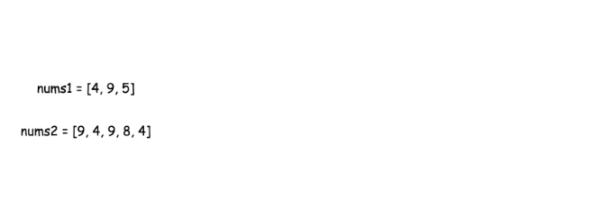
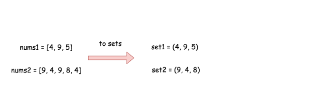
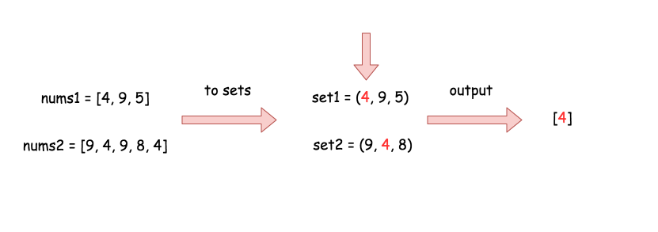
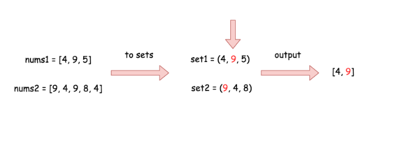
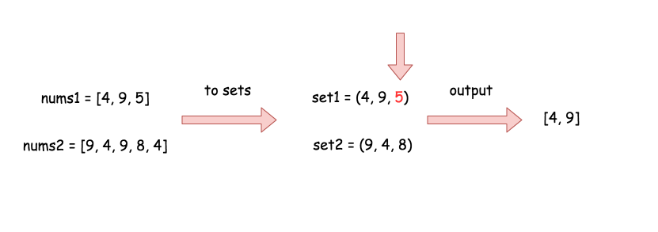
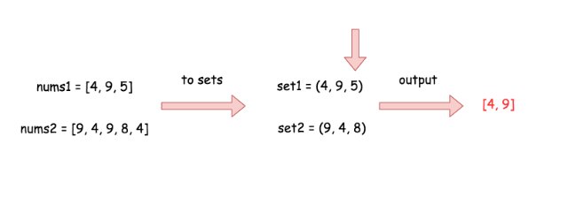

349. Intersection of Two Arrays

Given two arrays, write a function to compute their intersection.

**Example 1:**
```
Input: nums1 = [1,2,2,1], nums2 = [2,2]
Output: [2]
```

**Example 2:**
```
Input: nums1 = [4,9,5], nums2 = [9,4,9,8,4]
Output: [9,4]
```

**Note:**

* Each element in the result must be unique.
* The result can be in any order.

# Solution
---
Approach 1: Two Sets
Intuition

The naive approach would be to iterate along the first array `nums1` and to check for each value if this value in `nums2` or not. If yes - add the value to output. Such an approach would result in a pretty bad $\mathcal{O}(n \times m)$ time complexity, where n and m are arrays' lengths.

>To solve the problem in linear time, let's use the structure set, which provides in/contains operation in $\mathcal{O}(1)$ time in average case.

The idea is to convert both arrays into sets, and then iterate over the smallest set checking the presence of each element in the larger set. Time complexity of this approach is $\mathcal{O}(n + m)$ in the average case.








```python
class Solution:
    def set_intersection(self, set1, set2):
        return [x for x in set1 if x in set2]
        
    def intersection(self, nums1, nums2):
        """
        :type nums1: List[int]
        :type nums2: List[int]
        :rtype: List[int]
        """  
        set1 = set(nums1)
        set2 = set(nums2)
        
        if len(set1) < len(set2):
            return self.set_intersection(set1, set2)
        else:
            return self.set_intersection(set2, set1)
```

**Complexity Analysis**

* Time complexity : $\mathcal{O}(n + m)$, where n and m are arrays' lengths. $\mathcal{O}(n)$ time is used to convert `nums1` into set, $\mathcal{O}(m)$ time is used to convert `nums2`, and contains/in operations are $\mathcal{O}(1)$ in the average case.

* Space complexity : $\mathcal{O}(m + n)$ in the worst case when all elements in the arrays are different.

## Approach 2: Built-in Set Intersection
**Intuition**

There are built-in intersection facilities, which provide $\mathcal{O}(n + m)$ time complexity in the average case and $\mathcal{O}(n \times m)$ time complexity in the worst case.

>In Python it's intersection operator, in Java - `retainAll()` function.

**Implementation**

```python
class Solution:
    def intersection(self, nums1, nums2):
        """
        :type nums1: List[int]
        :type nums2: List[int]
        :rtype: List[int]
        """  
        set1 = set(nums1)
        set2 = set(nums2)
        return list(set2 & set1)
```

**Complexity Analysis**

* Time complexity : $\mathcal{O}(n + m)$ in the average case and $\mathcal{O}(n \times m)$ in the worst case when load factor is high enough.

* Space complexity : $\mathcal{O}(n + m)$ in the worst case when all elements in the arrays are different.

# Submissions
---
**Solution 1:**
```
Runtime: 40 ms
Memory Usage: 12.8 MB
```
```python
class Solution:
    def intersection(self, nums1: List[int], nums2: List[int]) -> List[int]:
        return set(nums1) & set(nums2)
```