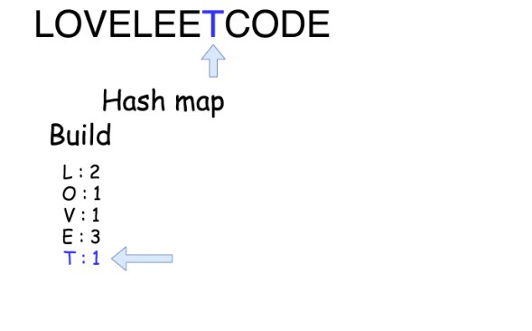

387. First Unique Character in a String

Given a string, find the first non-repeating character in it and return it's index. If it doesn't exist, return -1.

**Examples:**
```
s = "leetcode"
return 0.

s = "loveleetcode",
return 2.
```

**Note:** You may assume the string contain only lowercase letters.

# Solution
---
## Approach 1: Linear time solution
The best possible solution here could be of a linear time because to ensure that the character is unique you have to check the whole string anyway.

The idea is to go through the string and save in a hash map the number of times each character appears in the string. That would take $\mathcal{O}(N)$ time, where `N` is a number of characters in the string.

And then we go through the string the second time, this time we use the hash map as a reference to check if a character is unique or not.
If the character is unique, one could just return its index. The complexity of the second iteration is $\mathcal{O}(N)$ as well.





```python
class Solution:
    def firstUniqChar(self, s: str) -> int:
        """
        :type s: str
        :rtype: int
        """
        # build hash map : character and how often it appears
        count = collections.Counter(s)
        
        # find the index
        for idx, ch in enumerate(s):
            if count[ch] == 1:
                return idx     
        return -1
```

**Complexity Analysis**

* Time complexity : $\mathcal{O}(N)$ since we go through the string of length `N` two times.

* Space complexity : $\mathcal{O}(N)$ since we have to keep a hash map with `N` elements.

# Submissions
---
**Solution 1: (Linear time solution, Counter)**
```
Runtime: 116 ms
Memory Usage: 12.9 MB
```
```python
class Solution:
    def firstUniqChar(self, s):
        """
        :type s: str
        :rtype: int
        """            
        # build hash map : character and how often it appears
        count = collections.Counter(s)

        # find the index
        for idx, ch in enumerate(s):
            if count[ch] == 1:
                return idx     
        return -1
```

**Solution 2: (Counter)**
```
Runtime: 24 ms
Memory: 11.72 MB
```
```c++
class Solution {
public:
    int firstUniqChar(string s) {
        int dp[26] = {0};
        for (char c: s) {
            dp[c-'a'] += 1;
        }
        for (int i = 0; i < s.size(); i ++) {
            if (dp[s[i]-'a'] == 1) {
                return i;
            }
        }
        return -1;
    }
};
```
