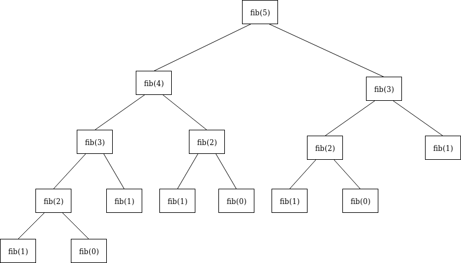

509. Fibonacci Number

The **Fibonacci numbers**, commonly denoted F(n) form a sequence, called the **Fibonacci sequence**, such that each number is the sum of the two preceding ones, starting from `0` and `1`. That is,
```
F(0) = 0,   F(1) = 1
F(N) = F(N - 1) + F(N - 2), for N > 1.
```
Given `N`, calculate `F(N)`.

**Example 1:**
```
Input: 2
Output: 1
Explanation: F(2) = F(1) + F(0) = 1 + 0 = 1.
```

**Example 2:**
```
Input: 3
Output: 2
Explanation: F(3) = F(2) + F(1) = 1 + 1 = 2.
```

**Example 3:**
```
Input: 4
Output: 3
Explanation: F(4) = F(3) + F(2) = 2 + 1 = 3.
``` 

**Note:**

* `0 ≤ N ≤ 30`.

# Solution
---
## Approach 1: Recursion
**Intuition**

Use recursion to compute the Fibonacci number of a given integer.



Figure 1. An example tree representing what fib(5) would look like

**Algorithm**

* Check if the provided input value, `N`, is less than or equal to `1`. If `true`, return `N`.

* Otherwise, the function `fib(int N)` calls itself, with the result of the 2 previous numbers being added to each other, passed in as the argument. This is derived directly from the recurrence relation: $F_{n} = F_{n-1} + F_{n-2}$

* Do this until all numbers have been computed, then return the resulting answer.

```python
class Solution:
    def fib(self, N: int) -> int:
        if N <= 1:
            return N
        return self.fib(N-1) + self.fib(N-2)
```

**Complexity Analysis**

* Time complexity : $O(2^N)$. This is the slowest way to solve the Fibonacci Sequence because it takes exponential time. The amount of operations needed, for each level of recursion, grows exponentially as the depth approaches `N`.

* Space complexity : $O(N)$. We need space proportionate to `N` to account for the max size of the stack, in memory. This stack keeps track of the function calls to `fib(N)`. This has the potential to be bad in cases that there isn't enough physical memory to handle the increasingly growing stack, leading to a `StackOverflowError`. The Java docs have a good explanation of this, describing it as an error that occurs because an application recurses too deeply.

## Approach 2: Bottom-Up Approach using Memoization
**Intuition**

Improve upon the recursive option by using iteration, still solving for all of the sub-problems and returning the answer for `N`, using already computed Fibonacci values. In using a bottom-up approach, we can iteratively compute and store the values, only returning once we reach the result.

**Algorithm**

* If `N` is less than or equal to `1`, return `N`
* Otherwise, iterate through `N`, storing each computed answer in an array along the way.
* Use this array as a reference to the 2 previous numbers to calculate the current Fibonacci number.
* Once we've reached the last number, return it's Fibonacci number.

```python
class Solution:
    def fib(self, N: int) -> int:
        if N <= 1:
            return N
        return self.memoize(N)

    def memoize(self, N: int) -> {}:
        cache = {0: 0, 1: 1}

        # Since range is exclusive and we want to include N, we need to put N+1.
        for i in range(2, N+1):
            cache[i] = cache[i-1] + cache[i-2]

        return cache[N]
```

**Complexity Analysis**

* Time complexity : $O(N)$. Each number, starting at `2` up to and including `N`, is visited, computed and then stored for $O(1)$ access later on.

* Space complexity : $O(N)$. The size of the data structure is proportionate to `N`.

## Approach 3: Top-Down Approach using Memoization
**Intuition**

Solve for all of the sub-problems, use memoization to store the pre-computed answers, then return the answer for `N`. We will leverage recursion, but in a smarter way by not repeating the work to calculate existing values.

**Algorithm**

* Check if `N` <= 1. If it is, return `N`.
* Call and return `memoize(N)`
* If `N` exists in the map, return the cached value for `N`
* Otherwise set the value of `N`, in our mapping, to the value of `memoize(N-1) + memoize(N-2)`

```python
class Solution:
    def fib(self, N: int) -> int:
        if N <= 1:
            return N
        self.cache = {0: 0, 1: 1}
        return self.memoize(N)

    def memoize(self, N: int) -> {}:
        if N in self.cache.keys():
            return self.cache[N]
        self.cache[N] = self.memoize(N-1) + self.memoize(N-2)
        return self.memoize(N)
```

**Complexity Analysis**

* Time complexity : $O(N)$. Each number, starting at `2` up to and including `N`, is visited, computed and then stored for $O(1)$ access later on.

* Space complexity : $O(N)$. The size of the stack in memory is proportionate to `N`.

## Approach 4: Iterative Top-Down Approach
**Intuition**

Let's get rid of the need to use all of that space and instead use the minimum amount of space required. We can achieve $O(1)$ space complexity by only storing the value of the two previous numbers and updating them as we iterate to `N`.

**Algorithm**

* Check if `N` <= 1, if it is then we should return `N`.
* Check if `N` == 2, if it is then we should return `1` since `N` is `2` and `fib(2-1) + fib(2-2)` equals `1 + 0 = 1`.
* To use an iterative approach, we need at least `3` variables to store each state `fib(N)`, `fib(N-1)` and `fib(N-2)`.
* Preset the initial values:
    * Initialize current with `0`.
    * Initialize `prev1` with `1`, since this will represent `fib(N-1)` when computing the current value.
    * Initialize `prev2` with `1`, since this will represent `fib(N-2)` when computing the current value.
* Iterate, incrementally by `1`, all the way up to and including `N`. Starting at `3`, since `0`, `1` and `2` are pre-computed.
* Set the current value to `fib(N-1) + fib(N-2)` because that is the value we are currently computing.
* Set the `prev2` value to `fib(N-1)`.
* Set the `prev1` value to `current_value`.
* When we reach `N+1`, we will exit the loop and return the previously set current value.

```python
class Solution:
    def fib(self, N: int) -> int:
        if (N <= 1):
            return N
        if (N == 2):
            return 1

        current = 0
        prev1 = 1
        prev2 = 1

        # Since range is exclusive and we want to include N, we need to put N+1.
        for i in range(3, N+1):
            current = prev1 + prev2
            prev2 = prev1
            prev1 = current
        return current
```

**Complexity Analysis**

* Time complexity : $O(N)$. Each value from `2` to `N` will be visited at least once. The time it takes to do this is directly proportionate to `N` where `N` is the Fibonacci Number we are looking to compute.

* Space complexity : $O(1)$. This requires `1` unit of Space for the integer `N` and `3` units of Space to store the computed values `(curr, prev1 and prev2)` for every loop iteration. The amount of Space doesn't change so this is constant Space complexity.

## Approach 5: Matrix Exponentiation
**Intuition**

Use Matrix Exponentiation to get the Fibonacci number from the element at `(0, 0)` in the resultant matrix.

In order to do this we can rely on the matrix equation for the Fibonacci sequence, to find the Nth Fibonacci number: $\begin{pmatrix} 1\,\,1 \\ 1\,\,0 \end{pmatrix}^{n}=\begin{pmatrix} \: F_{(n+1)}\;\;\:F_{(n)}\\ \: F_{(n)}\;\;\:F_{(n-1)} \end{pmatrix}$

**Algorithm**

* Check if `N` is less than or equal to `1`. If it is, return `N`.
* Use a recursive function, `matrixPower`, to calculate the power of a given matrix `A`. The power will be `N-1`, where `N` is the `N`th Fibonacci number.
* The `matrixPower` function will be performed for `N/2` of the Fibonacci numbers.
* Within `matrixPower`, call the multiply function to multiply 2 matrices.
* Once we finish doing the calculations, return `A[0][0]` to get the `N`th Fibonacci number.

```python
class Solution:
    def fib(self, N: int) -> int:
        if (N <= 1):
            return N

        A = [[1, 1], [1, 0]]
        self.matrix_power(A, N-1)

        return A[0][0]

    def matrix_power(self, A: list, N: int):
        if (N <= 1):
            return A

        self.matrix_power(A, N//2)
        self.multiply(A, A)
        B = [[1, 1], [1, 0]]

        if (N%2 != 0):
            self.multiply(A, B)

    def multiply(self, A: list, B: list):
        x = A[0][0] * B[0][0] + A[0][1] * B[1][0]
        y = A[0][0] * B[0][1] + A[0][1] * B[1][1]
        z = A[1][0] * B[0][0] + A[1][1] * B[1][0]
        w = A[1][0] * B[0][1] + A[1][1] * B[1][1]

        A[0][0] = x
        A[0][1] = y
        A[1][0] = z
        A[1][1] = w
```

**Complexity Analysis**

* Time complexity : $O(\log N)$. By halving the `N` value in every `matrixPower`'s call to itself, we are halving the work needed to be done.

* Space complexity : O(\log N)O(logN). The size of the stack in memory is proportionate to the function calls to `matrixPower` plus the memory used to account for the matrices which takes up constant space.

## Approach 6: Math
**Intuition**

sing the `golden ratio`, a.k.a `Binet's forumula`: $\varphi = \frac{1 + \sqrt{5}}{2} \approx 1.6180339887....$

Here's a link to find out more about how the Fibonacci sequence and the `golden ratio` work.

We can derive the most efficient solution to this problem using only constant time and constant space!

**Algorithm**

Use the `golden ratio` formula to calculate the Nth Fibonacci number.

```python
# Contributed by LeetCode user mereck.
class Solution:
  def fib(self, N):
  	golden_ratio = (1 + 5 ** 0.5) / 2
  	return int((golden_ratio ** N + 1) / 5 ** 0.5)
```

**Complexity Analysis**

* Time complexity : $O(1)$. Constant time complexity since we are using no loops or recursion and the time is based on the result of performing the calculation using `Binet's formula`.

* Space complexity : $O(1)$. The space used is the space needed to create the variable to store the `golden ratio` formula.

# Submissions
---
**Solution 1: (Recursion)**
```
Runtime: 1060 ms
Memory Usage: 13.8 MB
```
```python
class Solution:
    def fib(self, N: int) -> int:
        if N <= 1:
            return N
        return self.fib(N-1) + self.fib(N-2)
```

**Solution 2: (Bottom-Up Approach using Memoization)**
```
Runtime: 40 ms
Memory Usage: 13.9 MB
```
```python
class Solution:
    def fib(self, N: int) -> int:
        if N <= 1:
            return N
        return self.memoize(N)

    def memoize(self, N: int) -> {}:
        cache = {0: 0, 1: 1}

        # Since range is exclusive and we want to include N, we need to put N+1.
        for i in range(2, N+1):
            cache[i] = cache[i-1] + cache[i-2]

        return cache[N]
```

**Solution 3: (Top-Down Approach using Memoization)**
```
Runtime: 40 ms
Memory Usage: 13.7 MB
```
```python
class Solution:
    def fib(self, N: int) -> int:
        if N <= 1:
            return N
        self.cache = {0: 0, 1: 1}
        return self.memoize(N)

    def memoize(self, N: int) -> {}:
        if N in self.cache.keys():
            return self.cache[N]
        self.cache[N] = self.memoize(N-1) + self.memoize(N-2)
        return self.memoize(N)
```

**Solution 4: (Iterative Top-Down Approach)**
```
Runtime: 40 ms
Memory Usage: 13.8 MB
```
```python
class Solution:
    def fib(self, N: int) -> int:
        if (N <= 1):
            return N
        if (N == 2):
            return 1

        current = 0
        prev1 = 1
        prev2 = 1

        # Since range is exclusive and we want to include N, we need to put N+1.
        for i in range(3, N+1):
            current = prev1 + prev2
            prev2 = prev1
            prev1 = current
        return current
```

**Solution 5: (Matrix Exponentiation)**
```
Runtime: 40 ms
Memory Usage: 13.7 MB
```
```python
class Solution:
    def fib(self, N: int) -> int:
        if (N <= 1):
            return N

        A = [[1, 1], [1, 0]]
        self.matrix_power(A, N-1)

        return A[0][0]

    def matrix_power(self, A: list, N: int):
        if (N <= 1):
            return A

        self.matrix_power(A, N//2)
        self.multiply(A, A)
        B = [[1, 1], [1, 0]]

        if (N%2 != 0):
            self.multiply(A, B)

    def multiply(self, A: list, B: list):
        x = A[0][0] * B[0][0] + A[0][1] * B[1][0]
        y = A[0][0] * B[0][1] + A[0][1] * B[1][1]
        z = A[1][0] * B[0][0] + A[1][1] * B[1][0]
        w = A[1][0] * B[0][1] + A[1][1] * B[1][1]

        A[0][0] = x
        A[0][1] = y
        A[1][0] = z
        A[1][1] = w
```

**Solution 6: (Math)**
```
Runtime: 52 ms
Memory Usage: 13.9 MB
```
```python
class Solution:
    def fib(self, N: int) -> int:
        golden_ratio = (1 + 5 ** 0.5) / 2
        return int((golden_ratio ** N + 1) / 5 ** 0.5)
```