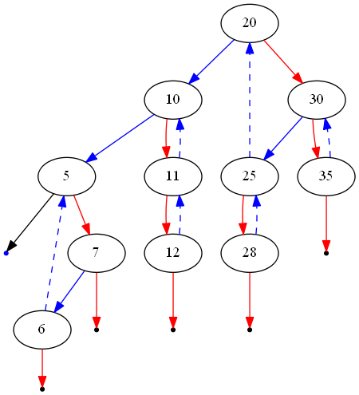

538. Convert BST to Greater Tree

Given a Binary Search Tree (BST), convert it to a Greater Tree such that every key of the original BST is changed to the original key plus sum of all keys greater than the original key in BST.

**Example:**
```
Input: The root of a Binary Search Tree like this:
              5
            /   \
           2     13

Output: The root of a Greater Tree like this:
             18
            /   \
          20     13
```

# Solution
---
**Initial Thoughts**

This question asks us to modify an asymptotically linear number of nodes in a given binary search tree, so a very efficient solution will visit each node once. The key to such a solution would be a way to visit nodes in descending order, keeping a sum of all values that we have already visited and adding that sum to the node's values as we traverse the tree. This method for tree traversal is known as a reverse in-order traversal, and allows us to guarantee visitation of each node in the desired order. The basic idea of such a traversal is that before visiting any node in the tree, we must first visit all nodes with greater value. Where are all of these nodes conveniently located? In the right subtree.

## Approach #1 Recursion [Accepted]
**Intuition**

One way to perform a reverse in-order traversal is via recursion. By using the call stack to return to previous nodes, we can easily visit the nodes in reverse order.

**Algorithm**

For the recursive approach, we maintain some minor "global" state so each recursive call can access and modify the current total sum. Essentially, we ensure that the current node exists, recurse on the right subtree, visit the current node by updating its value and the total sum, and finally recurse on the left subtree. If we know that recursing on `root.right` properly updates the right subtree and that recursing on `root.left` properly updates the left subtree, then we are guaranteed to update all nodes with larger values before the current node and all nodes with smaller values after.

```python
class Solution(object):
    def __init__(self):
        self.total = 0

    def convertBST(self, root):
        if root is not None:
            self.convertBST(root.right)
            self.total += root.val
            root.val = self.total
            self.convertBST(root.left)
        return root
```

**Complexity Analysis**

* Time complexity : $O(n)$

A binary tree has no cycles by definition, so convertBST gets called on each node no more than once. Other than the recursive calls, `convertBST` does a constant amount of work, so a linear number of calls to `convertBST` will run in linear time.

* Space complexity : $O(n)$

Using the prior assertion that convertBST is called a linear number of times, we can also show that the entire algorithm has linear space complexity. Consider the worst case, a tree with only right (or only left) subtrees. The call stack will grow until the end of the longest path is reached, which in this case includes all nn nodes.

## Approach #2 Iteration with a Stack [Accepted]
**Intuition**

If we don't want to use recursion, we can also perform a reverse in-order traversal via iteration and a literal stack to emulate the call stack.

**Algorithm**

One way to describe the iterative stack method is in terms of the intuitive recursive solution. First, we initialize an empty stack and set the current node to the root. Then, so long as there are unvisited nodes in the stack or `node` does not point to `null`, we push all of the nodes along the path to the rightmost leaf onto the stack. This is equivalent to always processing the right subtree first in the recursive solution, and is crucial for the guarantee of visiting nodes in order of decreasing value. Next, we visit the node on the top of our stack, and consider its left subtree. This is just like visiting the current node before recursing on the left subtree in the recursive solution. Eventually, our stack is empty and `node` points to the left `null` child of the tree's minimum value node, so the loop terminates.

```python
class Solution(object):
    def convertBST(self, root):
        total = 0
        
        node = root
        stack = []
        while stack or node is not None:
            # push all nodes up to (and including) this subtree's maximum on
            # the stack.
            while node is not None:
                stack.append(node)
                node = node.right

            node = stack.pop()
            total += node.val
            node.val = total

            # all nodes with values between the current and its parent lie in
            # the left subtree.
            node = node.left

        return root
```

**Complexity Analysis**

* Time complexity : $O(n)$

The key observation is that each node is pushed onto the stack exactly once. I will take for granted the assumption that a node will always be pushed at least once, as the alternative would imply that at least one node is disconnected from the root. Notice that nodes are only pushed onto the stack when they are pointed to by `node` at the beginning of the outer `while` loop, or when there is a path to them from such a node by using only `right` pointers. Then notice that at the end of each iteration of the loop, `node` points to the left child of a node that has been pushed onto (and subsequently popped from) the stack. Therefore, because the outer `while` loop always begins with `node` pointing to `None`, the root (which is not pointed to by any other node), or a left child of a visited node, we cannot revisit nodes.

* Space complexity : $O(n)$

If we assume that the above logic is sound, the assertion that each node is pushed onto the stack exactly once implies that the stack can contain (at most) nn nodes. All other parts of the algorithm use constant space, so there is overall a linear memory footprint.

## Approach #3 Reverse Morris In-order Traversal [Accepted]
**Intuition**

There is a clever way to perform an in-order traversal using only linear time and constant space, first described by J. H. Morris in his 1979 paper "Traversing Binary Trees Simply and Cheaply". In general, the recursive and iterative stack methods sacrifice linear space for the ability to return to a node after visiting its left subtree. The Morris traversal instead exploits the unused `null` pointer(s) of the tree's leaves to create a temporary link out of the left subtree, allowing the traversal to be performed using only constant additional memory. To apply it to this problem, we can simply swap all "left" and "right" references, which will reverse the traversal.

**Algorithm**

First, we initialize `node`, which points to the root. Then, until `node` points to `null` (specifically, the left `null` of the tree's minimum-value node), we repeat the following. First, consider whether the current node has a right subtree. If it does not have a right subtree, then there is no unvisited node with a greater value, so we can visit this node and move into the left subtree. If it does have a right subtree, then there is at least one unvisited node with a greater value, and thus we must visit first go to the right subtree. To do so, we obtain a reference to the in-order successor (the smallest-value node larger than the current) via our helper function `getSuccessor`. This successor node is the node that must be visited immediately before the current node, so it by definition has a `null` `left` pointer (otherwise it would not be the successor). Therefore, when we first find a node's successor, we temporarily link it (via its `left` pointer) to the node and proceed to the node's right subtree. Then, when we finish visiting the right subtree, the leftmost `left` pointer in it will be our temporary link that we can use to escape the subtree. After following this link, we have returned to the original node that we previously passed through, but did not visit. This time, when we find that the successor's `left` pointer loops back to the current node, we know that we have visited the entire right subtree, so we can now erase the temporary link and move into the left subtree.



The figure above shows an example of the modified tree during a reverse Morris traversal. Left pointers are illustrated in blue and right pointers in red. Dashed edges indicate temporary links generated at some point during the algorithm (which will be erased before it terminates). Notice that blue edges can be dashed, as we always exploit the empty `left` pointer of successor nodes. Additionally, notice that every node with a right subtree has a link from its in-order successor.

```python
class Solution(object):
    def convertBST(self, root):
        # Get the node with the smallest value greater than this one.
        def get_successor(node):
            succ = node.right
            while succ.left is not None and succ.left is not node:
                succ = succ.left
            return succ
                
        total = 0
        node = root
        while node is not None:
            # If there is no right subtree, then we can visit this node and
            # continue traversing left.
            if node.right is None:
                total += node.val
                node.val = total
                node = node.left
            # If there is a right subtree, then there is a node that has a
            # greater value than the current one. therefore, we must traverse
            # that node first.
            else:
                succ = get_successor(node)
                # If there is no left subtree (or right subtree, because we are
                # in this branch of control flow), make a temporary connection
                # back to the current node.
                if succ.left is None:
                    succ.left = node
                    node = node.right
                # If there is a left subtree, it is a link that we created on
                # a previous pass, so we should unlink it and visit this node.
                else:
                    succ.left = None
                    total += node.val
                    node.val = total
                    node = node.left
        
        return root
```

**Complexity Analysis**

* Time complexity : $O(n)$

Although the Morris traversal does slightly more work than the other approaches, it is only by a constant factor. To be specific, if we can show that each edge in the tree is traversed no more than kk times (for some constant kk), then the algorithm is shown to have linear time complexity. First, note that getSuccessor is called at most twice per node. On the first invocation, the temporary link back to the node in question is created, and on the second invocation, the temporary link is erased. Then, the algorithm steps into the left subtree with no way to return to the node. Therefore, each edge can only be traversed 3 times: once when we move the node pointer, and once for each of the two calls to getSuccessor.

* Space complexity : $O(1)$

Because we only manipulate pointers that already exist, the Morris traversal uses constant space.

# Submissions
---
**Solution:**
```
Runtime: 72 ms
Memory Usage: 15.1 MB
```
```python
# Definition for a binary tree node.
# class TreeNode:
#     def __init__(self, x):
#         self.val = x
#         self.left = None
#         self.right = None

class Solution:
    def __init__(self):
        self.total = 0
        
    def convertBST(self, root):
        """
        :type root: TreeNode
        :rtype: TreeNode
        """
        if root is not None:
            self.convertBST(root.right)
            self.total += root.val
            root.val = self.total
            self.convertBST(root.left)
        return root
```

**Solution:**
```
Runtime: 68 ms
Memory Usage: 14.9 MB
```
```python
# Definition for a binary tree node.
# class TreeNode:
#     def __init__(self, x):
#         self.val = x
#         self.left = None
#         self.right = None

class Solution:        
    def convertBST(self, root):
        """
        :type root: TreeNode
        :rtype: TreeNode
        """
        total = 0
        
        node = root
        stack = []
        while stack or node is not None:
            # push all nodes up to (and including) this subtree's maximum on
            # the stack.
            while node is not None:
                stack.append(node)
                node = node.right

            node = stack.pop()
            total += node.val
            node.val = total

            # all nodes with values between the current and its parent lie in
            # the left subtree.
            node = node.left

        return root
        
```