563. Binary Tree Tilt

Given a binary tree, return the tilt of the **whole tree**.

The tilt of a **tree node** is defined as the **absolute difference** between the sum of all left subtree node values and the sum of all right subtree node values. Null node has tilt 0.

The tilt of the **whole tree** is defined as the sum of all nodes' tilt.

**Example:**
```
Input: 
         1
       /   \
      2     3
Output: 1
Explanation: 
Tilt of node 2 : 0
Tilt of node 3 : 0
Tilt of node 1 : |2-3| = 1
Tilt of binary tree : 0 + 0 + 1 = 1
```

**Note:**

1. The sum of node values in any subtree won't exceed the range of 32-bit integer.
1. All the tilt values won't exceed the range of 32-bit integer.

# Solution
---
## Approach 1: Using Recursion
**Algorithm**

From the problem statement, it is clear that we need to find the tilt value at every node of the given tree and add up all the tilt values to obtain the final result. To find the tilt value at any node, we need to subtract the sum of all the nodes in its left subtree and the sum of all the nodes in its right subtree.

Thus, to find the solution, we make use of a recursive function `traverse` which when called from any node, returns the sum of the nodes below the current node including itself. With the help of such sum values for the right and left subchild of any node, we can directly obtain the tilt value corresponding to that node.

The below animation depicts how the value passing and tilt calculation:

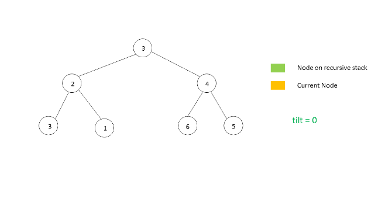
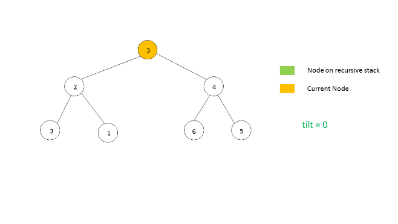
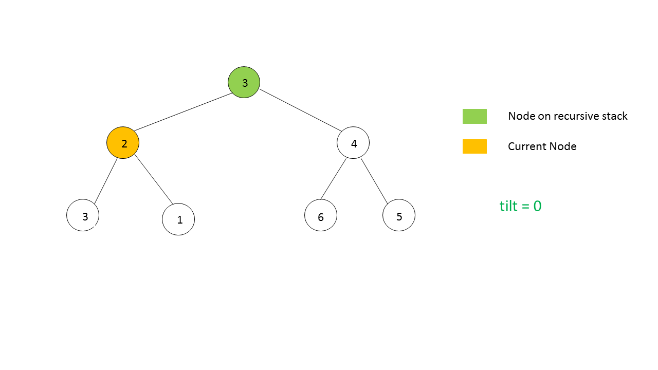
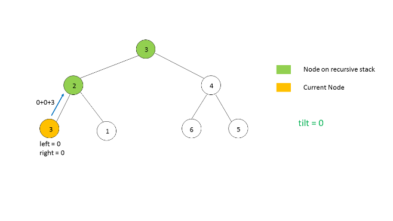
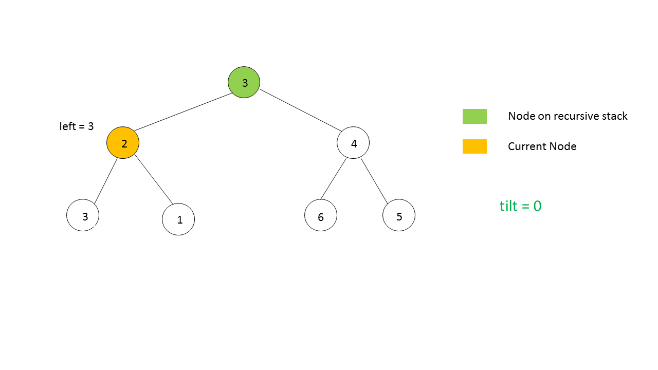
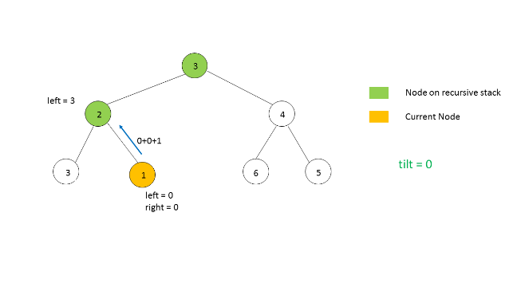
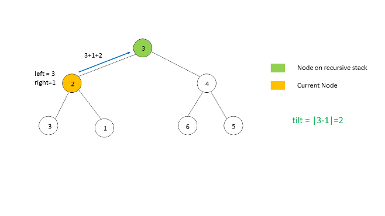
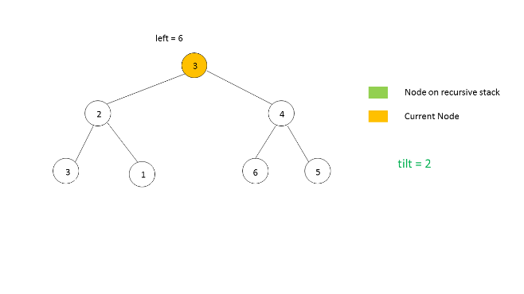
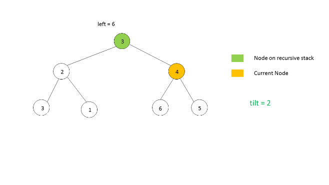
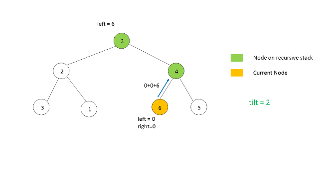
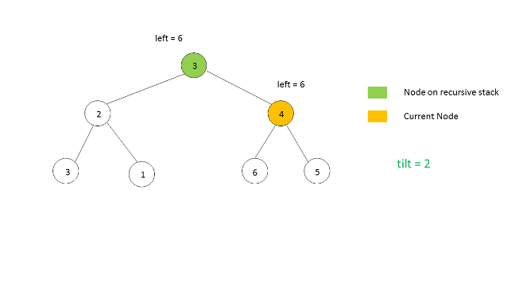
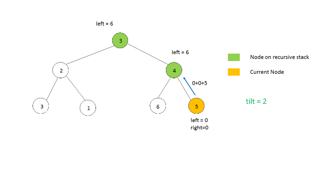
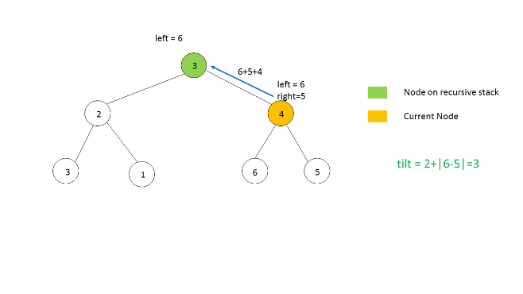
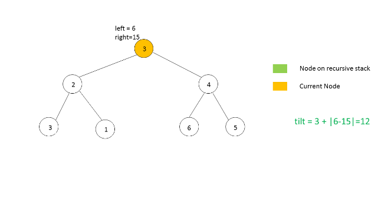

```java
/**
 * Definition for a binary tree node.
 * public class TreeNode {
 *     int val;
 *     TreeNode left;
 *     TreeNode right;
 *     TreeNode(int x) { val = x; }
 * }
 */
public class Solution {
    int tilt = 0;
    public int findTilt(TreeNode root) {
        traverse(root);
        return tilt;
    }
    public int traverse(TreeNode root)
    {
        if (root == null )
            return 0;
        int left = traverse(root.left);
        int right = traverse(root.right);
        tilt += Math.abs(left-right);
        return left + right + root.val;
    }
}
```

**Complexity Analysis**

* Time complexity : $O(n)$. where $n$ is the number of nodes. Each node is visited once.

* Space complexity : $O(n)$. In worst case when the tree is skewed depth of tree will be $n$. In average case depth will be $\log n$.

# Submissions
---
**Solution 1:**
```
Runtime: 52 ms
Memory Usage: 14.9 MB
```
```python
# Definition for a binary tree node.
# class TreeNode:
#     def __init__(self, x):
#         self.val = x
#         self.left = None
#         self.right = None

class Solution:
    def findTilt(self, root: TreeNode) -> int:
        self.ans = 0
        def dfs(node):
            if not node:
                return 0
            left = dfs(node.left)
            right = dfs(node.right)
            diff = abs(left - right)
            self.ans += diff
            return node.val + left + right
        
        dfs(root)
        return self.ans
```