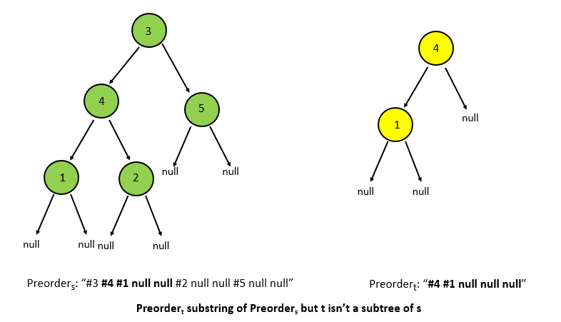
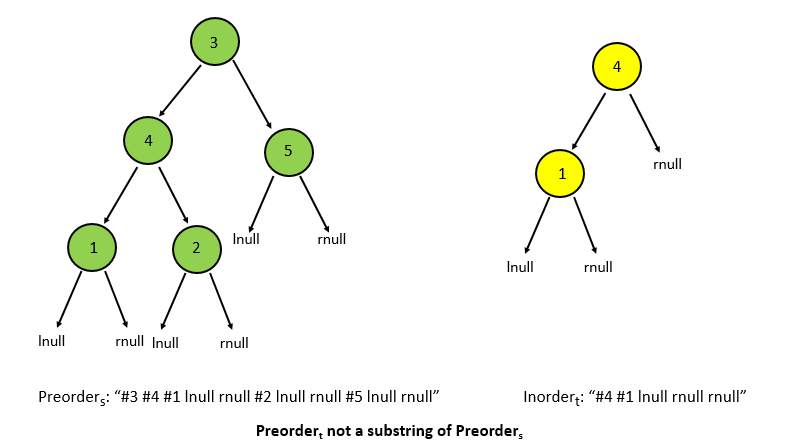
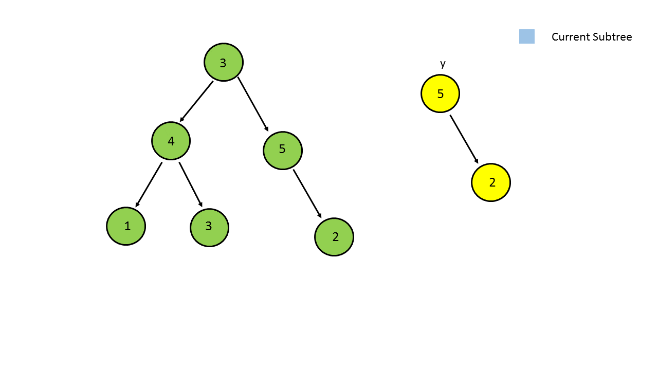
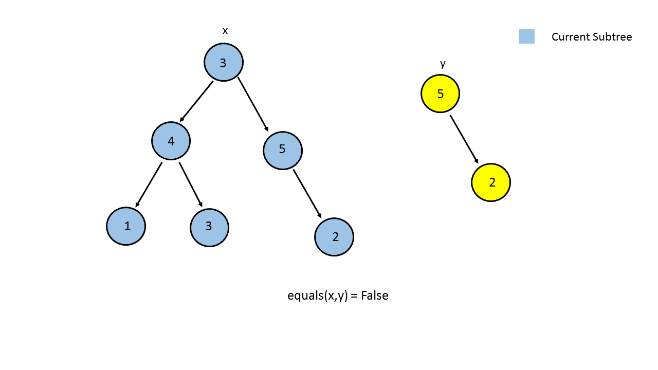
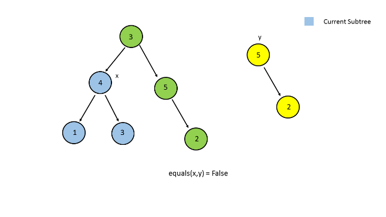
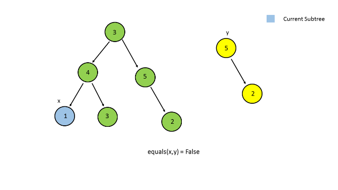
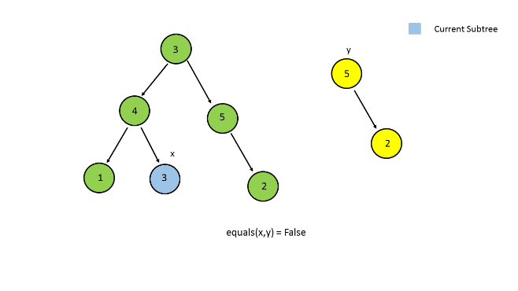
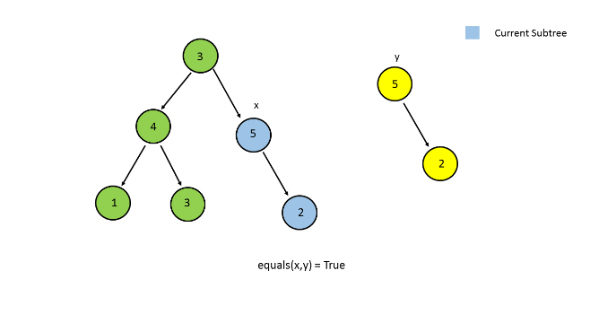

572. Subtree of Another Tree

Given two non-empty binary trees **s** and **t**, check whether tree **t** has exactly the same structure and node values with a subtree of **s**. A subtree of **s** is a tree consists of a node in **s** and all of this node's descendants. The tree s could also be considered as a subtree of itself.

**Example 1:**
```
Given tree s:

     3
    / \
   4   5
  / \
 1   2
Given tree t:
   4 
  / \
 1   2
Return true, because t has the same structure and node values with a subtree of s.
```

**Example 2:**
```
Given tree s:

     3
    / \
   4   5
  / \
 1   2
    /
   0
Given tree t:
   4
  / \
 1   2
Return false.
```

# Solution
---
## Approach #1 Using Preorder Traversal [Accepted]
**Algorithm**

We can find the preorder traversal of the given tree $s$ and $t$, given by, say $s_{preorder}$ and $t_{preorder}$ respectively(represented in the form of a string). Now, we can check if $t_{preorder}$ is a substring of $s_{preorder}$.

But, in order to use this approach, we need to treat the given tree in a different manner. Rather than assuming a $null$ value for the childern of the leaf nodes, we need to treat the left and right child as a $lnull$ and $rnull$ value respectively. This is done to ensure that the $t_{preorder}$ doesn't become a substring of $s_{preorder}$ even in cases when $t$ isn't a subtree of $s$.

You can also note that we've added a '#' before every considering every value. If this isn't done, the trees of the form `s:[23, 4, 5]` and `t:[3, 4, 5]` will also give a true result since the preorder string of the `t("23 4 lnull rull 5 lnull rnull")` will be a substring of the preorder string of `s("3 4 lnull rull 5 lnull rnull")`. Adding a '#' before the node's value solves this problem.





```java

/**
 * Definition for a binary tree node.
 * public class TreeNode {
 *     int val;
 *     TreeNode left;
 *     TreeNode right;
 *     TreeNode(int x) { val = x; }
 * }
 */
public class Solution {
    HashSet < String > trees = new HashSet < > ();
    public boolean isSubtree(TreeNode s, TreeNode t) {
        String tree1 = preorder(s, true);
        String tree2 = preorder(t, true);
        return tree1.indexOf(tree2) >= 0;
    }
    public String preorder(TreeNode t, boolean left) {
        if (t == null) {
            if (left)
                return "lnull";
            else
                return "rnull";
        }
        return "#"+t.val + " " +preorder(t.left, true)+" " +preorder(t.right, false);
    }
}
```

**Complexity Analysis**

* Time complexity : $O(m^2+n^2+m*n)$. A total of $n$ nodes of the tree $s$ and $m$ nodes of tree $t$ are traversed. Assuming string concatenation takes $O(k)$ time for strings of length $k$ and indexOf takes $O(m*n)$.

* Space complexity : $O(max(m,n))$. The depth of the recursion tree can go upto $n$ for tree $t$ and $m$ for tree $s$ in worst case.

## Approach #2 By Comparison of Nodes [Accepted]
**Algorithm**

Instead of creating an inorder traversal, we can treat every node of the given tree $t$ as the root, treat it as a subtree and compare the corresponding subtree with the given subtree $s$ for equality. For checking the equality, we can compare the all the nodes of the two subtrees.

For doing this, we make use a function `traverse(s,t)` which traverses over the given tree $s$ and treats every node as the root of the subtree currently being considered. It also checks the two subtrees currently being considered for their equality. In order to check the equality of the two subtrees, we make use of `equals(x,y)` function, which takes $x$ and yy, which are the roots of the two subtrees to be compared as the inputs and returns True or False depending on whether the two are equal or not. It compares all the nodes of the two subtrees for equality. Firstly, it checks whether the roots of the two trees for equality and then calls itself recursively for the left subtree and the right subtree.

The follwowing animation depicts an abstracted view of the process:








```java
/**
 * Definition for a binary tree node.
 * public class TreeNode {
 *     int val;
 *     TreeNode left;
 *     TreeNode right;
 *     TreeNode(int x) { val = x; }
 * }
 */
 
public class Solution {
    public boolean isSubtree(TreeNode s, TreeNode t) {
        return traverse(s,t);
    }
    public boolean equals(TreeNode x,TreeNode y)
    {
        if(x==null && y==null)
            return true;
        if(x==null || y==null)
            return false;
        return x.val==y.val && equals(x.left,y.left) && equals(x.right,y.right);
    }
    public boolean traverse(TreeNode s,TreeNode t)
    {
        return  s!=null && ( equals(s,t) || traverse(s.left,t) || traverse(s.right,t));
    }
}
```

**Complexity Analysis**

* Time complexity : $O(m*n)$. In worst case(skewed tree) traverse function takes $O(m*n)$ time.

* Space complexity : $O(n)$. The depth of the recursion tree can go upto $n$. $n$ refers to the number of nodes in $s$.

# Submissions
---
**Solution 1:**
```
Runtime: 236 ms
Memory Usage: 13.7 MB
```
```python
# Definition for a binary tree node.
# class TreeNode:
#     def __init__(self, x):
#         self.val = x
#         self.left = None
#         self.right = None

class Solution:
    def isSubtree(self, s: TreeNode, t: TreeNode) -> bool:
        def equals(x, y):
            if not x and not y:
                return True
            if not x or not y:
                return False
            return x.val == y.val and equals(x.left, y.left) and equals(x.right, y.right)
    
        def traverse(s, t):
            return s and (equals(s,t) or traverse(s.left,t) or traverse(s.right,t))
        
        return traverse(s,t);
```