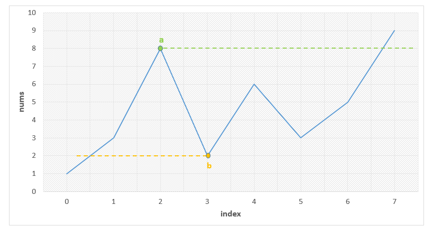

581. Shortest Unsorted Continuous Subarray

Given an integer array, you need to find one **continuous subarray** that if you only sort this subarray in ascending order, then the whole array will be sorted in ascending order, too.

You need to find the **shortest** such subarray and output its length.

**Example 1:**
```
Input: [2, 6, 4, 8, 10, 9, 15]
Output: 5
Explanation: You need to sort [6, 4, 8, 10, 9] in ascending order to make the whole array sorted in ascending order.
```
**Note:**
1. Then length of the input array is in range [1, 10,000].
1. The input array may contain duplicates, so ascending order here means <=.

# Solution
---
## Approach 1: Brute Force
**Algorithm**

In the brute force approach, we consider every possible subarray that can be formed from the given array $nums$. For every subarray $nums[i:j$ considered, we need to check whether this is the smallest unsorted subarray or not. Thus, for every such subarray considered, we find out the maximum and minimum values lying in that subarray given by $max$ and $min$ respectively.

If the subarrays $nums[0:i-1]$ and $nums[j:n-1]$ are correctly sorted, then only $nums[i:j]$ could be the required subrray. Further, the elements in $nums[0:i-1]$ all need to be lesser than the $min$ for satisfying the required condition. Similarly, all the elements in $nums[j:n-1]$ need to be larger than $max$. We check for these conditions for every possible $i$ and $j$ selected.

Further, we also need to check if $nums[0:i-1]$ and $nums[j:n-1]$ are sorted correctly. If all the above conditions are satisfied, we determine the length of the unsorted subarray as $j-i$. We do the same process for every subarray chosen and determine the length of the smallest unsorted subarray found.

```java
public class Solution {
    public int findUnsortedSubarray(int[] nums) {
        int res = nums.length;
        for (int i = 0; i < nums.length; i++) {
            for (int j = i; j <= nums.length; j++) {
                int min = Integer.MAX_VALUE, max = Integer.MIN_VALUE, prev = Integer.MIN_VALUE;
                for (int k = i; k < j; k++) {
                    min = Math.min(min, nums[k]);
                    max = Math.max(max, nums[k]);
                }
                if ((i > 0 && nums[i - 1] > min) || (j < nums.length && nums[j] < max))
                    continue;
                int k = 0;
                while (k < i && prev <= nums[k]) {
                    prev = nums[k];
                    k++;
                }
                if (k != i)
                    continue;
                k = j;
                while (k < nums.length && prev <= nums[k]) {
                    prev = nums[k];
                    k++;
                }
                if (k == nums.length) {
                    res = Math.min(res, j - i);

                }
            }
        }
        return res;
    }
}
```

**Complexity Analysis**

* Time complexity : $O(n^3)$. Three nested loops are there.

* Space complexity : $O(1)$. Constant space is used.

## Approach 2: Better Brute Force
**Algorithm**

In this approach, we make use of an idea based on selection sort. We can traverse over the given $nums$ array choosing the elements $nums[i]$. For every such element chosen, we try to determine its correct position in the sorted array. For this, we compare $nums[i]$ with every $nums[j]$, such that $i < j < n$. Here, $n$ refers to the length of $nums$ array.

If any $nums[j]$ happens to be lesser than $nums[i]$, it means both $nums[i]$ and $nums[j]$ aren't at their correct position for the sorted array. Thus, we need to swap the two elements to bring them at their correct positions. Here, instead of swapping, we just note the position of $nums[i]$(given by $i$) and $nums[j]$(given by $j$). These two elements now mark the boundary of the unsorted subarray(atleast for the time being).

Thus, out of all the $nums[i]$ chosen, we determine the leftmost $nums[i]$ which isn't at its correct position. This marks the left boundary of the smallest unsorted subarray(ll). Similarly, out of all the $nums[j]$'s considered for all $nums[i]$'s we determine the rightmost $nums[j]$ which isn't at its correct position. This marks the right boundary of the smallest unsorted subarray(rr).


Thus, we can determine the length of the smallest unsorted subarray as $r - l + 1$.

```java
public class Solution {
    public int findUnsortedSubarray(int[] nums) {
        int l = nums.length, r = 0;
        for (int i = 0; i < nums.length - 1; i++) {
            for (int j = i + 1; j < nums.length; j++) {
                if (nums[j] < nums[i]) {
                    r = Math.max(r, j);
                    l = Math.min(l, i);
                }
            }
        }
        return r - l < 0 ? 0 : r - l + 1;
    }
}
```

**Complexity Analysis**

* Time complexity : $O(n^2)$. Two nested loops are there.

* Space complexity : $O(1)$. Constant space is used.

## Approach 3: Using Sorting
**Algorithm**

Another very simple idea is as follows. We can sort a copy of the given array $nums$, say given by $nums\_sorted$. Then, if we compare the elements of $nums$ and $nums\_sorted$, we can determine the leftmost and rightmost elements which mismatch. The subarray lying between them is, then, the required shorted unsorted subarray.

```java
public class Solution {
    public int findUnsortedSubarray(int[] nums) {
        int[] snums = nums.clone();
        Arrays.sort(snums);
        int start = snums.length, end = 0;
        for (int i = 0; i < snums.length; i++) {
            if (snums[i] != nums[i]) {
                start = Math.min(start, i);
                end = Math.max(end, i);
            }
        }
        return (end - start >= 0 ? end - start + 1 : 0);
    }
}
```

**Complexity Analysis**

* Time complexity : $O(n\log n)$. Sorting takes $n\log n$ time.

* Space complexity : $O(n)$. We are making copy of original array.

## Approach 4: Using Stack
**Algorithm**

The idea behind this approach is also based on selective sorting. We need to determine the correct position of the minimum and the maximum element in the unsorted subarray to determine the boundaries of the required unsorted subarray.

To do so, in this implementation, we make use of a $stack$. We traverse over the $nums$ array starting from the beginning. As we go on facing elements in ascending order(a rising slope), we keep on pushing the elements' indices over the $stack$. This is done because such elements are in the correct sorted order(as it seems till now). As soon as we encounter a falling slope, i.e. an element $nums[j]$ which is smaller than the element on the top of the $stack$, we know that $nums[j]$ isn't at its correct position.

In order to determine the correct position of $nums[j]$, we keep on popping the elemnents from the top of the $stack$ until we reach the stage where the element(corresponding to the index) on the top of the $stack$ is lesser than $nums[j]$. Let's say the popping stops when the index on $stack$'s top is $k$. Now, $nums[j]$ has found its correct position. It needs to lie at an index $k + 1$.

We follow the same process while traversing over the whole array, and determine the value of minimum such $k$. This marks the left boundary of the unsorted subarray.

Similarly, to find the right boundary of the unsorted subarray, we traverse over the $nums$ array backwards. This time we keep on pushing the elements if we see a falling slope. As soon as we find a rising slope, we trace forwards now and determine the larger element's correct position. We do so for the complete array and thus, determine the right boundary.

We can look at the figure below for reference. We can observe that the slopes directly indicate the relative ordering. We can also observe that the point $b$ needs to lie just after index 0 marking the left boundary and the point $a$ needs to lie just before index 7 marking the right boundary of the unsorted subarray.



```java
public class Solution {
    public int findUnsortedSubarray(int[] nums) {
        Stack < Integer > stack = new Stack < Integer > ();
        int l = nums.length, r = 0;
        for (int i = 0; i < nums.length; i++) {
            while (!stack.isEmpty() && nums[stack.peek()] > nums[i])
                l = Math.min(l, stack.pop());
            stack.push(i);
        }
        stack.clear();
        for (int i = nums.length - 1; i >= 0; i--) {
            while (!stack.isEmpty() && nums[stack.peek()] < nums[i])
                r = Math.max(r, stack.pop());
            stack.push(i);
        }
        return r - l > 0 ? r - l + 1 : 0;
    }
}
```

**Complexity Analysis**

* Time complexity : $O(n)$. Stack of size $n$ is filled.

* Space complexity : $O(n)$. Stack size grows upto $n$.

## Approach 5: Without Using Extra Space
**Algorithm**

The idea behind this method is that the correct position of the minimum element in the unsorted subarray helps to determine the required left boundary. Similarly, the correct position of the maximum element in the unsorted subarray helps to determine the required right boundary.

Thus, firstly we need to determine when the correctly sorted array goes wrong. We keep a track of this by observing rising slope starting from the beginning of the array. Whenever the slope falls, we know that the unsorted array has surely started. Thus, now we determine the minimum element found till the end of the array $nums$, given by $min$.

Similarly, we scan the array $nums$ in the reverse order and when the slope becomes rising instead of falling, we start looking for the maximum element till we reach the beginning of the array, given by $max$.

Then, we traverse over $nums$ and determine the correct position of $min$ and $max$ by comparing these elements with the other array elements. e.g. To determine the correct position of $min$, we know the initial portion of $nums$ is already sorted. Thus, we need to find the first element which is just larger than $min$. Similarly, for $max$'s position, we need to find the first element which is just smaller than $max$ searching in $nums$ backwards.

We can take this figure for reference again:


We can observe that the point $b$ needs to lie just after index 0 marking the left boundary and the point $a$ needs to lie just before index 7 marking the right boundary of the unsorted subarray.

```java
public class Solution {
    public int findUnsortedSubarray(int[] nums) {
        int min = Integer.MAX_VALUE, max = Integer.MIN_VALUE;
        boolean flag = false;
        for (int i = 1; i < nums.length; i++) {
            if (nums[i] < nums[i - 1])
                flag = true;
            if (flag)
                min = Math.min(min, nums[i]);
        }
        flag = false;
        for (int i = nums.length - 2; i >= 0; i--) {
            if (nums[i] > nums[i + 1])
                flag = true;
            if (flag)
                max = Math.max(max, nums[i]);
        }
        int l, r;
        for (l = 0; l < nums.length; l++) {
            if (min < nums[l])
                break;
        }
        for (r = nums.length - 1; r >= 0; r--) {
            if (max > nums[r])
                break;
        }
        return r - l < 0 ? 0 : r - l + 1;
    }
}
```

**Complexity Analysis**

* Time complexity : $O(n)$. Four $O(n)$ loops are used.

* Space complexity : $O(1)$. Constant space is used.

# Submissions
---
**Solution 1: (Sort)**
```
Runtime: 212 ms
Memory Usage: 13.9 MB
```
```python
class Solution:
    def findUnsortedSubarray(self, nums: List[int]) -> int:
        sorted_nums = sorted(nums) # returns the another sorted copy     
        start = 0
        end = len(nums)-1
        while start <= end and sorted_nums[start] == nums[start]:
            start += 1
        while end >= 0 and sorted_nums[end] == nums[end]:
            end -= 1
            
        return 0 if start > end else end - start + 1
```

**Solution 2: (Two Pointers)**
```
Runtime: 256 ms
Memory Usage: 13.9 MB
```
```python
class Solution:
    def findUnsortedSubarray(self, nums: List[int]) -> int:
        N = len(nums)
        mi, ma = float('inf'), float('-inf')
        flag = False
        for i in range(1, N):
            if nums[i] < nums[i - 1]:
                flag = True
            if flag:
                mi = min(mi, nums[i])
        flag = False
        for i in range(N-2, -1, -1):
            if nums[i] > nums[i + 1]:
                flag = True
            if flag:
                ma = max(ma, nums[i])
        left, right = 0, N-1
        while left < N:
            if mi < nums[left]:
                break
            left += 1
        while right >= 0:
            if ma > nums[right]:
                break
            right -= 1
                
        return 0 if right - left < 0 else right - left + 1
```