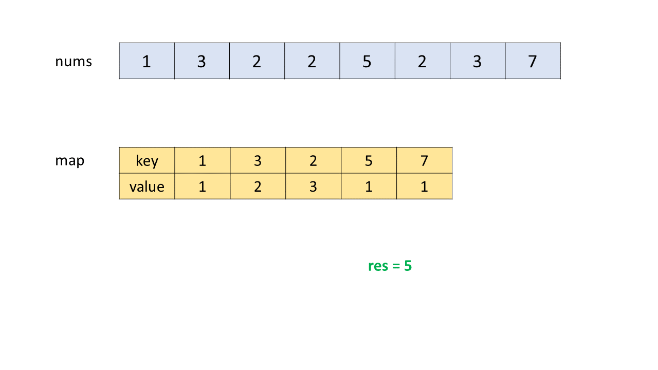

594. Longest Harmonious Subsequence

We define a harmounious array as an array where the difference between its maximum value and its minimum value is **exactly** 1.

Now, given an integer array, you need to find the length of its longest harmonious subsequence among all its possible subsequences.

**Example 1:**
```
Input: [1,3,2,2,5,2,3,7]
Output: 5
Explanation: The longest harmonious subsequence is [3,2,2,2,3].
```

**Note:** The length of the input array will not exceed `20,000`.

# Solution
---
## Approach 1: Brute Force
In the brute force solution, we consider every possible subsequence that can be formed using the elements of the given array. For every subsequence, we find the maximum and minimum values in the subsequence. If the difference between the maximum and the minimum values obtained is `1`, it means the current subsequence forms a harmonious subsequence. Thus, we can consider the number of elements in this subsequence to be compared with the length of the last longest harmonious subsequence.

In order to obtain all the subseqeuences possible, we make use of binary number representation of decimal numbers. For a binary number of size $n$, a total of $2^n$ different binary numbers can be generated. We generate all these binary numbers from $0$ to $2^n$. For every binary number generated, we consider the subsequence to be comprised of only those elements of $nums$ which have a 1 at the corresponding position in the current binary number. The following figure shows an example of the way the elements of $nums$ are considered in the current subsequence.


```java
public class Solution {
    public int findLHS(int[] nums) {
        int res = 0;
        for (int i = 0; i < (1 << nums.length); i++) {
            int count = 0, min = Integer.MAX_VALUE, max = Integer.MIN_VALUE;
            for (int j = 0; j < nums.length; j++) {
                if ((i & (1 << j)) != 0) {
                    min = Math.min(min, nums[j]);
                    max = Math.max(max, nums[j]);
                    count++;
                }
            }
            if (max - min == 1)
                res = Math.max(res, count);
        }
        return res;
    }
}
```

**Complexity Analysis**

* Time complexity : $O(2^n)$. Number of subsequences generated will be $2^n$.

* Space complexity : $O(1)$. Constant space required.

## Approach 2: Better Brute Force
**Algorithm**

In the last approach, we created every possible subsequence, and for every such subsequence, we found out if it satisfies the harmonicity condition. Instead of doing this, we can do as follows. We can consider every element of the given $nums$ array one by one. For $nums[i]$ chosen to be the current element, we determine the $count$ of all the elements in the $nums$ array, which satisfy the harmonicity condition with $nums[i]$, i.e. the $count$ of all such $nums[j]$ satisfying $nums[i] == nums[j]$ or $nums[i] == nums[j] + 1$. When we reach the end of the array for $nums[i]$ being the current element, we compare this $count$ obtained with the result obtained from the previous traversals and update the result appropriately. When all the elements of the array have been chosen as the element to be chosen as the base for harmonicity check, we get the required length of the longest harmonic subsequence.

The following animation illustrates the process:


```java
public class Solution {
    public int findLHS(int[] nums) {
        int res = 0;
        for (int i = 0; i < nums.length; i++) {
            int count = 0;
            boolean flag = false;
            for (int j = 0; j < nums.length; j++) {
                if (nums[j] == nums[i])
                    count++;
                else if (nums[j] + 1 == nums[i]) {
                    count++;
                    flag = true;
                }
            }
            if (flag)
                res = Math.max(count, res);
        }
        return res;
    }
}
```

**Complexity Analysis**

* Time complexity : $O(n^2)$. Two nested loops are there.

* Space complexity : $O(1)$. Constant space required.

## Approach 3: Using Sorting
**Algorithm**

Since we are concerned only with the count of elements which are at a difference of 1, we can use sorting to our advantage. If we sort the given $nums$ array, the related elements will get arranged close to each other. Thus, we can traverse over the sorted array, and find the count of similar elements and elements one larger than the current ones, which occur consecutively(all the similar elements will be lying consecutively now). Initially, this value is stored in `prev\_countprev_count` variable. Then, if we encounter an element which is just `1` larger than the last elements, we count the occurences of such elements as well. This value is stored in $count$ variable.

Thus, now for the harmonic subsequence comprised of only these two elements is a subsequence of length $count + prev\_count$. This result is stored in $res$ for each subsequence found. When we move forward to considering the next set of similar consecutive elements, we need to update the $prev\_count$ with the $count$'s value, since now $count$ will act as the count of the elements 1 lesser than the next elements encountered. The value of $res$ is always updated to be the larger of previous $res$ and the current $count + prev\_count$ value.

When we are done traversing over the whole array, the value of $res$ gives us the required result.

```java
public class Solution {
    public int findLHS(int[] nums) {
        Arrays.sort(nums);
        int prev_count = 1, res = 0;
        for (int i = 0; i < nums.length; i++) {
            int count = 1;
            if (i > 0 && nums[i] - nums[i - 1] == 1) {
                while (i < nums.length - 1 && nums[i] == nums[i + 1]) {
                    count++;
                    i++;
                }
                res = Math.max(res, count + prev_count);
                prev_count = count;
            } else {
                while (i < nums.length - 1 && nums[i] == nums[i + 1]) {
                    count++;
                    i++;
                }
                prev_count = count;
            }
        }
        return res;
    }
}
```

**Complexity Analysis**

* Time complexity : $O(n\log n)$. Sorting takes $O(n\log n)$ time.

* Space complexity : $O(\log n)$. $\log n$ space is required by sorting in average case.

## Approach 4: Using HashMap
**Algorithm**

In this approach, we make use of a hashmap $map$ which stores the number of times an element occurs in the array along with the element's value in the form $(num: count\_num)$, where $num$ refers to an element in the array and $count\_num$ refers to the number of times this $num$ occurs in the $nums$ array. We traverse over the $nums$ array and fill this $map$ once.

After this, we traverse over the keys of the $map$ created. For every key of the $map$ considered, say $key$, we find out if the map contains the $key + 1$. Such an element is found, since only such elements can be counted for the harmonic subsequence if $key$ is considered as one of the element of the harmonic subsequence. We need not care about $key - 1$, because if $key$ is present in the harmonic subsequence, at one time either $key + 1$ or $key - 1$ only could be included in the harmonic subsequence. The case of $key - 1$ being in the harmonic subsequence will automatically be considered, when $key - 1$ is encountered as the current key.

Now, whenver we find that $key + 1$ exists in the keys of $map$, we determine the count of the current harmonic subsequence as $count_{key} + count_{key+1}$, where $count_i$ refers to the value corresponding to the key $i$ in $map$, which reprents the number of times $i$ occurs in the array $nums$.

Look at the animation below for a pictorial view of the process:


```java
public class Solution {
    public int findLHS(int[] nums) {
        HashMap < Integer, Integer > map = new HashMap < > ();
        int res = 0;
        for (int num: nums) {
            map.put(num, map.getOrDefault(num, 0) + 1);
        }
        for (int key: map.keySet()) {
            if (map.containsKey(key + 1))
                res = Math.max(res, map.get(key) + map.get(key + 1));
        }
        return res;
    }
}
```

**Complexity Analysis**

* Time complexity : $O(n)$. One loop is required to fill $map$ and one for traversing the $map$.

* Space complexity : $O(n)$. In worst case map size grows upto size $n$.

## Approach 5: In Single Loop
**Algorithm**

Instead of filling the $map$ first and then traversing over the $map$ to determine the lengths of the harmonic subsequences encountered, we can traverse over the $nums$ array, and while doing the traversals, we can determine the lengths of the harmonic subsequences possible till the current index of the $nums$ array.

The method of finding the length of harmonic subsequence remains the same as the last approach. But, this time, we need to consider the existence of both $key + 1$ and $key - 1$ exclusively and determine the counts corresponding to both the cases. This is needed now because it could be possible that $key$ has already been added to the $map$ and later on $key - 1$ is encountered. In this case, if we consider the presence of $key + 1$ only, we'll go in the wrong direction.

Thus, we consider the $counts$ corresponding to both the cases separately for every $key$ and determine the maximum out of them. Thus, now the same task can be done only in a single traveral of the $nums$ array.

See the animation below for understanding the process:




```java
public class Solution {
    public int findLHS(int[] nums) {
        HashMap < Integer, Integer > map = new HashMap < > ();
        int res = 0;
        for (int num: nums) {
            map.put(num, map.getOrDefault(num, 0) + 1);
            if (map.containsKey(num + 1))
                res = Math.max(res, map.get(num) + map.get(num + 1));
            if (map.containsKey(num - 1))
                res = Math.max(res, map.get(num) + map.get(num - 1));
        }
        return res;
    }
}
```

**Complexity Analysis**

* Time complexity : $O(n)$. Only one loop is there.

* Space complexity : $O(n)$. $map$ size grows upto size $n$.

# Submissions
---
**Solution 1: (Using HashMap)**
```
Runtime: 320 ms
Memory Usage: 14.4 MB
```
```python
class Solution:
    def findLHS(self, nums: List[int]) -> int:
        seen_d = collections.Counter(nums)        # prep dict { elem: times_seen }

        # find 2 harmomious keys in seen_d with max times_seen for both of them
        max_seen = 0
        for k in seen_d:
            if k + 1 in seen_d:
                max_seen = max(max_seen, seen_d[k] + seen_d[k + 1])
        return max_seen
```

**Solution 2: (Sort, Sliding Window)**
```
Runtime: 9 ms, Beats 89.56%
Memory: 36.11 MB, Beats 94.99%
```
```c++
class Solution {
public:
    int findLHS(vector<int>& nums) {
        int n = nums.size(), i = 0, j, ans = 0;
        sort(nums.begin(), nums.end());
        for (j = 0; j < n; j ++) {
            while (nums[j]-nums[i] > 1) {
                i += 1;
            }
            if (nums[j] - nums[i] == 1) {
                ans = max(ans, j-i+1);
            }
        }
        return ans;
    }
};
```

**Solution 3: (Counter)**
```
Runtime: 32 ms, Beats 38.66%
Memory: 43.96 MB, Beats 29.65%
```
```c++
class Solution {
public:
    int findLHS(vector<int>& nums) {
        unordered_map<int,int> cnt;
        int ans = 0;
        for (auto num: nums) {
            cnt[num] += 1;
        }
        for (auto [a, k]: cnt) {
            if (cnt.count(a+1)) {
                ans = max(ans, k + cnt[a+1]);
            }
        }
        return ans;
    }
};
```
