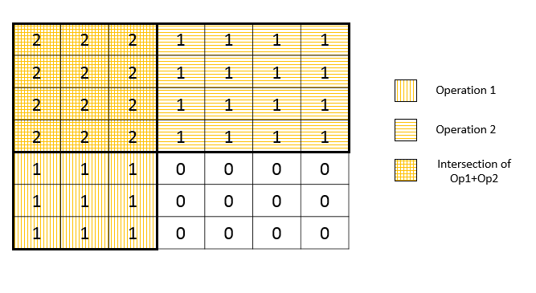

598. Range Addition II

Given an m * n matrix M initialized with all 0's and several update operations.

Operations are represented by a 2D array, and each operation is represented by an array with two positive integers **a** and **b**, which means **M[i][j]** should be **added by one** for all **0 <= i < a** and **0 <= j < b**.

You need to count and return the number of maximum integers in the matrix after performing all the operations.

**Example 1:**
```
Input: 
m = 3, n = 3
operations = [[2,2],[3,3]]
Output: 4
Explanation: 
Initially, M = 
[[0, 0, 0],
 [0, 0, 0],
 [0, 0, 0]]

After performing [2,2], M = 
[[1, 1, 0],
 [1, 1, 0],
 [0, 0, 0]]

After performing [3,3], M = 
[[2, 2, 1],
 [2, 2, 1],
 [1, 1, 1]]

So the maximum integer in M is 2, and there are four of it in M. So return 4.
```

**Note:**

1. The range of m and n is [1,40000].
1. The range of a is [1,m], and the range of b is [1,n].
1. The range of operations size won't exceed 10,000.

# Solution
---
## Approach #1 Brute Force [Time Limit Exceeded]
The simplest method is to create a actual 2-D array of size mmxnn(arrarr), perform all the operations one by one on the given range of elements, and then count the number of maximum elements. Now, we know that all the operations performed always include the element at index $(0,0)$. Thus, the element $arr[0][0]$ will always be the maximum. After performing all the operations, we can count the number of elements equal to $arr[0][0]$ to get the required count of the maximum elements.

```java
public class Solution {
    public int maxCount(int m, int n, int[][] ops) {
        int[][] arr = new int[m][n];
        for (int[] op: ops) {
            for (int i = 0; i < op[0]; i++) {
                for (int j = 0; j < op[1]; j++) {
                    arr[i][j] += 1;
                }
            }
        }
        int count = 0;
        for (int i = 0; i < m; i++) {
            for (int j = 0; j < n; j++) {
                if (arr[i][j] == arr[0][0])
                    count++;
            }
        }
        return count;
    }
}
```

**Complexity Analysis**

* Time complexity : $O(x * m * n)$. Array is updated $x$ times, where $x$ represents number of times operation is preformed i.e. $ops.lengt$.

* Space complexity : $O(m * n)$. Array of size ${m * n}$ is used.

## Approach #2 Single Pass [Accepted]
**Algorithm**

As per the given problem statement, all the operations are performed on a rectangular sub-matrix of the initial all 0's $M$ matrix. The upper left corner of each such rectangle is given by the index $(0, 0)$ and the lower right corner for an operation $[i, j]$ is given by the index (i, j)(i,j).

The maximum element will be the one on which all the operations have been performed. The figure below shows an example of two operations being performed on the initial $M$ array.



From this figure, we can observe that the maximum elements will be the ones which lie in the intersection region of the rectangles representing the operations. Further, we can observe that to count the number of elements lying in this intersection region, we don't actually need to perform the operations, but we need to determine the lower right cornerof the intersecting region only. This corner is given by $\big(x, y\big) = \big(\text{min}(op[0], \text{min}(op[1])\big)$, where $\text{min}(op[i])$ reprsents the minimum value of $op[i]$ from among all the $op[i]$'s in the given set of operations.

Thus, the resultant count of elements lying in the intersection is given by: $x$x$y$.

```java
public class Solution {
    public int maxCount(int m, int n, int[][] ops) {
        for (int[] op: ops) {
            m = Math.min(m, op[0]);
            n = Math.min(n, op[1]);
        }
        return m * n;
    }
}
```

**Complexity Analysis**

* Time complexity : $O(x)$. Single traversal of all operations is done. $x$ refers to the number of operations.

* Space complexity : $O(1)$. No extra space is used.

# Submissions
---
**Solution 1: (Single Pass)**
```
Runtime: 72 ms
Memory Usage: 14.8 MB
```
```python
class Solution:
    def maxCount(self, m: int, n: int, ops: List[List[int]]) -> int:
        for op in ops:
            m = min(m, op[0])
            n = min(n, op[1])
        return m*n
```
