599. Minimum Index Sum of Two Lists

Suppose Andy and Doris want to choose a restaurant for dinner, and they both have a list of favorite restaurants represented by strings.

You need to help them find out their common interest with the least list index sum. If there is a choice tie between answers, output all of them with no order requirement. You could assume there always exists an answer.

**Example 1:**
```
Input:
["Shogun", "Tapioca Express", "Burger King", "KFC"]
["Piatti", "The Grill at Torrey Pines", "Hungry Hunter Steakhouse", "Shogun"]
Output: ["Shogun"]
Explanation: The only restaurant they both like is "Shogun".
```

**Example 2:**
```
Input:
["Shogun", "Tapioca Express", "Burger King", "KFC"]
["KFC", "Shogun", "Burger King"]
Output: ["Shogun"]
Explanation: The restaurant they both like and have the least index sum is "Shogun" with index sum 1 (0+1).
```

**Note:**
1. The length of both lists will be in the range of [1, 1000].
1. The length of strings in both lists will be in the range of [1, 30].
1. The index is starting from 0 to the list length minus 1.
1. No duplicates in both lists.

# Solution
---
## Approach #1 Using HashMap [Accepted]
In this approach, we compare every string in $list1$ and $list2$ by traversing over the whole list $list2$ for every string chosen from $list1$. We make use of a hashmap mapmap, which contains elements of the form $(sum : list_{sum})$. Here, sumsum refers to the sum of indices of matching elements and $list_{sum}$ refers to the list of matching strings whose indices' sum equals $sum$.

Thus, while doing the comparisons, whenever a match between a string at $i^{th}$ index of $list1$ and $j^{th}$ index of $list2$ is found, we make an entry in the mapmap corresponding to the sum $i+j$, if this entry isn't already present. If an entry with this sum already exists, we need to keep a track of all the strings which lead to the same index sum. Thus, we append the current string to the list of strings corresponding to sum $i + j$.

At the end, we traverse over the keys of the $map$ and find out the list of strings corresponding to the key reprsenting the minimum sum.

```java
public class Solution {
    public String[] findRestaurant(String[] list1, String[] list2) {
        HashMap < Integer, List < String >> map = new HashMap < > ();
        for (int i = 0; i < list1.length; i++) {
            for (int j = 0; j < list2.length; j++) {
                if (list1[i].equals(list2[j])) {
                    if (!map.containsKey(i + j))
                        map.put(i + j, new ArrayList < String > ());
                    map.get(i + j).add(list1[i]);
                }
            }
        }
        int min_index_sum = Integer.MAX_VALUE;
        for (int key: map.keySet())
            min_index_sum = Math.min(min_index_sum, key);
        String[] res = new String[map.get(min_index_sum).size()];
        return map.get(min_index_sum).toArray(res);
    }
}

```

**Complexity Analysis**

* Time complexity : $O(l_1*l_2*x)$. Every item of $list1$ is compared with all the items of $list2$. $l_1$ and $l_2$ are the lengths of $list1$ and $list2$ respectively. And xx refers to average string length.

* Space complexity : $O(l_1*l_2*x)$. In worst case all items of $list1$ and $list2$ are same. In that case, hashmap size grows upto $l_1*l_2*xl$, where $x$ refers to average string length.

## Approach #2 Without Using HashMap [Accepted]
**Algorithm**

Another method could be to traverse over the various $sum$(index sum) values and determine if any such string exists in $list1$ and $list2$ such that the sum of its indices in the two lists equals sumsum.

Now, we know that the value of index sum, sumsum could range from 0 to m + n - 1m+n−1. Here, $m$ and $n$ refer to the length of lists $list1$ and $list2$ respectively. Thus, we choose every value of sumsum in ascending order. For every sumsum chosen, we iterate over $list1$. Suppose, currently the string at $i^{th}$ index in $list1$ is being considered. Now, in order for the index sum $sum$ to be the one corresponding to matching strings in $list1$ and $list2$, the string at index $j$ in $list2$ should match the string at index $i$ in $list1$, such that $sum = i + j$.

Or, stating in other terms, the string at index $j$ in $list2$ should be equal to the string at index $i$ in $list1$, such that $j = sum - i$. Thus, for a particular sumsum and ii(from list1list1), we can directly determine that we need to check the element at index $j= sum - i$ in list2list2, instead of traversing over the whole list2list2.

Doing such checks/comparisons, iterate over all the indices of $list1$ for every $sum$ value chosen. Whenver a match occurs between $list1$ and $list2$, we put the matching string in a list resres.

We do the same process of checking the strings for all the values of $sum$ in ascending order. After completing every iteration over $list1$ for a particular $sum$, we check if the resres list is empty or not. If it is empty, we need to continue the process with the next $sum$ value considered. If not, the current resres gives the required list with minimum index sum. This is because we are already considering the index sum values in ascending order. So, the first list to be found is the required resultant list.

The following example depicts the process:

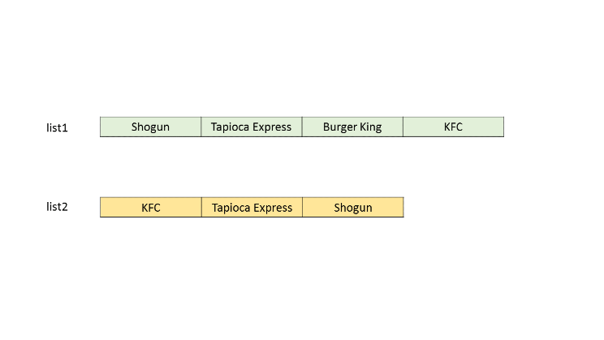
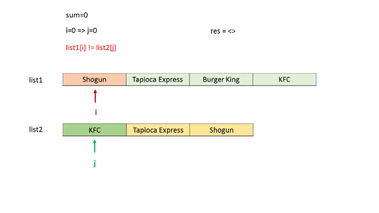
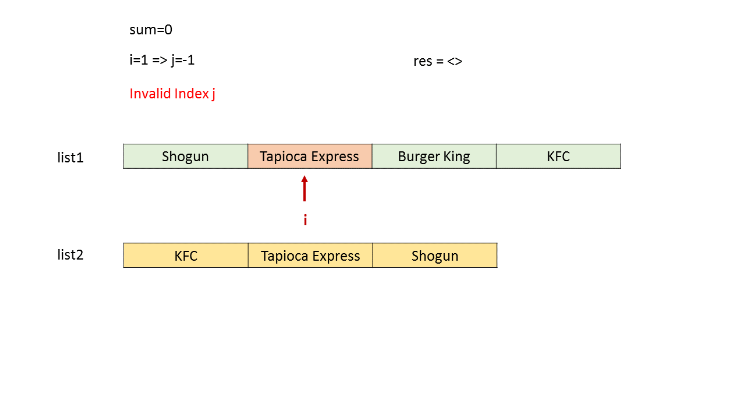
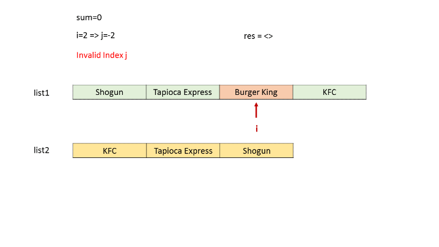
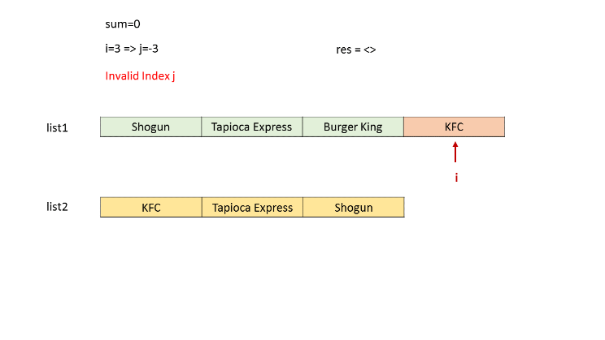
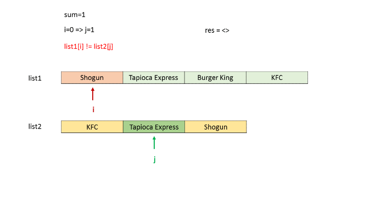
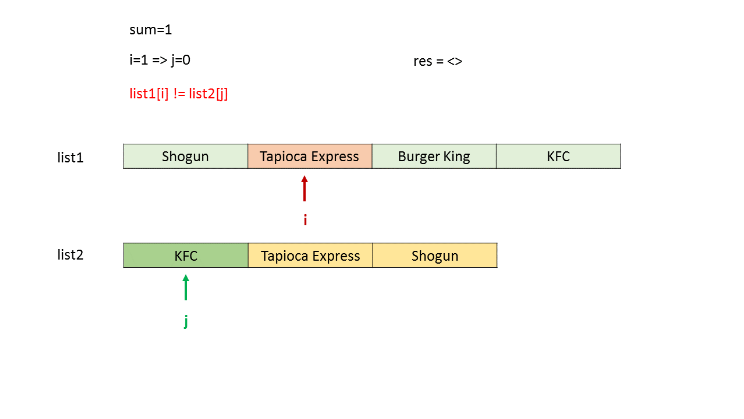


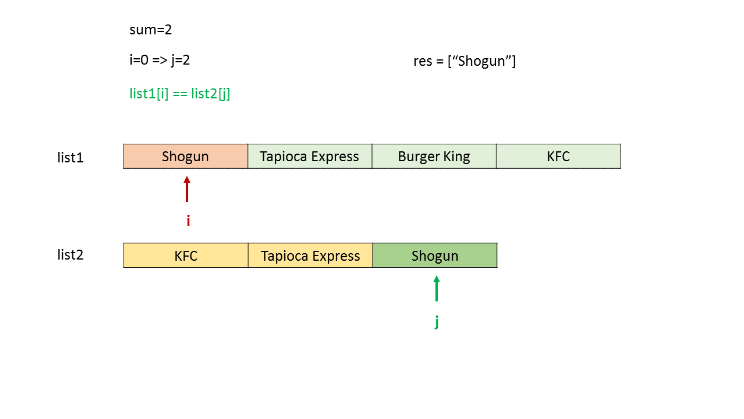
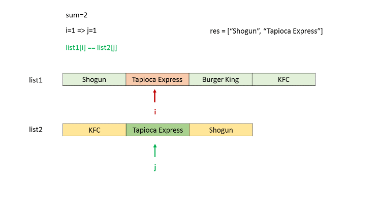
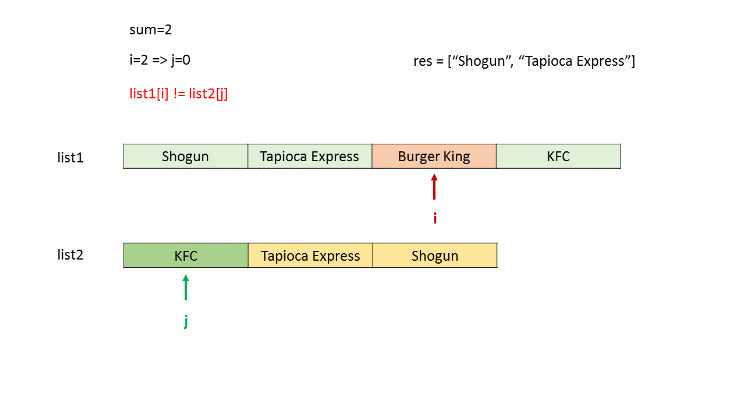
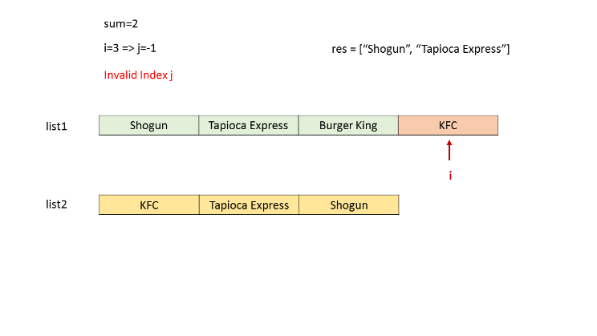
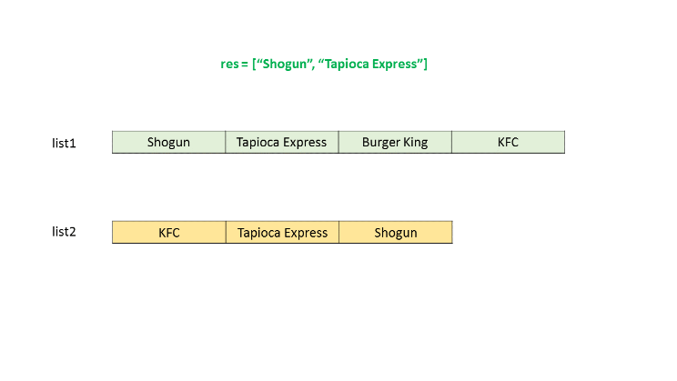

```java
public class Solution {
    public String[] findRestaurant(String[] list1, String[] list2) {
        List < String > res = new ArrayList < > ();
        for (int sum = 0; sum < list1.length + list2.length - 1; sum++) {
            for (int i = 0; i <= sum; i++) {
                if (i < list1.length && sum - i < list2.length && list1[i].equals(list2[sum - i]))
                    res.add(list1[i]);
            }
            if (res.size() > 0)
                break;
        }
        return res.toArray(new String[res.size()]);
    }
}
```

**Complexity Analysis**

* Time complexity : $O((l_1+l_2)^2*x)$. There are two nested loops upto $l_1+l_2$ and string comparison takes $x$ time. Here, $x$ refers to the average string length.

* Space complexity : $O(r*x)$. resres list is used to store the result. Assuming $r$ is the length of resres.

##　Approach #3 Using HashMap (linear) [Accepted]
We make use of a HashMap to solve the given problem in a different way in this approach. Firstly, we traverse over the whole $list1$ and create an entry for each element of $list1$ in a HashMap $map$, of the form $(list[i], i)$. Here, $i$ refers to the index of the $i^{th}$ element, and $list[i]$ is the $i^{th}$ element itself. Thus, we create a mapping from the elements of $list1$ to their indices.

Now, we traverse over $list2$. For every element ,$list2[j]$, of $list2$ encountered, we check if the same element already exists as a key in the $map$. If so, it means that the element exists in both $list1$ and $list2$. Thus, we find out the sum of indices corresponding to this element in the two lists, given by $sum = map.get(list[j]) + j$. If this $sum$ is lesser than the minimum sum obtained till now, we update the resultant list to be returned, resres, with the element $list2[j]$ as the only entry in it.

If the sumsum is equal to the minimum sum obtained till now, we put an extra entry corresponding to the element $list2[j]$ in the resres list.

Below code is inspired by @cloud.runner

```java
public class Solution {
    public String[] findRestaurant(String[] list1, String[] list2) {
        HashMap < String, Integer > map = new HashMap < String, Integer > ();
        for (int i = 0; i < list1.length; i++)
            map.put(list1[i], i);
        List < String > res = new ArrayList < > ();
        int min_sum = Integer.MAX_VALUE, sum;
        for (int j = 0; j < list2.length && j <= min_sum; j++) {
            if (map.containsKey(list2[j])) {
                sum = j + map.get(list2[j]);
                if (sum < min_sum) {
                    res.clear();
                    res.add(list2[j]);
                    min_sum = sum;
                } else if (sum == min_sum)
                    res.add(list2[j]);
            }
        }
        return res.toArray(new String[res.size()]);
    }
}
```

**Complexity Analysis**

* Time complexity : $O(l_1+l_2)$. Every item of $list2$ is checked in a map of $list1$. $l_1$ and $l_2$ are the lengths of $list1$ and $list2$ respectively.

* Space complexity : $O(l_1*x)$. hashmap size grows upto $l_1*x$, where $x$ refers to average string length.

# Submissions
---

**Solution :**
```
Runtime: 152 ms
Memory Usage: 14 MB
```
```python
class Solution:
    def findRestaurant(self, list1: List[str], list2: List[str]) -> List[str]:
        common_dict = {}
        ans = []
        least_index_sum = float('inf')
        for i in range(len(list1)):
            common_dict[list1[i]] = i
        for i in range(len(list2)):
            if list2[i] in common_dict:
                if common_dict[list2[i]] + i < least_index_sum:
                    ans.clear()
                    ans.append(list2[i])
                    least_index_sum = common_dict[list2[i]] + i
                elif common_dict[list2[i]] + i == least_index_sum:
                    ans.append(list2[i])
                    
        return ans
```