606. Construct String from Binary Tree

You need to construct a string consists of parenthesis and integers from a binary tree with the preorder traversing way.

The null node needs to be represented by empty parenthesis pair "()". And you need to omit all the empty parenthesis pairs that don't affect the one-to-one mapping relationship between the string and the original binary tree.

**Example 1:**
```
Input: Binary tree: [1,2,3,4]
       1
     /   \
    2     3
   /    
  4     

Output: "1(2(4))(3)"

Explanation: Originallay it needs to be "1(2(4)())(3()())", 
but you need to omit all the unnecessary empty parenthesis pairs. 
And it will be "1(2(4))(3)".
```

**Example 2:**
```
Input: Binary tree: [1,2,3,null,4]
       1
     /   \
    2     3
     \  
      4 

Output: "1(2()(4))(3)"

Explanation: Almost the same as the first example, 
except we can't omit the first parenthesis pair to break the one-to-one mapping relationship between the input and the output.
```

# Solution
---
## Approach #1 Using Recursion [Accepted]

This solution is very simple. We simply need to do the preorder traversal of the given Binary Tree. But, along with this, we need to make use of braces at appropriate positions. But, we also need to make sure that we omit the unnecessary braces. To do the preorder traversal, we make use of recursion. We print the current node and call the same given function for the left and the right children of the node in that order(if they exist). For every node encountered, the following cases are possible.

* Case 1: Both the left child and the right child exist for the current node. In this case, we need to put the braces () around both the left child's preorder traversal output and the right child's preorder traversal output.

* Case 2: None of the left or the right child exist for the current node. In this case, as shown in the figure below, considering empty braces for the null left and right children is redundant. Hence, we need not put braces for any of them.


* Case 3: Only the left child exists for the current node. As the figure below shows, putting empty braces for the right child in this case is unnecessary while considering the preorder traversal. This is because the right child will always come after the left child in the preorder traversal. Thus, omitting the empty braces for the right child also leads to same mapping between the string and the binary tree.


* Case 4: Only the right child exists for the current node. In this case, we need to consider the empty braces for the left child. This is because, during the preorder traversal, the left child needs to be considered first. Thus, to indicate that the child following the current node is a right child we need to put a pair of empty braces for the left child.


Just by taking care of the cases, mentioned above, we can obtain the required output string.

```java
/**
 * Definition for a binary tree node.
 * public class TreeNode {
 *     int val;
 *     TreeNode left;
 *     TreeNode right;
 *     TreeNode(int x) { val = x; }
 * }
 */
public class Solution {
    public String tree2str(TreeNode t) {
        if(t==null)
            return "";
        if(t.left==null && t.right==null)
            return t.val+"";
        if(t.right==null)
            return t.val+"("+tree2str(t.left)+")";
        return t.val+"("+tree2str(t.left)+")("+tree2str(t.right)+")";   
    }
}
```

**Complexity Analysis**

* Time complexity : $O(n)$. The preorder traversal is done over the $n$ nodes of the given Binary Tree.

* Space complexity : $O(n)$. The depth of the recursion tree can go upto $n$ in case of a skewed tree.

## Approach #2 Iterative Method Using stack [Accepted]
**Algorithm**

In order to solve the given problem, we can also make use of a $stack$. To see how to do it, we'll go through the implementation and we'll also look at the idea behind each step.

We make use of a $stack$ onto which various nodes of the given tree will be pushed during the process. The node at the top of the $stack$ represents the current node to be processed. Whenever a node has been processed once, it is marked as visited. The reasoning behind this will be discussed soon.

We start off by pushing the root of the binary tree onto the $stack$. Now, the root acts as the current node. For every current node encountered, firstly, we check if it has not been visited already. If not, we add it to the set of visited nodes.

Since, for the preorder traversal, we know, we need to process the nodes in the order current-left-right. Thus, we add a `(` followed by the current node to the string $s$ to be returned.

Now, if both the left and the right children of the current node exist, we need to process them in the order left-right. To do so, we need to push them onto the $stack$ in the reverse order, so that when they are picked up later on, their order of processing gets corrected.

Since we've already added $current\_node$ to the string $s$, if only the right child of the current node exists, as discussed in case 4 in the last approach, we need to put a `()` in $s$ representing the null left node. We need not push anything onto the $stack$ for the left node and we can directly add the `()` to $s$ for this. But, we still need to push the right child onto the $stack$ for future processing.

If only the left child exists, we need not consider the right child at all, as discussed in case 3 in the last approach. We can continue the process by just pushing the left child onto the stackstack.

Now, we need to note that even when a node is being processed, if it has not already been visited, it isn't popped off from the $stack$k. But, if a node that has already been processed(i.e. its children have been considered already), it is popped off from the $stack$ when encountered again. Such a situation will occur for a node only when the preorder traversal of both its left and right sub-trees has been completely done. Thus, we need to add a `)` to mark the end of the preorder traversal of the current node as well.

Thus, at the end, we get the required pre-order traversal in the substring $s(1:n-1)$. Here, $n$ represents the length of $s$. This is because, we need not put the parentheses(redundant) at the outermost level.

The following animation better depicts the process.

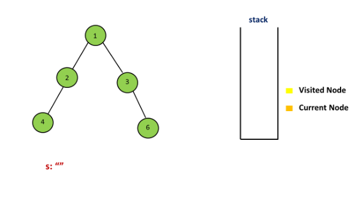
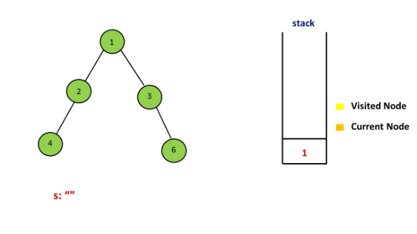
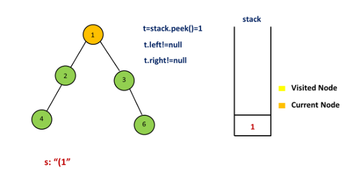
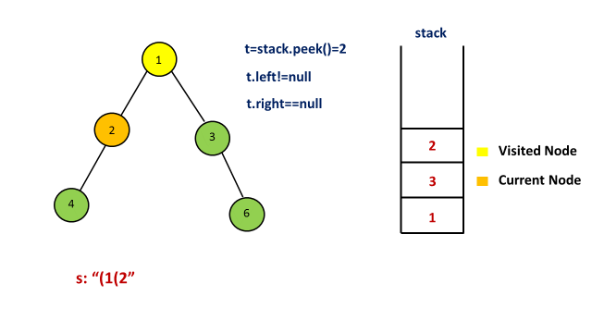
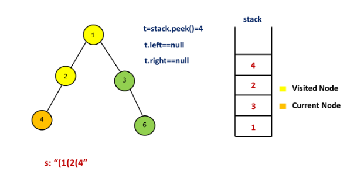
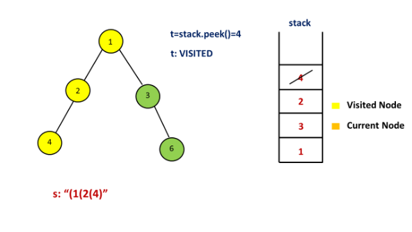
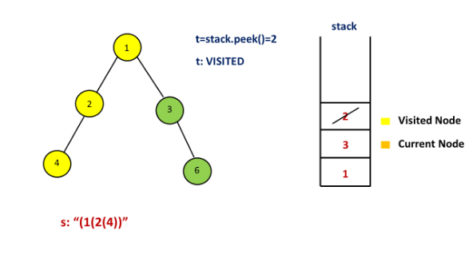
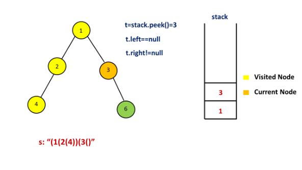
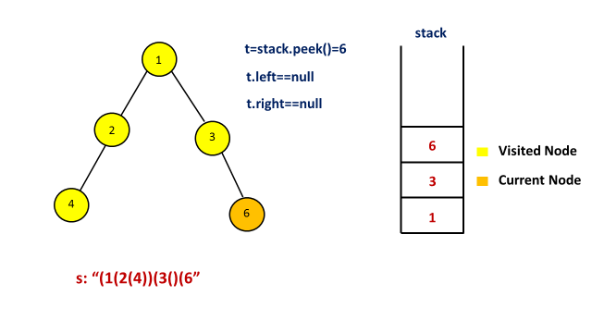
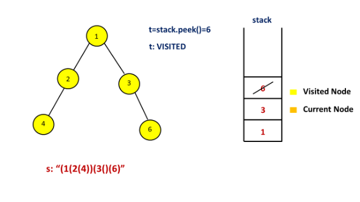
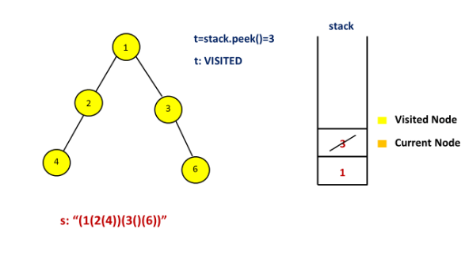
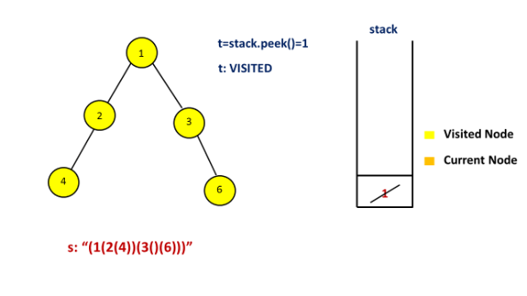
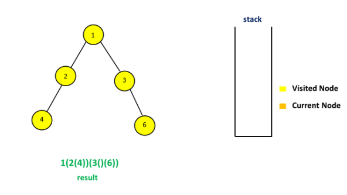

```java
public class Solution {
    public String tree2str(TreeNode t) {
        if (t == null)
            return "";
        Stack < TreeNode > stack = new Stack < > ();
        stack.push(t);
        Set < TreeNode > visited = new HashSet < > ();
        StringBuilder s = new StringBuilder();
        while (!stack.isEmpty()) {
            t = stack.peek();
            if (visited.contains(t)) {
                stack.pop();
                s.append(")");
            } else {
                visited.add(t);
                s.append("(" + t.val);
                if (t.left == null && t.right != null)
                    s.append("()");
                if (t.right != null)
                    stack.push(t.right);
                if (t.left != null)
                    stack.push(t.left);
            }
        }
        return s.substring(1, s.length() - 1);
    }
}
```

**Complexity Analysis**

* Time complexity : $O(n)$. $n$ nodes are pushed and popped in a stack.

* Space complexity : $O(n)$. $stack$ size can grow upto $n$.

# Submissions
---
**Solution 1: (Iterative Method Using stack)**
```
Runtime: 52 ms
Memory Usage: 14.5 MB
```
```python
# Definition for a binary tree node.
# class TreeNode:
#     def __init__(self, x):
#         self.val = x
#         self.left = None
#         self.right = None

class Solution:
    def tree2str(self, t: TreeNode) -> str:
        if not t:
            return ""
        stack = []
        stack.append(t)
        visited = set()
        s = ''
        while stack:
            t = stack[-1];
            if t in visited:
                stack.pop()
                s += ')'
            else:
                visited.add(t)
                s += "(" + str(t.val)
                if not t.left and t.right:
                    s += '()'
                if t.right:
                    stack.append(t.right)
                if t.left:
                    stack.append(t.left)

        return s[1:-1]
```

**Solution 2: (Using Recursion)**
```
Runtime: 36 ms
Memory Usage: 14.5 MB
```
```python
# Definition for a binary tree node.
# class TreeNode:
#     def __init__(self, x):
#         self.val = x
#         self.left = None
#         self.right = None

class Solution:
    def tree2str(self, t: TreeNode) -> str:
        if not t:
            return ''
        if not t.left and not t.right:
            return str(t.val) + ''
        if not t.right:
            return str(t.val) + '(' + self.tree2str(t.left) + ')'
        return str(t.val) + '(' + self.tree2str(t.left) + ')(' + self.tree2str(t.right) + ')'
```

**Solution 3: (Using Recursion)**
```
Runtime: 49 ms
Memory Usage: 26 MB
```
```c++
/**
 * Definition for a binary tree node.
 * struct TreeNode {
 *     int val;
 *     TreeNode *left;
 *     TreeNode *right;
 *     TreeNode() : val(0), left(nullptr), right(nullptr) {}
 *     TreeNode(int x) : val(x), left(nullptr), right(nullptr) {}
 *     TreeNode(int x, TreeNode *left, TreeNode *right) : val(x), left(left), right(right) {}
 * };
 */
class Solution {
public:
    string tree2str(TreeNode* root) {
        if(!root)
            return "";
        if (!root->left && !root->right)
            return to_string(root->val)+"";
        if (!root->right)
            return to_string(root->val) + "("+ tree2str(root->left) + ")";
        return to_string(root->val) + "(" + tree2str(root->left) + ")(" + tree2str(root->right) + ")"; 
    }
};
```
