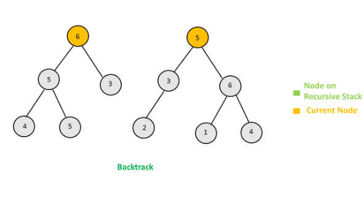
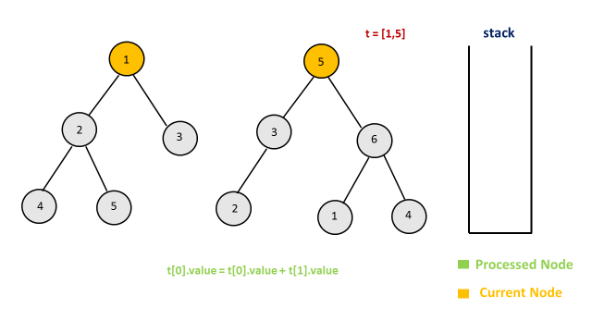
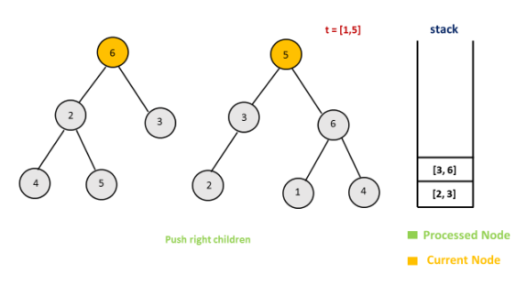

617. Merge Two Binary Trees

Given two binary trees and imagine that when you put one of them to cover the other, some nodes of the two trees are overlapped while the others are not.

You need to merge them into a new binary tree. The merge rule is that if two nodes overlap, then sum node values up as the new value of the merged node. Otherwise, the NOT null node will be used as the node of new tree.

**Example 1:**

```
Input: 
	Tree 1                     Tree 2                  
          1                         2                             
         / \                       / \                            
        3   2                     1   3                        
       /                           \   \                      
      5                             4   7                  
Output: 
Merged tree:
	     3
	    / \
	   4   5
	  / \   \ 
	 5   4   7
```

**Note:** The merging process must start from the root nodes of both trees.

# Solution
---
## Approach #1 Using Recursion [Accepted]
We can traverse both the given trees in a preorder fashion. At every step, we check if the current node exists(isn't null) for both the trees. If so, we add the values in the current nodes of both the trees and update the value in the current node of the first tree to reflect this sum obtained. At every step, we also call the original function `mergeTrees()` with the left children and then with the right children of the current nodes of the two trees. If at any step, one of these children happens to be null, we return the child of the other tree(representing the corresponding child subtree) to be added as a child subtree to the calling parent node in the first tree. At the end, the first tree will represent the required resultant merged binary tree.

The following animation illustrates the process.





```java
/**
 * Definition for a binary tree node.
 * public class TreeNode {
 *     int val;
 *     TreeNode left;
 *     TreeNode right;
 *     TreeNode(int x) { val = x; }
 * }
 */
public class Solution {
    public TreeNode mergeTrees(TreeNode t1, TreeNode t2) {
        if (t1 == null)
            return t2;
        if (t2 == null)
            return t1;
        t1.val += t2.val;
        t1.left = mergeTrees(t1.left, t2.left);
        t1.right = mergeTrees(t1.right, t2.right);
        return t1;
    }
}
```

**Complexity Analysis**

* Time complexity : $O(m)$. A total of $m$ nodes need to be traversed. Here, $m$ represents the minimum number of nodes from the two given trees.

* Space complexity : $O(m)$. The depth of the recursion tree can go upto $m$ in the case of a skewed tree. In average case, depth will be $O(logm)$.

## Approach #2 Iterative Method [Accepted]
**Algorithm**

In the current approach, we again traverse the two trees, but this time we make use of a $stack$ to do so instead of making use of recursion. Each entry in the $stack$ strores data in the form $[node_{tree1}, node_{tree2}]$. Here, $node_{tree1}$ and $node_{tree2}$ are the nodes of the first tree and the second tree respectively.

We start off by pushing the root nodes of both the trees onto the $stack$. Then, at every step, we remove a node pair from the top of the stack. For every node pair removed, we add the values corresponding to the two nodes and update the value of the corresponding node in the first tree. Then, if the left child of the first tree exists, we push the left child(pair) of both the trees onto the stack. If the left child of the first tree doesn't exist, we append the left child(subtree) of the second tree to the current node of the first tree. We do the same for the right child pair as well.

If, at any step, both the current nodes are null, we continue with popping the next nodes from the $stack$.

The following animation depicts the process.







```java
/**
 * Definition for a binary tree node.
 * public class TreeNode {
 *     int val;
 *     TreeNode left;
 *     TreeNode right;
 *     TreeNode(int x) { val = x; }
 * }
 */
public class Solution {
    public TreeNode mergeTrees(TreeNode t1, TreeNode t2) {
        if (t1 == null)
            return t2;
        Stack < TreeNode[] > stack = new Stack < > ();
        stack.push(new TreeNode[] {t1, t2});
        while (!stack.isEmpty()) {
            TreeNode[] t = stack.pop();
            if (t[0] == null || t[1] == null) {
                continue;
            }
            t[0].val += t[1].val;
            if (t[0].left == null) {
                t[0].left = t[1].left;
            } else {
                stack.push(new TreeNode[] {t[0].left, t[1].left});
            }
            if (t[0].right == null) {
                t[0].right = t[1].right;
            } else {
                stack.push(new TreeNode[] {t[0].right, t[1].right});
            }
        }
        return t1;
    }
}
```

**Complexity Analysis**

* Time complexity : $O(n)$. We traverse over a total of nn nodes. Here, $n$ refers to the smaller of the number of nodes in the two trees.

* Space complexity : $O(n)$. The depth of stack can grow upto $n$ in case of a skewed tree.

# Submissions
---
**Solution 1:**
```
Runtime: 92 ms
Memory Usage: N/A
```
```python
class Solution:
    def mergeTrees(self, t1, t2):
        """
        :type t1: TreeNode
        :type t2: TreeNode
        :rtype: TreeNode
        """
        if t1 is None:
            return t2
        if t2 is None:
            return t1

        t1.val += t2.val;
        t1.left = self.mergeTrees(t1.left, t2.left)
        t1.right = self.mergeTrees(t1.right, t2.right)
        return t1
```