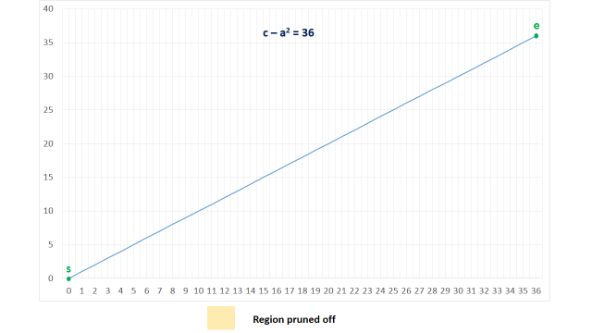
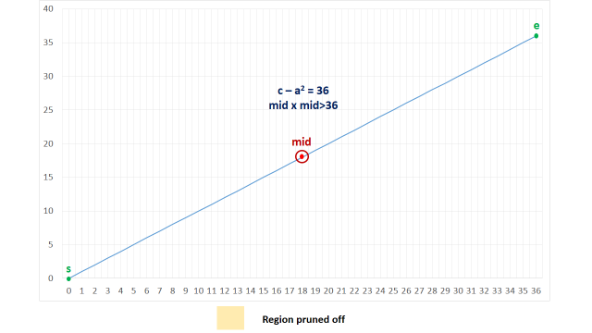
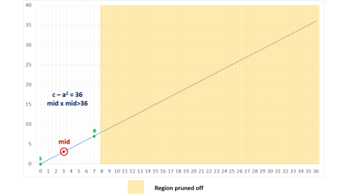
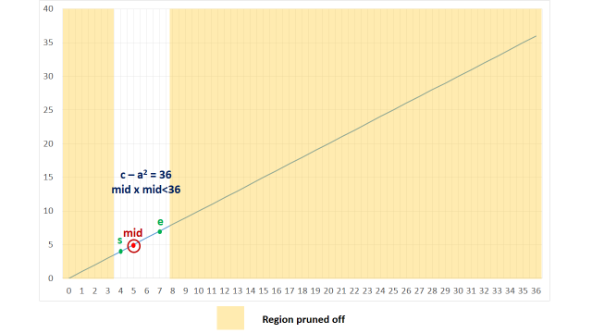
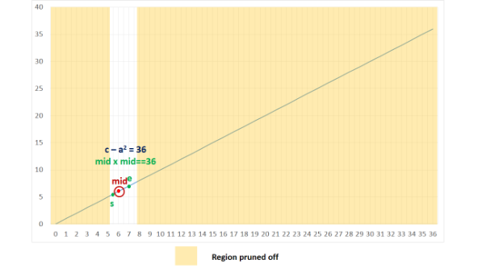

633. Sum of Square Numbers

Given a non-negative integer `c`, your task is to decide whether there're two integers $a$ and $b$ such that $a^2 + b^2 = c$.

**Example 1:**
```
Input: 5
Output: True
Explanation: 1 * 1 + 2 * 2 = 5
```

**Example 2:**
```
Input: 3
Output: False
```

# Solution
---
## Approach 1: Brute Force
The simplest solution would be to consider every possible combination of integers aa and bb and check if the sum of their squares equals $c$. Now, both $a$ and $b$ can lie within the range $(0,\sqrt{c})$. Thus, we need to check for the values of $a$ and $b$ in this range only.

```java
public class Solution {
    public boolean judgeSquareSum(int c) {
        for (long a = 0; a * a <= c; a++) {
            for (long b = 0; b * b <= c; b++) {
                if (a * a + b * b == c)
                    return true;
            }
        }
        return false;
    }
}
```

**Complexity Analysis**

* Time complexity : $O(c)$. Two loops upto $\sqrt{c}$. Here, $c$ refers to the given integer(sum of squares).

* Space complexity : $O(1)$. Constant extra space is used.

## Approach 2: Better Brute Force
We can improve the last solution, if we make the following observation. For any particular aa chosen, the value of $b$ required to satisfy the equation $a^2 + b^2 = c$ will be such that $b^2 = c - a^2$. Thus, we need to traverse over the range $(0, \sqrt{c})$ only for considering the various values of $a$. For every current value of aa chosen, we can determine the corresponding $b^2$ value and check if it is a perfect square or not. If it happens to be a perfect square, $c$ is a sum of squares of two integers, otherwise not.

Now, to determine, if the number $c - a^2$ is a perfect square or not, we can make use of the following theorem:

>> The square of $n^{th}$ positive integer can be represented as a sum of first $n$ odd positive integers.

Or in mathematical terms:

$n^2 = 1 + 3 + 5 + ... + (2 \cdot n-1) = \sum_{i=1}^{n} (2 \cdot i - 1)$

To look at the proof of this statement, look at the L.H.S. of the above statement.

$\begin{aligned} &1 + 3 + 5 + \ldots + (2 \cdot n-1) \\ = \; &(2 \cdot 1-1) + (2 \cdot 2-1) + (2 \cdot 3-1) + \ldots + (2 \cdot n-1) \\ = \; &2 \cdot (1+2+3+....+n) - (\underbrace{1+1+ \ldots +1}_{n\text{ times}}) \\ = \; &2 \cdot \frac{n\;(n+1)}{2} - n \\ = \; &n\;(n+1) - n \\ = \; &n^2 + n - n \\ = \; &n^2 \end{aligned}$

This completes the proof of the above statement.

```java
public class Solution {
    public boolean judgeSquareSum(int c) {
        for (long a = 0; a * a <= c; a++) {
            int b =  c - (int)(a * a);
            int i = 1, sum = 0;
            while (sum < b) {
                sum += i;
                i += 2;
            }
            if (sum == b)
                return true;
        }
        return false;
    }
}
```

**Complexity Analysis**

* Time complexity : $O(c)$. The total number of times the $sum$ is updated is: $1 + 2 + 3 + \ldots + \sqrt{c} = \frac{\sqrt{c}\;(\sqrt{c}+1)}{2} = O(c)$.

* Space complexity : $O(1)$. Constant extra space is used.

## Approach 3: Using Sqrt Function
**Algorithm**

Instead of finding if $c - a^2$ is a perfect square using sum of odd numbers, as done in the last approach, we can make use of the inbuilt sqrtsqrt function and check if $\sqrt{c - a^2}$ turns out to be an integer. If it happens for any value of aa in the range $[0, \sqrt{c}]$, we can return a True value immediately.

```java
public class Solution {
    public boolean judgeSquareSum(int c) {
        for (long a = 0; a * a <= c; a++) {
            double b = Math.sqrt(c - a * a);
            if (b == (int) b)
                return true;
        }
        return false;
    }
}
```

**Complexity Analysis**

* Time complexity : $O\big(\sqrt{c}\log c\big)$. We iterate over $\sqrt{c}$ values for choosing $a$. For every $a$ chosen, finding square root of $c - a^2$ takes $O\big(\log c\big)$ time in the worst case.

* Space complexity : $O(1)$. Constant extra space is used.

## Approach 4: Binary Search
**Algorithm**

Another method to check if $c - a^2$ is a perfect square, is by making use of Binary Search. The method remains same as that of a typical Binary Search to find a number. The only difference lies in that we need to find an integer, $mid$ in the range $[0, c - a^2]$, such that this number is the square root of $c - a^2$. Or in other words, we need to find an integer, $mid$, in the range $[0, c - a^2]$, such that $mid \times mid = c - a^2$.

The following animation illustrates the search process for a particular value of $c - a^2 = 36$.








```java
public class Solution {
    public boolean judgeSquareSum(int c) {
        for (long a = 0; a * a <= c; a++) {
            int b = c - (int)(a * a);
            if (binary_search(0, b, b))
                return true;
        }
        return false;
    }
    public boolean binary_search(long s, long e, int n) {
        if (s > e)
            return false;
        long mid = s + (e - s) / 2;
        if (mid * mid == n)
            return true;
        if (mid * mid > n)
            return binary_search(s, mid - 1, n);
        return binary_search(mid + 1, e, n);
    }
}
```

**Complexity Analysis**

* Time complexity : $O\big(\sqrt{c}\log c\big)$. Binary search taking $O\big(\log c\big)$ in the worst case is done for $\sqrt{c}$ values of $a$.

* Space complexity : $O(\log c)$. Binary Search will take $O(\log c)$ space.

## Approach 5: Fermat Theorem
**Algorithm**

This approach is based on the following statement, which is based on Fermat's Theorem:

>> Any positive number $n$ is expressible as a sum of two squares if and only if the prime factorization of $n$, every prime of the form $(4k+3)$ occurs an even number of times.

By making use of the above theorem, we can directly find out if the given number $c$ can be expressed as a sum of two squares.

To do so we simply find all the prime factors of the given number $c$, which could range from $[2,\sqrt{c}]$ along with the count of those factors, by repeated division. If at any step, we find out that the number of occurences of any prime factor of the form $(4k+3)$ occurs an odd number of times, we can return a False value.

In case, $c$ itself is a prime number, it won't be divisible by any of the primes in the $[2,\sqrt{c}]$. Thus, we need to check if $c$ can be expressed in the form of $4k+3$. If so, we need to return a False value, indicating that this prime occurs an odd number(1) of times.

Otherwise, we can return a True value.

The proof of this theorem includes the knowledge of advanced mathematics and is beyond the scope of this article. However, interested reader can refer to this documentation.

```java
public class Solution {
    public boolean judgeSquareSum(int c) {
        for (int i = 2; i * i <= c; i++) {
            int count = 0;
            if (c % i == 0) {
                while (c % i == 0) {
                    count++;
                    c /= i;
                }
                if (i % 4 == 3 && count % 2 != 0)
                    return false;
            }
        }
        return c % 4 != 3;
    }
}
```

**Complexity Analysis**

* Time complexity : $O\big(\sqrt{c}\log c\big)$. We find the factors of $c$ and their count using repeated division. We check for the factors in the range $[0, \sqrt{c}]$. The maximum number of times a factor can occur(repeated division can be done) is $\log n$(considering 2 as the only factor, $c=2^x$. Thus, $x=\log c$).

* Space complexity : $O(1)$. Constant space is used.

# Submissions
---
**Solution 1:**
```
Runtime: 260 ms
Memory Usage: 12.9 MB
```
```python
class Solution:
    def judgeSquareSum(self, c: int) -> bool:
        for a in range(int(c**.5) + 1):
            b = (c - a**2)**.5
            if b == int(b):
                return True
        return False
```