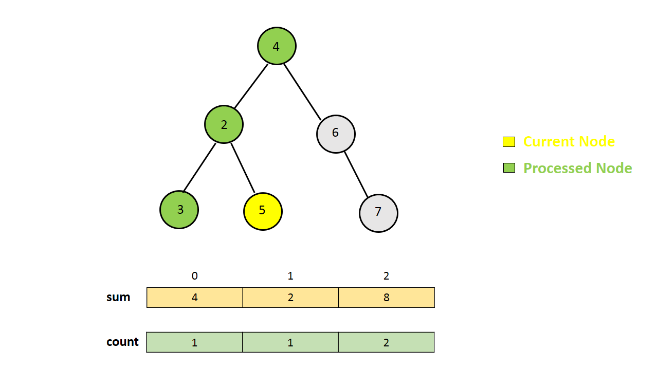

637. Average of Levels in Binary Tree

Given a non-empty binary tree, return the average value of the nodes on each level in the form of an array.
**Example 1:**
```
Input:
    3
   / \
  9  20
    /  \
   15   7
Output: [3, 14.5, 11]
Explanation:
The average value of nodes on level 0 is 3,  on level 1 is 14.5, and on level 2 is 11. Hence return [3, 14.5, 11].
```

**Note:**

* The range of node's value is in the range of 32-bit signed integer.

# Solution
---
## Approach #1 Using Depth First Search [Accepted]
**Algorithm**

One of the methods to solve the given problem is to make use of Depth First Search. In DFS, we try to exhaust each branch of the given tree during the tree traversal before moving onto the next branch.

To make use of DFS to solve the given problem, we make use of two lists $count$ and $res$. Here, $count[i]$ refers to the total number of nodes found at the $i^{th}$ level(counting from root at level 0) till now, and $res[i]$ refers to the sum of the nodes at the $i^{th}$ level encountered till now during the Depth First Search.

We make use of a function `average(t, i, res, count)`, which is used to fill the $res$ and $count$ array if we start the DFS from the node $t$ at the $i^{th}$ level in the given tree. We start by making the function call `average(root, 0, res, count)`. After this, we do the following at every step:

1. Add the value of the current node to the `resres(or sumsum)` at the index corresponding to the current level. Also, increment the $count$ at the index corresponding to the current level.

1. Call the same function, `average`, with the left and the right child of the current node. Also, update the current level used in making the function call.

1. Repeat the above steps till all the nodes in the given tree have been considered once.

1. Populate the averages in the resultant array to be returned.

The following animation illustrates the process.





```java
/**
 * Definition for a binary tree node.
 * public class TreeNode {
 *     int val;
 *     TreeNode left;
 *     TreeNode right;
 *     TreeNode(int x) { val = x; }
 * }
 */
public class Solution {
    public List < Double > averageOfLevels(TreeNode root) {
        List < Integer > count = new ArrayList < > ();
        List < Double > res = new ArrayList < > ();
        average(root, 0, res, count);
        for (int i = 0; i < res.size(); i++)
            res.set(i, res.get(i) / count.get(i));
        return res;
    }
    public void average(TreeNode t, int i, List < Double > sum, List < Integer > count) {
        if (t == null)
            return;
        if (i < sum.size()) {
            sum.set(i, sum.get(i) + t.val);
            count.set(i, count.get(i) + 1);
        } else {
            sum.add(1.0 * t.val);
            count.add(1);
        }
        average(t.left, i + 1, sum, count);
        average(t.right, i + 1, sum, count);
    }
}
```

**Complexity Analysis**

* Time complexity : $O(n)$. The whole tree is traversed once only. Here, $n$ refers to the total number of nodes in the given binary tree.

* Space complexity : $O(h)$. $res$ and $count$ array of size $h$ are used. Here, $h$ refers to the height(maximum number of levels) of the given binary tree. Further, the depth of the recursive tree could go upto $h$ only.

## Approach #2 Breadth First Search [Accepted]
**Algorithm**

Another method to solve the given problem is to make use of a Breadth First Search. In BFS, we start by pushing the root node into a $queue$. Then, we remove an element(node) from the front of the $queue$. For every node removed from the $queue$, we add all its children to the back of the same $queue$. We keep on continuing this process till the $queue$ becomes empty. In this way, we can traverse the given tree on a level-by-level basis.

But, in the current implementation, we need to do a slight modification, since we need to separate the nodes on one level from that of the other.

The steps to be performed are listed below:

1. Put the root node into the $queue$.

1. Initialize $sum$ and $count$ as 0 and $temp$ as an empty queue.

1. Pop a node from the front of the $queue$. Add this node's value to the $sum$ corresponding to the current level. Also, update the $count$ corresponding to the current level.

1. Put the children nodes of the node last popped into the a $temp$ queue(instead of $queue$).

1. Continue steps 3 and 4 till $queue$ becomes empty. (An empty $queue$ indicates that one level of the tree has been considered).

1. Reinitialize $queue$ with its value as $temp$.

1. Populate the $res$ array with the average corresponding to the current level.

1. Repeat steps 2 to 7 till the $queue$ and $temp$ become empty.

At the end, $res$ is the required result.

The following animation illustrates the process.


```java

/**
 * Definition for a binary tree node.
 * public class TreeNode {
 *     int val;
 *     TreeNode left;
 *     TreeNode right;
 *     TreeNode(int x) { val = x; }
 * }
 */
public class Solution {
    public List < Double > averageOfLevels(TreeNode root) {
        List < Double > res = new ArrayList < > ();
        Queue < TreeNode > queue = new LinkedList < > ();
        queue.add(root);
        while (!queue.isEmpty()) {
            long sum = 0, count = 0;
            Queue < TreeNode > temp = new LinkedList < > ();
            while (!queue.isEmpty()) {
                TreeNode n = queue.remove();
                sum += n.val;
                count++;
                if (n.left != null)
                    temp.add(n.left);
                if (n.right != null)
                    temp.add(n.right);
            }
            queue = temp;
            res.add(sum * 1.0 / count);
        }
        return res;
    }
}
```

**Complexity Analysis**

* Time complexity : $O(n)$. The whole tree is traversed atmost once. Here, $n$ refers to the number of nodes in the given binary tree.

* Space complexity : $O(m)$. The size of $queue$ or $temp$ can grow upto atmost the maximum number of nodes at any level in the given binary tree. Here, $m$ refers to the maximum mumber of nodes at any level in the input tree.

# Submissions
---
**Solution 1: (Level-Order)**
```
Runtime: 48 ms
Memory Usage: 14.9 MB
```
```python
# Definition for a binary tree node.
# class TreeNode:
#     def __init__(self, x):
#         self.val = x
#         self.left = None
#         self.right = None

class Solution:
    def averageOfLevels(self, root: TreeNode) -> List[float]:
        ans = []
        level = [root]
        while level:
            ans += [sum([node.val for node in level])/len(level)]
            level = [c for node in level if node for c in [node.left, node.right] if c]
        return ans
```