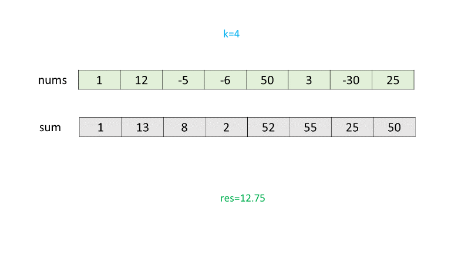

643. Maximum Average Subarray I

Given an array consisting of `n` integers, find the contiguous subarray of given length `k` that has the maximum average value. And you need to output the maximum average value.

**Example 1:**
```
Input: [1,12,-5,-6,50,3], k = 4
Output: 12.75
Explanation: Maximum average is (12-5-6+50)/4 = 51/4 = 12.75
```

**Note:**

1. `1 <= k <= n <= 30,000`.
1. Elements of the given array will be in the range [-10,000, 10,000].

# Solution
---
## Approach #1 Cumulative Sum [Accepted]
**Algorithm**

We know that in order to obtain the averages of subarrays with length $k$, we need to obtain the sum of these $k$ length subarrays. One of the methods of obtaining this sum is to make use of a cumulative sum array, $sum$, which is populated only once. Here, $sum[i]$ is used to store the sum of the elements of the given $nums$ array from the first element upto the element at the $i^{th}$ index.

Once the $sum$ array has been filled up, in order to find the sum of elements from the index $i$ to $i+k$, all we need to do is to use: $sum[i] - sum[i-k]$. Thus, now, by doing one more iteration over the $sum$ array, we can determine the maximum average possible from the subarrays of length $k$.

The following animation illustrates the process for a simple example.




```java
public class Solution {
    public double findMaxAverage(int[] nums, int k) {
        int[] sum = new int[nums.length];
        sum[0] = nums[0];
        for (int i = 1; i < nums.length; i++)
        sum[i] = sum[i - 1] + nums[i];
        double res = sum[k - 1] * 1.0 / k;
        for (int i = k; i < nums.length; i++) {
            res = Math.max(res, (sum[i] - sum[i - k]) * 1.0 / k);
        }
        return res;
    }
}
```

**Complexity Analysis**

* Time complexity : $O(n)$. We iterate over the $nums$ array of length $n$ once to fill the $sum$ array. Then, we iterate over $n-k$ elements of $sum$ to determine the required result.

* Space complexity : $O(n)$. We make use of a $sum$ array of length $n$ to store the cumulative sum.

## Approach #2 Sliding Window [Accepted]
**Algorithm**

Instead of creating a cumulative sum array first, and then traversing over it to determine the required sum, we can simply traverse over $nums$ just once, and on the go keep on determining the sums possible for the subarrays of length $k$. To understand the idea, assume that we already know the sum of elements from index $i$ to index $i+k$, say it is $x$.

Now, to determine the sum of elements from the index $i+1$ to the index $i+k+1$, all we need to do is to subtract the element $nums[i]$ from $x$ and to add the element $nums[i+k+1]$ to $x$. We can carry out our process based on this idea and determine the maximum possible average.

```java
public class Solution {
    public double findMaxAverage(int[] nums, int k) {
        double sum=0;
        for(int i=0;i<k;i++)
            sum+=nums[i];
        double res=sum;
        for(int i=k;i<nums.length;i++){
            sum+=nums[i]-nums[i-k];
                res=Math.max(res,sum);
        }
        return res/k;
    }
}
```

**Complexity Analysis**

* Time complexity : $O(n)$. We iterate over the given $nums$ array of length $n$ once only.

* Space complexity : $O(1)$. Constant extra space is used.

# Submissions
---
**Solution**
```
Runtime: 996 ms
Memory Usage: 17.7 MB
```
```python
class Solution:
    def findMaxAverage(self, nums: List[int], k: int) -> float:
        sub_sum = sum(nums[:k])
        max_sum = sub_sum
        for i in range(1, len(nums)-k+1):
            sub_sum -= nums[i-1] 
            sub_sum += nums[i+k-1]
            max_sum = max(max_sum, sub_sum)
        return max_sum/k
```
