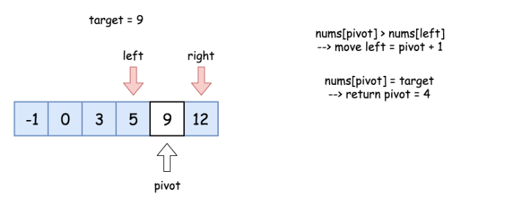

704. Binary Search

Given a **sorted** (in ascending order) integer array `nums` of n elements and a `target` value, write a function to search `target` in `nums`. If target exists, then return its index, otherwise return `-1`.


**Example 1:**
```
Input: nums = [-1,0,3,5,9,12], target = 9
Output: 4
Explanation: 9 exists in nums and its index is 4
```

**Example 2:**
```
Input: nums = [-1,0,3,5,9,12], target = 2
Output: -1
Explanation: 2 does not exist in nums so return -1
```

**Note:**

* You may assume that all elements in nums are unique.
* n will be in the range `[1, 10000]`.
* The value of each element in nums will be in the range `[-9999, 9999]`.

# Solution
---
## Approach 1: Binary Search
**Intuition**

Binary search is a textbook algorithm based on the idea to compare the target value to the middle element of the array.

If the target value is equal to the middle element - we're done.

If the target value is smaller - continue to search on the left.

If the target value is larger - continue to search on the right.


**Algorithm**

* Initialise `left` and `right` pointers : `left = 0, right = n - 1`.

* While `left <= right` :

    * Compare middle element of the array `nums[pivot]` to the target value `target`.

        * If the middle element is the target `target = nums[pivot]` : return pivot.

        * If the `target` is not yet found :

            * If `target < nums[pivot]`, continue the search on the left `right = pivot - 1`.

            * Else continue the search on the right `left = pivot + 1`.

**Implementation**




```python
class Solution:
    def search(self, nums: List[int], target: int) -> int:
        left, right = 0, len(nums) - 1
        while left <= right:
            pivot = left + (right - left) // 2
            if nums[pivot] == target:
                return pivot
            if target < nums[pivot]:
                right = pivot - 1
            else:
                left = pivot + 1
        return -1
```

**Complexity Analysis**

* Time complexity : $\mathcal{O}(\log N)$.

Let's compute time complexity with the help of master theorem $T(N) = aT\left(\frac{N}{b}\right) + \Theta(N^d)$. The equation represents dividing the problem up into aa subproblems of size $\frac{N}{b}$ in $\Theta(N^d)$ time. Here at step there is only one subproblem `a = 1`, its size is a half of the initial problem `b = 2`, and all this happens in a constant time `d = 0`. That means that $\log_b{a} = d$ a=d and hence we're dealing with case 2 that results in $\mathcal{O}(n^{\log_b{a}} \log^{d + 1} N)$ = $\mathcal{O}(\log N)$ time complexity.

* Space complexity : $\mathcal{O}(1)$ since it's a constant space solution.

# Submissions
---
**Solution: (Binary Search)**
```
Runtime: 260 ms
Memory Usage: 13.9 MB
```
```python
class Solution:
    def search(self, nums: List[int], target: int) -> int:
        left, right = 0, len(nums) - 1
        while left <= right:
            pivot = left + (right - left) // 2
            if nums[pivot] == target:
                return pivot
            if target < nums[pivot]:
                right = pivot - 1
            else:
                left = pivot + 1
        return -1
```

**Solution 2: (Binary Search)**
```
Runtime: 43 ms
Memory Usage: 7.3 MB
```
```c
int search(int* nums, int numsSize, int target){
    int left = 0, right = numsSize-1, mid;
    while (left <= right) {
        mid = (left+right) / 2;
        if (nums[mid] == target)
            return mid;
        else if (nums[mid] < target)
            left = mid + 1;
        else
            right = mid - 1;
    }
    return -1;
}
```
