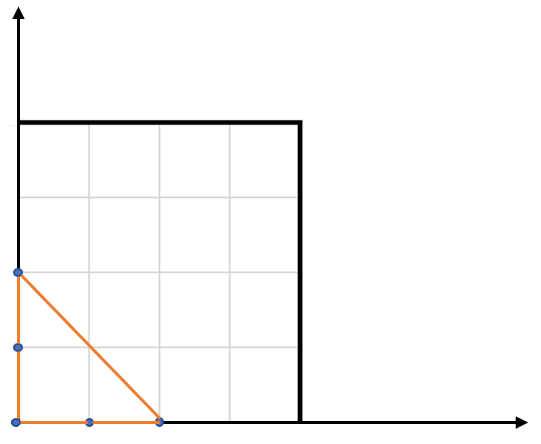

812. Largest Triangle Area

You have a list of points in the plane. Return the area of the largest triangle that can be formed by any 3 of the points.

**Example:**
```
Input: points = [[0,0],[0,1],[1,0],[0,2],[2,0]]
Output: 2
Explanation: 
The five points are show in the figure below. The red triangle is the largest.
```


**Notes:**

* `3 <= points.length <= 50`.
* No points will be duplicated.
* ``-50 <= points[i][j] <= 50`.
* Answers within `10^-6` of the true value will be accepted as correct.

# Solution
---
## Approach #1: Brute Force [Accepted]
**Intuition**

For each possible triangle, check it's area and keep the area of the largest.

**Algorithm**

We will have 3 for loops to cycle through each choice of 3 points in the array.

After, we'll need a function to calculate the area given 3 points. Here we have some options:

We can use the Shoelace formula directly, which tells us the area given the 3 points;

We can use Heron's formula, which requires the 3 side lengths which we can get by taking the distance of two points;

We can use the formula area = `0.5 * a * b * sin(C)` and calculate the angle C with trigonometry.

Our implementation illustrates the use of the shoelace formula.

If we did not know the shoelace formula, we could derive it for triangles with the following approach: starting with points `(px, py), (qx, qy), (rx, ry)`, the area of this triangle is the same under a translation by `(-rx, -ry)`, so that the points become `(px-rx, py-ry), (qx-rx, qy-ry), (0, 0)`.

From there, we could draw a square around the triangle with sides touching the coordinate axes, and calculate the area of the square minus the area of the right triangles surrounding the inner triangle.

For more on this approach, see the Wikipedia entry for the Shoelace formula.

```python
class Solution(object):
    def largestTriangleArea(self, points):
        def area(p, q, r):
            return .5 * abs(p[0]*q[1]+q[0]*r[1]+r[0]*p[1]
                           -p[1]*q[0]-q[1]*r[0]-r[1]*p[0])

        return max(area(*triangle)
            for triangle in itertools.combinations(points, 3))
```

**Complexity Analysis**

* Time Complexity: $O(N^3)$, where $N$ is the length of points. We use three for-loops of length $O(N)$, and our work calculating the area of a single triangle is $O(1)$.

* Space Complexity: $O(1)$.

# Submissions
---
**Solution 1:**
```
Runtime: 148 ms
Memory Usage: 12.9 MB
```
```python
class Solution:
    def largestTriangleArea(self, points: List[List[int]]) -> float:
        def area(p, q, r):
            return .5 * abs(p[0]*q[1]+q[0]*r[1]+r[0]*p[1]
                           -p[1]*q[0]-q[1]*r[0]-r[1]*p[0])

        return max(area(*triangle) for triangle in itertools.combinations(points, 3))
```