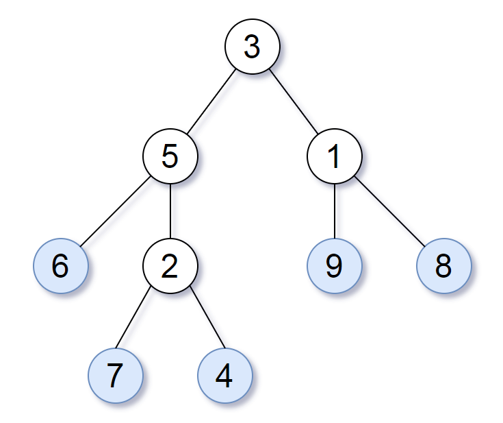

872. Leaf-Similar Trees

Consider all the leaves of a binary tree.  From left to right order, the values of those leaves form a leaf value sequence.



For example, in the given tree above, the leaf value sequence is `(6, 7, 4, 9, 8)`.

Two binary trees are considered leaf-similar if their leaf value sequence is the same.

Return `true` if and only if the two given trees with head nodes `root1` and `root2` are leaf-similar.

 

**Note:**

* Both of the given trees will have between `1` and `100` nodes.

# Solution
---
## Approach 1: Depth First Search
**Intuition and Algorithm**

Let's find the leaf value sequence for both given trees. Afterwards, we can compare them to see if they are equal or not.

To find the leaf value sequence of a tree, we use a depth first search. Our `dfs` function writes the node's value if it is a leaf, and then recursively explores each child. This is guaranteed to visit each leaf in left-to-right order, as left-children are fully explored before right-children.

```python
class Solution:
    def leafSimilar(self, root1, root2):
        def dfs(node):
            if node:
                if not node.left and not node.right:
                    yield node.val
                yield from dfs(node.left)
                yield from dfs(node.right)

        return list(dfs(root1)) == list(dfs(root2))
```

**Complexity Analysis**

* Time Complexity: $O(T_1 + T_2)$, where $T_1, T_2$ are the lengths of the given trees.

* Space Complexity: $O(T_1 + T_2)$, the space used in storing the leaf values.

# Submissions
---
**Solution:**
```
Runtime: 32 ms
Memory Usage: 12.7 MB
```
```python
# Definition for a binary tree node.
# class TreeNode:
#     def __init__(self, x):
#         self.val = x
#         self.left = None
#         self.right = None

class Solution:
    def leafSimilar(self, root1: TreeNode, root2: TreeNode) -> bool:
        def dfs(node):
            if node:
                if not node.left and not node.right:
                    yield node.val
                yield from dfs(node.left)
                yield from dfs(node.right)

        return list(dfs(root1)) == list(dfs(root2))      
```

**Solution 2: (DFS)**
```
Runtime: 0 ms
Memory: 14 MB
```
```c++
/**
 * Definition for a binary tree node.
 * struct TreeNode {
 *     int val;
 *     TreeNode *left;
 *     TreeNode *right;
 *     TreeNode() : val(0), left(nullptr), right(nullptr) {}
 *     TreeNode(int x) : val(x), left(nullptr), right(nullptr) {}
 *     TreeNode(int x, TreeNode *left, TreeNode *right) : val(x), left(left), right(right) {}
 * };
 */
class Solution {
public:
    bool leafSimilar(TreeNode* root1, TreeNode* root2) {

        function<void(TreeNode*, vector<int>&)> dfs = [&](TreeNode* node, vector<int> &rst) {
            if (!node) {
                return;
            }
            if (!node->left && !node->right) {
                rst.push_back(node->val);
                return;
            }
            dfs(node->left, rst);
            dfs(node->right, rst);
        };
        vector<int> v1, v2;
        dfs(root1, v1);
        dfs(root2, v2);
        return v1 == v2; 
    }
};
```
