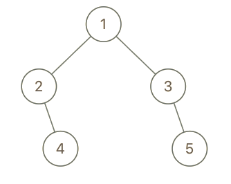
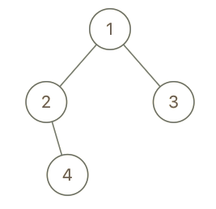

993. Cousins in Binary Tree

In a binary tree, the root node is at depth `0`, and children of each depth `k` node are at depth `k+1`.

Two nodes of a binary tree are cousins if they have the same depth, but have **different parents**.

We are given the root of a binary tree with unique values, and the values `x` and `y` of two different nodes in the tree.

Return true if and only if the nodes corresponding to the values `x` and `y` are cousins.

 

**Example 1:**


```
Input: root = [1,2,3,4], x = 4, y = 3
Output: false
```

**Example 2:**


```
Input: root = [1,2,3,null,4,null,5], x = 5, y = 4
Output: true
```

**Example 3:**


```
Input: root = [1,2,3,null,4], x = 2, y = 3
Output: false
```

**Note:**

1. The number of nodes in the tree will be between `2` and `100`.
1. Each node has a unique integer value from `1` to `100`.

# Solution
---
## Approach 1: Annotate Parent and Depth
**Intuition**

Nodes are cousins if they have the same depth but different parents. A straightforward approach is to be able to know the parent and depth of each node.

**Algorithm**

We can use a depth-first search to annotate each node. For each node with parent `par` and depth `d`, we will record results in hashmaps: `parent[node.val] = par` and `depth[node.val] = d`.

```python
class Solution(object):
    def isCousins(self, root, x, y):
        parent = {}
        depth = {}
        def dfs(node, par = None):
            if node:
                depth[node.val] = 1 + depth[par.val] if par else 0
                parent[node.val] = par
                dfs(node.left, node)
                dfs(node.right, node)

        dfs(root)
        return depth[x] == depth[y] and parent[x] != parent[y]
```

**Complexity Analysis**

* Time Complexity: $O(N)$, where $N$ is the number of nodes in the tree.

* Space Complexity: $O(N)$.

# Submissions
---
**Solution 1: (DFS)**
```
Runtime: 28 ms
Memory Usage: 12.7 MB
```
```python
# Definition for a binary tree node.
# class TreeNode:
#     def __init__(self, x):
#         self.val = x
#         self.left = None
#         self.right = None

class Solution:
    def isCousins(self, root: TreeNode, x: int, y: int) -> bool:
        parent = {}
        def dfs(node, par=None, depth=0):
            if node:
                parent[node.val] = (par, depth)
                dfs(node.left, node.val, depth + 1)
                dfs(node.right, node.val, depth + 1)
                
        dfs(root)
        x_parent, x_depth = parent[x]
        y_parent, y_depth = parent[y]
        return True if x_parent != y_parent and x_depth == y_depth else False 
```

**Solution 2: (BFS)**
```
Runtime: 24 ms
Memory Usage: 12.7 MB
```
```python
# Definition for a binary tree node.
# class TreeNode:
#     def __init__(self, x):
#         self.val = x
#         self.left = None
#         self.right = None

class Solution:
    def isCousins(self, root: TreeNode, x: int, y: int) -> bool:
        q = collections.deque([root]) 
        while q:
            level = []
            nodes = collections.defaultdict(int)
            for _ in range(len(q)):
                cur = q.popleft()
                if cur.left:
                    level.append(cur.left)
                    nodes[cur.left.val] = cur.val
                    
                if cur.right:
                    level.append(cur.right)
                    nodes[cur.right.val] = cur.val
            if x in nodes and y in nodes and nodes[x] != nodes[y]:
                return True
            if x in nodes and y in nodes and nodes[x] == nodes[y]:
                return False
            if x in nodes or y in nodes:
                return False
            q.extend(level)
```